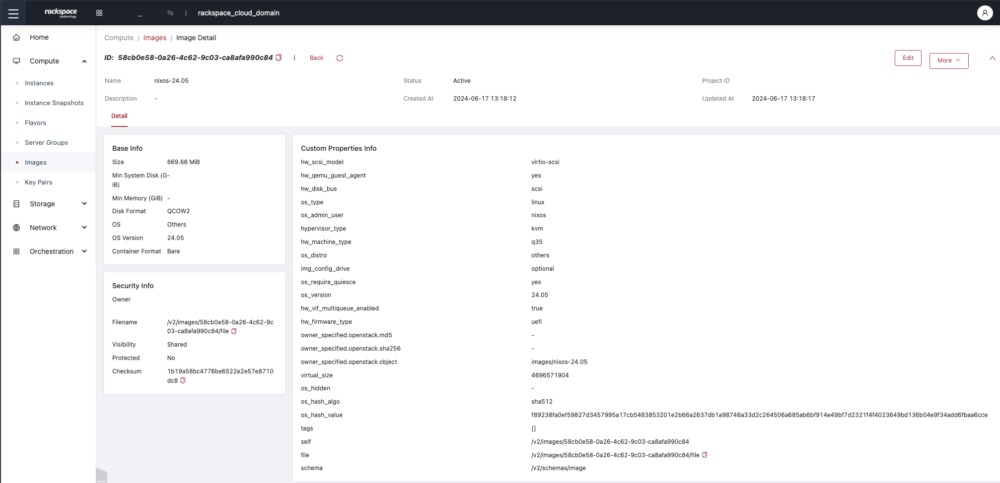
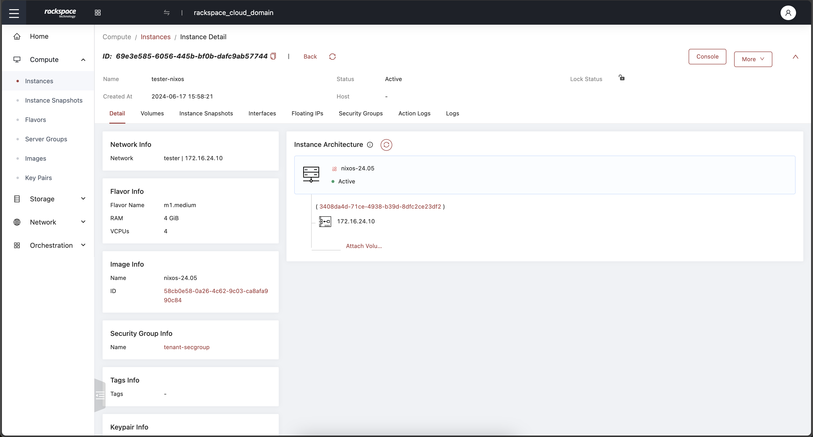
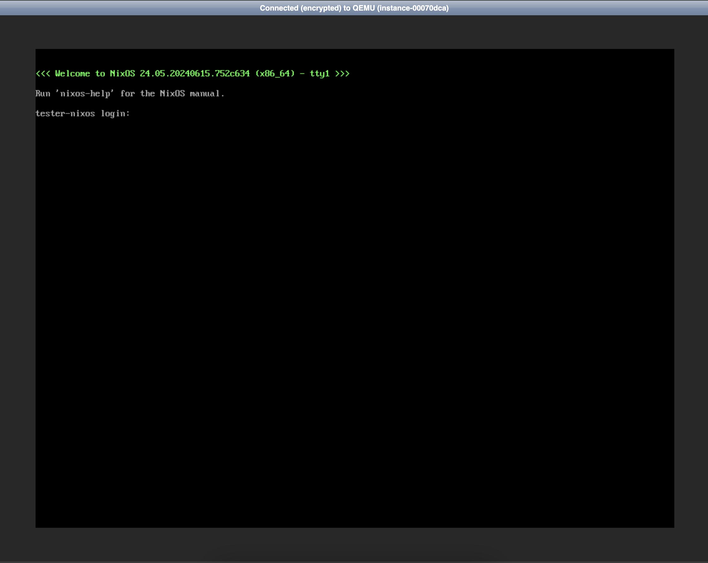

# Building NixOS from Another OS to Use as NixOS on OpenStack

A wordy title, but it was fun to write and hammers on "**OS**;" OpenStack / Operating System. With the release of OpenStack Flex, we have opened up some much needed ease of operation and functionality into our multi-tenant OpenStack platform. One of the many new features in our public cloud is the ability to simply create and manage custom images. In this blog post, we will guide you through creating a [NixOS 24.05](https://nixos.org/blog/announcements/2024/nixos-2405) QCOW2 image which is cloud ready. We'll use resources found in the [nixos-openstack GitHub repository](https://github.com/cloudnull/nixos-openstack) and we'll build all of this from Ubuntu within OpenStack Flex.

<!-- more -->

Interacting with OpenStack is incredibly straightforward. The OpenStack user interface (dashboard, command-line tools, SDKs, APIs) provides a seamless experience, enabling users, developers, operators, and administrators to manage cloud resources efficiently and effectively. Whether you are a beginner or an experienced user, OpenStack simplifies cloud, making it highly accessible.

## Overview

NixOS is a powerful platform which gives you the ability to more easily manage resources and deployments. While NixOS is powerful, at the time of this writing, there are no easily consumable cloud ready images that can be downloaded from official sources. So today we're combining the power of NixOS with the might of OpenStack to build a new custom image with a total of three commands (five if we include the image upload and booting a server).

!!! quote "Why NixOS?"

    Nix builds packages in isolation from each other. This ensures that they are reproducible and don’t have undeclared dependencies, so if a package works on one machine, it will also work on another.

As a declarative platform, NixOS has a lot of incredible advantages making it incredibly well suited for the cloud. While this post won't go into the specifics of running NixOS, it will cover how to get up and running with NixOS; giving you simplicity of the open cloud and the power of NixOS.

### Prerequisites

Before we begin, ensure you have the following:

1. A machine with an operating system that supports [Nix](https://nixos.org/download) (there are a lot of them)
2. Internet access to fetch necessary packages and files
3. About 10 minutes

### Step 1: Install Nix

First, we need to install the Nix command-line utility (Most Linux distros are supported).

!!! note "About the build node"

    This post intentionally does not cover the deployment of the build node. Setting up the `nix` command-line utility is trivial and can be done on a number of operating systems. To see all of the supported platforms have a look [here](https://nixos.org/download). All of the commands executed within this post were run from a Ubuntu 24.04 instances on OpenStack Flex.

```sh
sh <(curl -L https://nixos.org/nix/install) --daemon --yes
```

This command will download and install Nix with daemon support.

### Step 2: Clone the Repository

Clone the `nixos-openstack` repository to your local machine; it's a community resource, so go ahead and poke around, change things, and improve what's there. The main purpose of the `nixos-openstack` repo is to wrangle NixOS into submission with cloud-init, creating a playground where you can run whatever applications your heart desires.

!!! note "A word about git"

    You will need the `git` command on your system for this to work. While `git` is generally table stakes, if the command is not found you will need to install it.

``` shell
git clone https://github.com/cloudnull/nixos-openstack
```

Change the working directory into the cloned repository

``` shell
cd nixos-openstack
```

### Step 3: Build the QCOW2 Image

Navigate to the directory containing the `flake.nix` file and run the following command to build the NixOS QCOW2 image

``` shell
nix build .#nixosConfigurations.build-qcow2.config.system.build.qcow2 \
    --extra-experimental-features nix-command \
    --extra-experimental-features flakes
```

!!! info "A word about extra-experimental-features"

    This command tells Nix to use the `flakes` and `nix-command` experimental features to build the NixOS configuration specified in the `flake.nix` file. You can learn more about these features from the [NixOS wiki](https://nixos.wiki/wiki/Nix_command).

The build command will take a bit of time and is largely dependant on your system; however, it should be fairly quick.

!!! note "The build process on OpenStack Flex took around 5 minutes."

Once the image is built, you can validate the image file and move on to getting ready to upload the image to your project registry.

### Step 4: Prepare for OpenStack Deployment

Before uploading your image to OpenStack, ensure you have your `clouds.yaml` file configured and ready to use. This file contains the necessary credentials and configurations for your OpenStack cloud environment.

### Step 5: Upload the Image to OpenStack

!!! tip "A word about your command line configuration file"

    Make sure you have your `clouds.yaml` file created and ready to use. If you've not created your `clouds.yaml` file, check out the [following docs post on getting that going](https://docs.rackspacecloud.com/build-test-envs/#configure-openstack-client)."

After building the QCOW2 image, the result can be found at `result/nixos.qcow2`.

The following command will use the OpenStack command-line client to upload the image to your OpenStack cloud; however, if you were building this image on your local machine you could also upload the image using the Dashboard.

``` shell
openstack --os-cloud default image create \
          --progress \
          --disk-format qcow2 \
          --container-format bare \
          --file result/nixos.qcow2 \
          --property hw_scsi_model=virtio-scsi \
          --property hw_disk_bus=scsi \
          --property hw_vif_multiqueue_enabled=true \
          --property hw_qemu_guest_agent=yes \
          --property hypervisor_type=kvm \
          --property img_config_drive=optional \
          --property hw_machine_type=q35 \
          --property hw_firmware_type=uefi \
          --property os_require_quiesce=yes \
          --property os_type=linux \
          --property os_admin_user=nixos \
          --property os_distro=nixos \
          --property os_version=24.05 \
          nixos-24.05
```

!!! Note "OpenStack Image Metadata"

    This upload will create the new image using a lot of neat features provided by the OpenStack Flex cloud environment. For more information on the flags used in this post and all of the features available, please review the operator information found in the [OpenStack Flex operator guide](https://docs.rackspacecloud.com/openstack-glance-images).

The image upload will give you a progress indicator, upon completion the image will be ready for consumption.

!!! example "Rackspace OpenStack Cloud Dashboard for the NixOS Image"

    

### Step 6: Deploy the NixOS Image

Now that the NixOS image is uploaded to your OpenStack cloud, you can deploy it. Use the OpenStack command-line client to create a new instance using the NixOS image. Replace `{flavor}` with the desired flavor, `{network}` with your network ID or name, and `{keypair-name}` with the name of your stored keypair.

!!! tip "A word about keypair management"

    If you have questions about keypairs, checkout the [documentation](https://docs.rackspacecloud.com/openstack-keypairs) on creating and managing them.

``` shell
openstack --os-cloud default server create --image nixos-24.05 \
                                           --flavor {flavor} \
                                           --network {network} \
                                           --key-name {keypair-name} \
                                           NixOS-24.05-Instance
```

This command will create a new instance running NixOS. The instance will build in a few seconds and be immediately available to you via server list or within the dashboard.

!!! example "Rackspace OpenStack Cloud Dashboard for the NixOS server"

    

You can access it using the floating IP or through your OpenStack dashboard.

!!! example "Rackspace OpenStack Cloud console access to the NixOS server"

    

## Conclusion

We hope you've enjoyed this post and are loving some cloudy [NixOS 24.05](https://nixos.org/blog/announcements/2024/nixos-2405). This simple post provides some insight on image building, managing OpenStack resources, and adding NixOS into your fleet. While this post highlights different interactions from multiple operating systems, the key takeaway being presented is that the Rackspace OpenStack platform is hyper-flexible and simple to interact with; you're not stuck with basics and are in control of your own infrastructure destiny.

Happy clouding!
