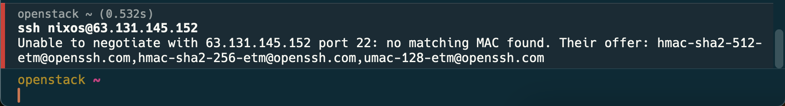
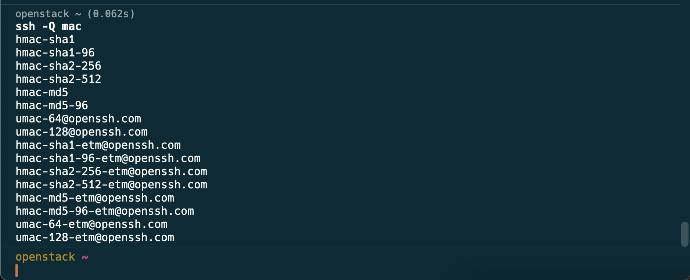
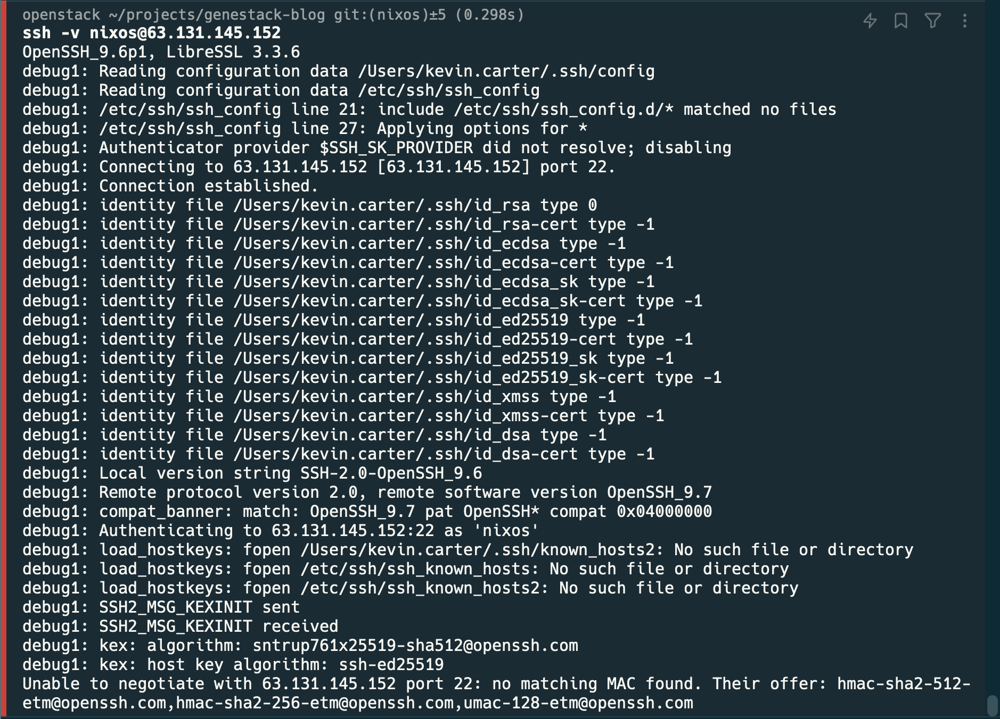
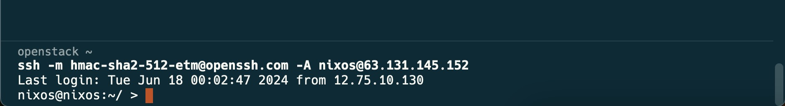

# Dealing with SSH MAC Limitations in Modern Systems

Modern SSH configurations can sometimes lead to MAC (Message Authentication Code) limitations when connecting between systems with different client setups. I've recently run into this issue when operating from a Mac and connecting to newer operating systems, like NixOS. These limitations can be frustrating, but they are fixable with minimal effort. This post will show you how to change your SSH client to use an appropriate MAC, even if it's not explicitly allowed in your configuration.

<!-- more -->

## What is a MAC

A Message Authentication Code (MAC) is a security feature used to verify the integrity and authenticity of a message. Learn more about MACs [here](https://www.geeksforgeeks.org/message-authentication-codes).

### What are Ciphers

**(honorable mention)**

Ciphers are used for data privacy over the connection. Learn more about your ssh_config [here](https://www.ssh.com/academy/ssh/sshd_config). Both the Ciphers and MACs work together to secure your connection.

## Common SSH enhancement

A common cause of this issue arises when administrators restrict the Ciphers and MACs allowed on a system, often in an effort to disable weak [algorithms](https://access.redhat.com/solutions/7028415). While disabling weak encryption is beneficial for security, it can also lead to unintended consequences. Disabling weak encryption algorithms helps prevent vulnerabilities and potential exploits, which is crucial for maintaining the security of a system. However, this practice can also create compatibility issues. For instance, if an SSH server only permits a narrow set of strong ciphers and MACs, clients that don't support these specific algorithms may fail to connect, resulting in errors like "*no matching MAC found*."

Moreover, as SSH evolves and new encryption standards emerge, administrators must continuously update their configurations to ensure compatibility without compromising security. If the server's configuration is not regularly updated to reflect the latest supported algorithms, clients using newer or different configurations may struggle to establish a connection. While the goal of enhancing security by disabling weak algorithms is well-intentioned, it's essential to strike a balance. Administrators need to ensure that their security measures do not excessively limit client compatibility. Regularly reviewing and updating the list of permitted ciphers and MACs can help maintain this balance, allowing secure and smooth connections across different systems.

## SSH Error Overview

When you run into a negotiation error, you'll see something that looks like this.

!!! failure "no matching MAC found"

    ``` shell
    Unable to negotiate with X.X.X.X port 22: no matching MAC found. Their offer: ...
    ```

    *An example of the issue with an older MacOS SSH client communicating with a newly deployed NixOS server.*

    

The above error is a bit cryptic, but after you dig into what a [MAC is](https://www.geeksforgeeks.org/message-authentication-codes), you learn a bit more and the problem becomes a little easier to digest, especially knowing a bit of the above context.

### Investigating the Error

In the error example, we see that the server offered three MAC negotiation options.

1. hmac-sha2-512-etm@openssh.com
2. hmac-sha2-256-etm@openssh.com
3. umac-128-etm@openssh.com

#### Client Query

To check what MAC options are available we can query the client.

!!! example "Run a MAC query"

    ``` shell
    ssh -Q mac
    ```

The query will provide output similar to the following.

!!! info "MAC Query return"

    

This query clearly shows the client has all three of the possible negotiation options being offered by the server; however, the client still failed.

#### Client Debug Output

Looking into the verbose output from the client, we see a bit more about what's happening and have some additional places we can investigate.

!!! failure "SSH MAC Error Verbose"

    

The output shows the following files being loaded into the client: `/Users/kevin.carter/.ssh/config`, and `/etc/ssh/ssh_config`.

#### Looking into allowed MACs

With the client configuration files we can do some quick grep'ing and figure out if we're inadvertently limiting the client from auto-negotiating.

!!! example "Searching the configuration"

    ``` shell
    grep -rni MAC /etc/ssh/ssh_config* /Users/kevin.carter/.ssh/config
    /etc/ssh/ssh_config:45:   MACs hmac-sha2-512,hmac-sha2-256,hmac-md5,hmac-sha1,umac-64@openssh.com
    ```

This simple `grep` highlights the fact that our default client configuration, which was provided by the system packages, is limiting the allowed MACs to the following:

1. hmac-sha2-512
2. hmac-sha2-256
3. hmac-md5
4. hmac-sha1
5. umac-64@openssh.com

Comparing what's permitted vs what's being offered by the server, we can easily see that we're missing some options in config.

## Fixing the Error

Resolving this error is very simple, however, there are a couple considerations. In this example we can see that the client has a default configuration in `/etc/ssh/ssh_config` that does not permit a MAC that would allow us to auto-negotiate with our server.

### Three ways to Resolve the Error

1. **Update the offending configuration:** During the investigation we learned that the error is caused by line 45 in our default `/etc/ssh/ssh_config`. Assuming you have superuser privileges on your machine, you can simply edit that file and extend the array of MACs permitted. Once the edit is complete the client will operate normally.

2. **Set a known good MAC on the command-line:** The command-line can define a specific MAC which will allow the client to omit auto-negotiation. Running `ssh` with a defined MAC is incredibly simple, all we need is a known good MAC. From the error output we know what the server is capable of and based on our MAC query we know what our client can do, so we simply find a match and run ssh with the `-m` flag.

!!! success "Setting a defined MAC on the command-line"

    ``` shell
    ssh -m hmac-sha2-512-etm@openssh.com -A nixos@63.131.145.152
    ```

    Adding the simple flag will permit access to the environment without issue.

    

3. **Update/create a user-specific configuration file:** Users can run with their own configuration files, which are sourced from `${HOME}/.ssh/config`, just like the configuration found in the default file, we can copy that syntax and add a stanza for the supported `MACs` we want.

!!! example "Adding MACs to user config"

    ``` conf
    Host 63.131.145.152  # limiting the updated config to our floating IP address.
        MACs hmac-sha2-512,hmac-sha2-256,hmac-md5,hmac-sha1,umac-64@openssh.com,hmac-sha2-512-etm@openssh.com,hmac-sha2-256-etm@openssh.com,umac-128-etm@openssh.com
    ```

Once you have the new configuration file in place, you'll immediately be able to SSH normally.

## Conclusion

Dealing with SSH MAC limitations can be a frustrating experience, mostly because the error is a bit opaque; however, with the right approach, it's a problem that can be resolved swiftly and efficiently. By understanding the root cause of the error and knowing how to adjust your client configuration, you can ensure smooth and secure SSH connections between different operating systems.

In this post, we walked through the steps to identify and fix the MAC negotiation error, offering multiple solutions to cater to various levels of user access and expertise. Whether you update your system-wide configuration, use command-line options, or create a user-specific configuration file, these methods provide flexibility and control over your SSH connections.

By staying informed about the latest best practices and recommendations for SSH configurations, you can future-proof your systems and avoid similar issues down the line. Regularly review and update your configurations to maintain secure and reliable communication between your systems.

Happy SSHing!
