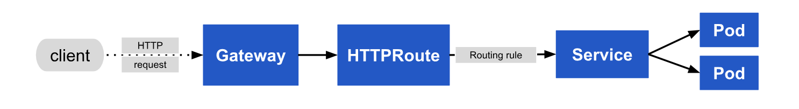
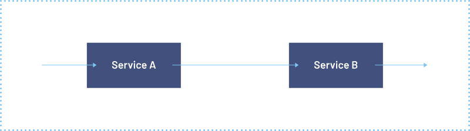
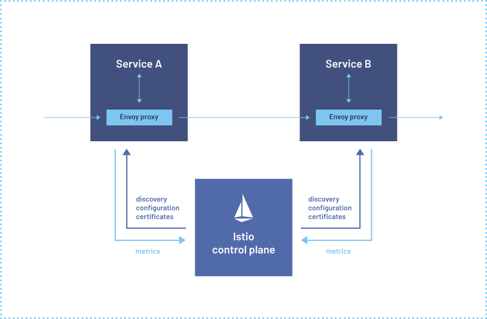
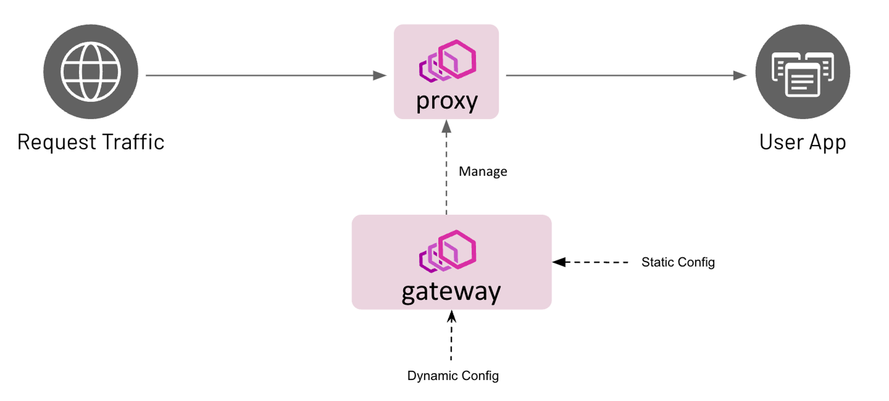

# Choosing Your Kubernetes Guardian: Ingress Controllers, Envoy GatewayAPI, or Istio?

## Introduction

In the ever-evolving landscape of cloud-native applications, effectively managing traffic within a Kubernetes cluster is essential for optimizing performance, enhancing security, and achieving scalability. Several popular solutions have emerged to address these challenges, including Envoy, Envoy GatewayAPI, Ingress Controllers, and Istio. However, users often face confusion when deciding which solution best suits their specific use cases. In this blog post, we will explore the differences and similarities assisting you in selecting the optimal tool based on your requirements.

<!-- more -->

## Prerequisites

There are a few assumptions about the user's understanding of certain topics:

- Basic Kubernetes concepts
- The functioning of an ingress controller

## What is Gateway API?

GatewayAPI provides a unified and consistent interface for defining how requests are routed to various backend services, as well as how traffic is shaped and controlled. Here is a request flow with Gateway API:

For a detailed explanation of GatewayAPI, you can refer to the [official documentation](https://gateway-api.sigs.k8s.io/).

## Can GatewayAPI be used in favour of Ingress Controller?

The short answer is yes. Traditional ingress controllers manage external access to services within a cluster, typically using HTTP/HTTPS, and provide basic routing, SSL termination, and load balancing. However, GatewayAPI offers several additional benefits such as:

- L4 and L7 routing
- Header-based routing
- Traffic splitting
- SSL termination
- Request header manipulation
- Mirroring
- Rate limiting, and more.

There are various implementations of GatewayAPI available, and this post will focus on the Envoy implementation, i.e. Envoy Gateway. The features GatewayAPI offers can vary depending on the chosen implementation.

## Does Envoy GatewayAPI Offer Similar Functionality as Istio?

Before we dive into Envoy GatewayAPI, let's understand what Envoy and Istio are.

Envoy is an open-source edge and service proxy designed for cloud-native applications. Originally developed by Lyft, it has since become a graduated project under the Cloud Native Computing Foundation(CNCF). While it is often deployed as part of a service mesh(e.g. with Istio), it can also be deployed independently to provide proxying and load balancing functionalities. However, managing Envoy configuration can be complicated.

Istio is a comprehensive servicemesh that provides advanced networking, security, and observability for microservices. It uses envoy as the data plane. Istio simplifies envoy. It understands Kubernetes YAML files(via CRD’s) and transforming them into a format Envoy can understand.

Here is a visual representation of Kubernetes service to service communication before and after using Istio.

- Before using Istio:

- After using Istio:

Istio offers many additional features beyond what you can achieve with Envoy GatewayAPI, such as mTLS to secure pod/application internal communication.

The table below highlights some key differences:

| Feature    | Envoy Gateway API  | Istio  |
|---|---|---|
| Architecture  | Gateway-centric  | Sidecar proxy model  |
| Security  | TLS termination  | mTLS, end-to-end encryption  |
| Scalability	  | Scales with the number of APIs  | Scales with microservices  |
| Observability	  | Basic metrics and logging  | Detailed telemetry, logging, tracing  |
| Configuration Management	  | Simplified, user-friendly	  | Complex, extensive configuration options|
| Use Case 1  | Basic traffic management  | Security compliance with mTLS and detailed policies  |
| Use Case 2  | Microservices and API management  | Advanced observability and resilience features  |

## What is Envoy Gateway?

Envoy Gateway is designed to simplify the deployment and management of Envoy as Gateway API. It focuses on providing essential gateway functionalities without the overhead of a full service mesh.

It offers an implementation of the GatewayAPI resources, such as Gateway, HTTPRoute, and GatewayClasses etc. Users can create these resources with values specific to Envoy Gateway. These GatewayAPI resources are then used to provision and configure the managed Envoy Proxies.

Below are some of the features provided by the Envoy Gateway implementation of GatewayAPI, along with their respective use cases:

- **Ingress and Egress Traffic Routing:**
  - Description: Directs incoming and outgoing traffic to the appropriate services within the cluster.
  - Use case: Route all traffic coming to application external APIs.

- **SSL/TLS Termination and Mutual TLS(Client to Gateway):**
  - Description: Ensuring secure communication.
  - Use case: Terminate SSL at the Gateway and forward plain HTTP traffic to the backend Kubernetes service. Cert-manager can be integrated to generate certificates.

- **Traffic Splitting and Mirroring:**
  - Description: Diverts a portion of traffic for testing or canary releases without impacting main traffic.
  - Use case: During the upgrade of any application, send 10% of the traffic to the canary-service for testing.

- **Rate Limiting and Request Filtering:**
  - Description: Limits the number of requests a client can make in a given time frame and filters requests based on rules.
  - Use case: Allow only 200 requests per minute from each IP address to application API.

- **HTTP request to HTTPS:**
  - Description: Automatically redirects HTTP requests to the HTTPS backend.
  - Use case: Redirect HTTP calls to the HTTPS backend of the application.

- **Request Header manipulation:**
  - Description: Append, delete, or update the HTTP request headers.
  - Use case: Modify the HTTP request headers from the user request before it reaches the application.
  
- **Observability and Metrics collection:**
  - Description: Collects data on traffic, errors, and performance for monitoring and debugging.
  - Use case: Export metrics to Prometheus for monitoring traffic volume and latency.

## Conclusion

Choosing the right tool for managing traffic within your Kubernetes cluster is crucial for ensuring optimal performance, security, and scalability. Envoy GatewayAPI and Istio each offer unique features and benefits tailored to different use cases.

Envoy GatewayAPI simplifies deployment and management. It excels in scenarios requiring basic traffic routing, SSL termination, and straightforward configuration.

Istio, on the other hand, provides a comprehensive service mesh solution with advanced features for networking, security, and observability. It is ideal for complex microservices architectures where end-to-end encryption, detailed telemetry, and extensive policy management are necessary.

By carefully evaluating your needs and considering the features highlighted in this blog post, you can select the tool that best aligns with your requirement.

## Additional Resources

- [Envoy](https://www.envoyproxy.io/)
- [Envoy Gateway](https://gateway.envoyproxy.io/)
- [Gateway API](https://kubernetes.io/docs/concepts/services-networking/gateway/)
- [Ingress Controller](https://kubernetes.io/docs/concepts/services-networking/ingress-controllers/)
