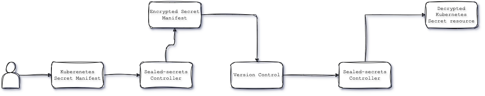

# Fortify Your Kubernetes Clusters: Encrypting Secrets with Sealed-Secrets

## Introduction

In today's cloud-native world, Kubernetes has become the de facto standard for container orchestration. Kubernetes secrets are essential for storing sensitive data like passwords, API keys, and database credentials for workloads running on Kubernetes clusters.

However, many teams encounter a common issue while interacting with Kubernetes secrets:

- The inadvertent exposure of the sensitive secrets when stored in version control systems.
- Kubernetes secrets are base64 encoded. Base64 encoding can be easily decoded, leading to significant security vulnerabilities, including unauthorized access and potential data breaches.

To address this issue, various solutions exist, but in this blog, we will focus on one: `sealed-secrets`.

We will walk through a practical example of how to use sealed-secrets to secure your Kubernetes secrets, ensuring they are both version-controlled and protected.

<!-- more -->

## Introduction to sealed-secrets

Sealed-secrets, developed by Bitnami, is an innovative tool designed to secure Kubernetes secrets. It provides a robust solution for managing sensitive information by allowing you to encrypt your secrets into a format that is safe to store in version control systems. Sealed-secrets ensures that your sensitive data remains protected even if your version control repository is compromised.

### How sealed-secrets Work

Sealed-secrets operates by utilizing a combination of a sealed-secrets controller and the kubeseal CLI tool.

The sealed-secrets controller maintains a set of private/public key(sealing keys) pairs as kubernetes secrets. Sealing keys are automatically renewed every 30 days. Which means a new sealing key is created and appended to the set of active sealing keys the controller can use to unseal SealedSecret resources.

The most recently created sealing key is the one used to seal new secrets when you use kubeseal and it's the one whose certificate is downloaded when you use `kubeseal --fetch-cert`.

The renewal time of 30 days is a reasonable default, but it can be tweaked as needed with the `--key-renew-period=<value>` flag for the command in the pod template of the SealedSecret controller. A value of 0 will deactivate automatic key renewal.

The encryption keys can be backedup which can be use to restore the encrypted secrets if required.

### Encryption Process

- You start by creating a Kubernetes Secret manifest.
- Using the `kubeseal` CLI, you encrypt this secret. `kubeseal` interacts with the sealed-secrets controller running in your Kubernetes cluster to encrypt the secret using a cluster-specific encryption key.
- The encrypted secret, now a SealedSecret resource, can be safely committed to your version control system.

### Decryption Process

- When you apply the SealedSecret resource to your Kubernetes cluster, the sealed-secrets controller automatically decrypts it back into a regular Kubernetes Secret.
- This ensures that only your Kubernetes cluster, with the appropriate sealed-secrets controller and encryption keys, can decrypt and access the secrets.

Here is the visual representation of the flow using sealed-secrets:



In the next section, we will walk through a practical example of how to use sealed-secrets to secure your Kubernetes secrets, demonstrating the process step-by-step.

## Example: Securing Kubernetes Secrets with sealed-secrets

In this section, we will walk through a practical example of how to use sealed-secrets to secure your Kubernetes secrets. We will cover the entire process, from setting up the necessary tools to encrypting and decrypting secrets within a Kubernetes cluster.

### Prerequisites

Before we begin, ensure you have the following:

- A Kubernetes cluster.
- `kubectl` installed and configured to interact with your cluster.
- `kubeseal` CLI installed. You can download it from [here](https://github.com/bitnami-labs/sealed-secrets/releases).
- `helm` CLI installed. You can download it from [here](https://helm.sh/docs/intro/install/).

### Setup

#### Install sealed-secrets Controller

The sealed-secrets controller runs within your Kubernetes cluster and handles the decryption of SealedSecret resources. To install it, use helm:

```shell
helm repo add sealed-secrets https://bitnami-labs.github.io/sealed-secrets
helm repo update
helm install --create-namespace sealed-secrets sealed-secrets/sealed-secrets -n sealed-secrets
```

#### Verify the Installation

```shell
kubectl get pods -n sealed-secrets 
```

#### Create and Encrypt a Secret

Create a YAML file named `mysecret.yaml` with the following content:

```shell
apiVersion: v1
kind: Secret
metadata:
  name: mysecret
  namespace: default
type: Opaque
stringData:
  username: test
  password: securepassword
```

#### Encrypt the Secret Using kubeseal

Use the kubeseal CLI to encrypt the secret:

```shell
kubeseal --scope cluster-wide --controller-namespace sealed-secrets --controller-name sealed-secrets -o yaml < mysecret.yaml > encrypted_mysecret.yaml
```

This command reads the `mysecret.yaml` file, encrypts the data, and outputs a SealedSecret resource to `encrypted_mysecret.yaml`. You can store `encrypted_mysecret.yaml` to version control. If malicious user gets access to `encrypted_mysecret.yaml`, the file will be of no use. It can only be decrypted, with the private key from sealing keys.

#### Check the SealedSecret resource manifest

Open the `encrypted_mysecret.yaml` file to verify the encrypted content:

```shell
apiVersion: bitnami.com/v1alpha1
kind: SealedSecret
metadata:
  annotations:
    sealedsecrets.bitnami.com/cluster-wide: "true"
  creationTimestamp: null
  name: mysecret
  namespace: default
spec:
  encryptedData:
    username: AgBYnmOneZoegFcfgck5vzZihjpbB3WG...
    password: AgBhpdzODhKBKY5nckavy/BFGZneP2Wez1m...
  template:
    metadata:
      annotations:
        sealedsecrets.bitnami.com/cluster-wide: "true"
      creationTimestamp: null
      name: mysecret
      namespace: default
    type: Opaque    
```

#### Apply the Sealed-Secret

Apply the SealedSecret Resource(`mysealedsecret.yaml`) to your Kubernetes cluster:

```shell
kubectl apply -f encrypted_mysecret.yaml
kubectl get sealedsecret
```

#### Verify the Decryption

Check that the SealedSecret has been decrypted into a Kubernetes Secret:

```shell
kubectl get secrets mysecret -o yaml
```

You should see the decrypted Secret manifest with the base64 encoded values.

#### Access the Secret

Create a pod(`test-pod.yaml`) that uses the secret:

```shell
apiVersion: v1
kind: Pod
metadata:
  name: secret-test-pod
  namespace: default
spec:
  containers:
  - name: secret-test-container
    image: nginx
    env:
    - name: USERNAME
      valueFrom:
        secretKeyRef:
          name: mysecret
          key: username
    - name: PASSWORD
      valueFrom:
        secretKeyRef:
          name: mysecret
          key: password
  restartPolicy: Never
```

Apply the pod manifest:

```shell
kubectl apply -f test-pod.yaml
kubectl get pod secret-test-pod
```

Check the pod to verify that the secret is being used correctly:

```shell
kubectl exec -it secret-test-pod -- env |egrep 'USERNAME|PASSWORD'
```

In this example, we have demonstrated how to create, encrypt, and use Kubernetes secrets securely with sealed-secrets. By following these steps, you can ensure your secrets are protected while still benefiting from the convenience of version control.

## Conclusion

Securing sensitive information in Kubernetes is crucial. sealed-secrets provides an effective solution by allowing encryption of secrets for safe storage in version control. By following the steps outlined in this blog, you can ensure your secrets remain protected while benefiting from the convenience of version control.

## Additional Resources

- [Sealed-Secrets GitHub Repository](https://github.com/bitnami-labs/sealed-secrets)
