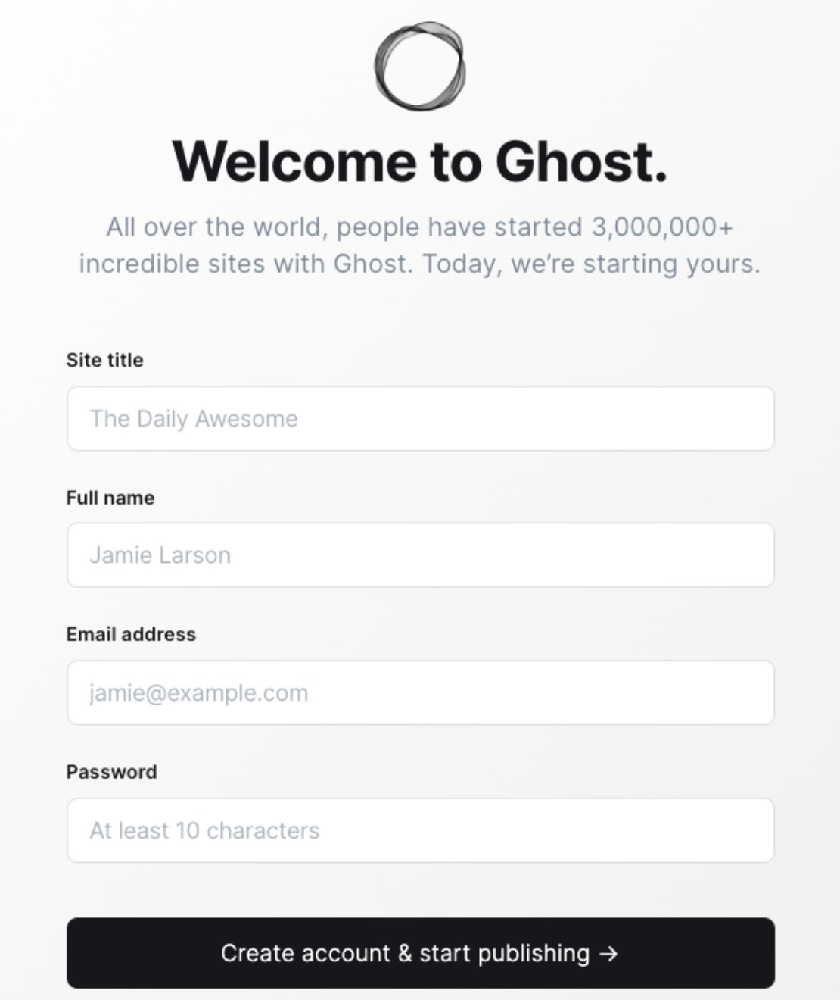

## Creating a Ghost site with Openstack-Flex

Welcome! In this blog post we are going over using Openstack-Flex to deploy Ghost. If you havent used ghost before and would like more information about it please visit their website using the link  [here](https://ghost.org/)

<!-- more -->

## Getting Started

First you will need to set up your clouds.yaml file to be able to complete the next steps. More information about that can be found [here](https://docs.rackspacecloud.com/build-test-envs/#configure-openstack-client).

### Creating our Openstack-Flex Server

First we are going to create our Flex router.

``` shell
openstack  --os-cloud {cloud_name} router create flex-router
```

Second we are we wil create our flex network

``` shell
openstack  --os-cloud {cloud_name} network create flex-network
```

Next we are going to set our router's external gateway to PUBLICNET to grant access to the internet.

``` shell
openstack  --os-cloud {cloud_name} router set --external-gateway PUBLICNET flex-router
```

Now we are going to set up our subnet, you can choose between ipv4 and ipv6. The ip range is also up to you. For the DNS name server you will need to ping cachens1.sjc3.rackspace.com and cachens2.sjc3.rackspace.com.

``` shell
ping cachens1.sjc3.rackspace.com -c2
ping cachens2.sjc3.rackspace.com -c2

openstack  --os-cloud {cloud_name} subnet create --ip-version 4 --subnet-range 172.18.107.0/24 --dns-nameserver 216.109.154.188 --dns-nameserver 216.109.154.189 --network flex-network flex-subnet
```

Connect the subnet to our flex-router

``` shell
openstack --os-cloud {cloud_name} router add subnet flex-router flex-subnet
```

Now we need to create our security group, this is the group which specify the network access rules. For our example now we are only going to allow SSH access.

``` shell
openstack --os-cloud {cloud_name} security group create flex-sg
```

``` shell
openstack --os-cloud {cloud_name} security group rule create --ingress --remote-ip 0.0.0.0/0 --dst-port 22 --protocol tcp flex-sg
```

Now we need to create our floating ip.

!!! note

    Save this ip for later we will need to connect it to our server.

``` shell
openstack --os-cloud {cloud_name} floating ip create --subnet PUBLICNET_SUBNET PUBLICNET
```

Now we are going to create our Public and Private ssh keys so we can securely connect to our server. I am naming my key wordpress-key

``` shell
ssh-keygen
```
This will prompt you store and name your private key. I did something like this /home/{username}/.ssh/flex-key.

After that we will create our public key using the command below then we will assign it using the the openstack cli tools.

``` shell
ssh-keygen -f ~/.ssh/flex-key -y > ~/.ssh/flex-key.pub
openstack —os-cloud {cloud_name} keypair create --public-key ~/.ssh/flex-key.pub flex-key
```

Now we create our server! This should include the flavor you'd like to use, the image, memory, network, key-name, and security group for this example.

``` shell
 openstack --os-cloud {cloud_name} server create --flavor m1.medium --image Ubuntu-22.04 --boot-from-volume 40 --network flex-network --key-name flex-key --security-group flex-sg flex-server
```

Assigning our floating ip. We can do this by adding it to our port for the server. If you get the fixed ip from our newly create server you can find the port ID by searching through the port list.

``` shell
openstack --os-cloud {cloud_name} port list
openstack --os-cloud {cloud_name} floating ip set --port {port id} {floating-ip}
```

SSH into your new Server!

``` shell
ssh -i ~/.ssh/flex-key ubuntu@{floating-ip}
```

## Deploying our Ghost website on our Openstack-Flex server

Once we have created our Openstack-Flex Server we will want to make sure everything is up to date.

``` shell
sudo apt-get update && sudo apt-get upgrade -y
```

Next we need to install nginx

``` shell
sudo apt-get install nginx
```
Next we need to enable nginx

``` shell
sudo systemctl enable nginx
```

Start nginx

``` shell
sudo systemctl start nginx
```

Next we install Mysql

``` shell
sudo apt install mysql-server
sudo mysql_secure_installation
```

Next we need to use mysql and create our wordpress database with our username and password. Please create your own personal username and password.

``` shell
sudo mysql
```

``` shell
CREATE DATABASE ghost-db;
CREATE USER 'openstack-flex'@'localhost' IDENTIFIED BY 'pass';
GRANT ALL PRIVILEGES ON ghost-db.* TO 'openstack-flex'@'localhost';
FLUSH PRIVILEGES;
EXIT;
```

Next step is to install Node.js

``` shell
curl -fsSL https://deb.nodesource.com/setup_18.x | sudo bash -
```

``` shell
sudo apt install nodejs
```

Our last step is to install Ghost

``` shell
sudo npm install ghost-cli@latest -g
```

``` shell
sudo mkdir -p /var/www/directory-name
sudo chown -R {username}:{username} /var/www/ghost/
sudo chmod -R 755 /var/www/ghost/
cd /var/www/ghost
```
``` shell
ghost install
```

Answer the configuration question and when that is complete you can reach the setup page for your website. It should look like this.


