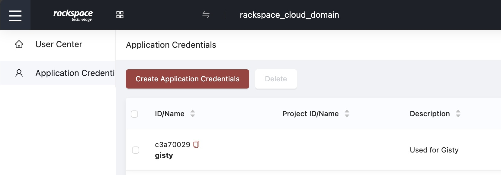
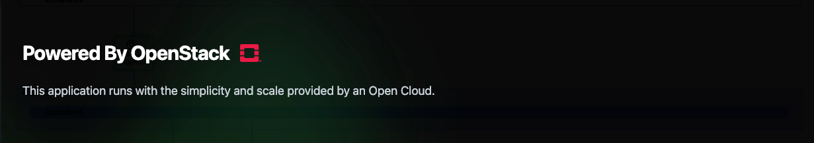
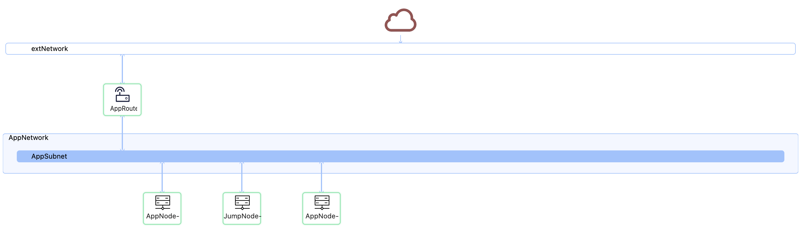

I recently decided I needed to run an application on OpenStack Flex to make things real. So naturally, I wrote an application from scratch that's more than just a boilerplate bucket of bolts. The gist of what I did over the weekend was to make a tool that harnesses the power of OpenStack with a Swift kick in the teeth.

<!-- more -->

##### [Say hello to Gisty](https://gisty.link)

In the vast ocean of the internet, where attention spans are shorter than the lifecycle of a JavaScript framework, Gisty emerges, a simple yet essential open-source code/content-sharing platform. Created for those fleeting moments when you want to drop some wisdom (or chaos) into the void, Gisty lets users submit content, store it securely, and retrieve it later via a unique URL; I designed it to be hilariously that simple.  

## The Good, the Simple, and the Hilarious

At its core, Gisty is like that reliable friend who always remembers your most embarrassing stories, except it does this for the content you submit. Generated content is hashed; that hash is a unique and shareable link. The user experience is blissfully simple: users submit their content via a form or API, and Gisty returns a unique URL that can be revisited later; it works on both the CLI and within the browser. A neat feature of the application is the ability to have self-destructive content, which is great when sharing things that may be potentially sensitive or something that you only want to read once.

Gisty is dark in its sense of humor and its GitHub-inspired theme, powered by Tailwind CSS. The sleek and responsive interface looks so good that you almost forget the site is just a bin for pasted content. Behind the scenes, the content is stored in OpenStack Swift, where it sits quietly, waiting to be rediscovered or forgotten.

### Swift as You've Never Known It

Gisty was written in Swift and uses the Vapor web framework. I built this application using Swift because of its clean API, type safety, lightning speed, I enjoy it, and it is funny to me that I wrote the code in Swift to store objects on Swift.

* The Vapor web framework handles all the routing, from submitting content to dynamically retrieving it
* OpenStack Swift handles the storage and metadata; yes, it's meta, do not overthink it
* On the front end, I used HTML and Tailwind CSS; no JavaScript here.

The application's storage lies in OpenStack Swift. Submitted content is hashed into unique identifiers (so no one will know you've submitted the same "Hello World" program 40 times, nor will it consume 40 objects). The consistent hashing ensures there are no duplicate uploads. Content is stored securely in Swift's object storage, meaning that, theoretically, it will live on forever, or at least until the server explodes. In the event of server destruction, you can count on the power of the sad toothpaste tube to brighten your day.

The application uses a toothpaste tube as the iconography because the backend is full of your pastes. When exploring or rendering content, you get a happy toothpaste tube. If you need to do better or if there's an error, you'll see a sad toothpaste tube. This sad toothpaste tube is not just a random choice of icon, it is a representation of the essence of failure: crumpled, exhausted, and a little disheveled. After all, nothing soothes the sting of a 500 error like a sad look of a disheveled tube of toothpaste.

> I opted for dark site with some dark humor. This dark humor is not just a design choice; it is a way to make the user experience more engaging and less intimidating.

### Rackspace OpenStack Flex?

Rackspace OpenStack Flex gives the application scalability, allowing it to handle a growing number of user submissions. A fantastic feature of OpenStack, available in OpenStack Flex, is the ability to use application credentials.

Application credentials keep my account-level access separate from my application, which is incredible because I can rotate or revoke the credentials as I see fit. Rackspace's native support for OpenStack made integration seamless. By seamless, I mean the Containerized app spins up nicely in CoreOS.

> Podman was used to containerize the entire application, because why have a stable local development environment when you can throw it into a container and pretend everything is okay? With Rackspace OpenStack Flex, deploying Gisty was as easy as setting the application credentials and running `systemctl start gisty.service`.

A load balancer fronts the traffic for the application nodes, giving me the horizontal scale I need to support a growing number of users. An all-mighty Let's Encrypt certificate gives users some feel-good encryption. Every application node is stateless, meaning I can scale horizontally to my heart's extent. To put it another way, leaning into some marketing doublespeak, the application is "cloud native."

## FIN

In conclusion, Gisty is everything you never thought you wanted in a paste-sharing platform: sleek, efficient, and always on the verge of an existential crisis. Whether you're submitting code snippets, random thoughts, or, more likely, debugging messages to yourself, Gisty is here for you. Deployed on Rackspace OpenStack Flex, Gisty has been designed to scale, survive your requests, and occasionally make you laugh. So, the next time you see a sad toothpaste tube, remember: it's not broken; it's just having a bad day, and in the weather, that can change anytime.

So that's Gisty. The gist of this effort was to introduce you to an actual application running on the foundational environment of Rackspace's new OpenStack cloud. It gives me something tangible to tinker with. I have to write some code and share this blog post, and I'm excited about what's coming soon.

Stay tuned for more!
