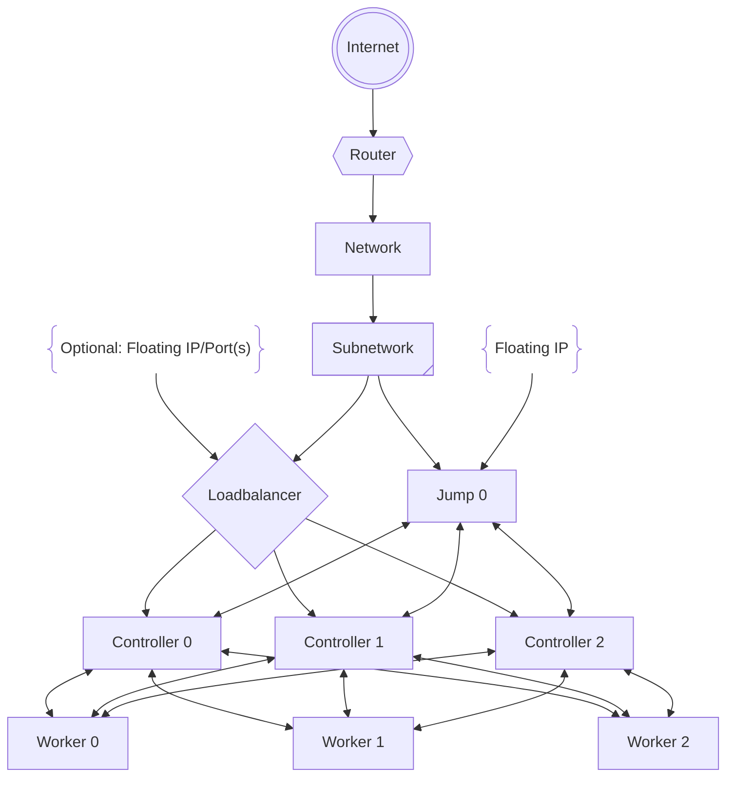
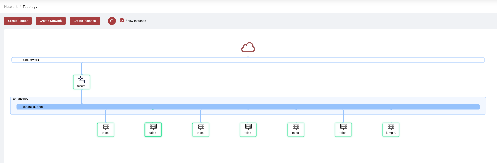

# Running Talos on OpenStack Flex

{ align=left }

As developers, we're constantly seeking platforms that streamline our workflows and enhance the performance and reliability of our applications. Talos is a container optimized Linux distribution reimagined for distributed systems. Designed with minimalism and practicality in mind, Talos brings a host of features that are particularly advantageous for OpenStack environments. By stripping away unnecessary components, it embodies minimalism, reducing the attack surface and resource consumption. It comes secure by default, providing out-of-the-box secure configurations that alleviate the need for extensive hardening.

<!-- more -->

Integrating Talos with OpenStack Flex brings significant benefits. The immutable and minimal nature of Talos ensures that all compute nodes in the OpenStack cluster are consistent, reducing the chances of unexpected behavior due to environmental differences and thus enhancing consistency and reliability. When OpenStack Flex and Talos are combined, it creates an optimal environment for developers. Talos's ephemeral and atomic nature makes scaling out compute resources in OpenStack Flex seamless and efficient, enhancing scalability. The combination ensures high availability and quick recovery from failures, as Talos's design simplifies node replacement and recovery, thereby improving resiliency.

In essence, Talos offers more by providing less—less complexity, less overhead, and fewer security concerns. This minimalistic yet powerful approach enhances security, efficiency, resiliency, and consistency. For developers working with OpenStack and specifically OpenStack Flex, Talos presents a compelling operating system choice that aligns perfectly with the goals of modern open infrastructure native applications.

## Creating a cluster via the CLI on OpenStack

In this guide, we will create an HA Kubernetes cluster in OpenStack with 3 worker nodes. We will assume some existing familiarity with OpenStack. For more information on OpenStack specifics, please see the official OpenStack documentation.



### Environment Setup

!!! note "This blog post was written with the following environment assumptions already existing"

    - Router: `tenant-router`
    - Network: `tenant-net`
    - Subnet: `tenant-subnet`
    - Key Pair: `tenant-key`

    If the project isn't setup completly, checkout the [getting started guide](https://blog.rackspacecloud.com/blog/2024/06/18/getting_started_with_rackspace_openstack_flex).

    All of the **tenant** items used within this post can be replaced with individual values.

The `openstack` client is assumed to be setup with a functional `clouds.yaml` file to interact with the cloud. This file will provide the necessary config to talk to with OpenStack Flex. Additional instructions on setting up the the OpenStack client can be found [here](https://docs.openstack.org/cli/quick-start.html).

## Network Infrastructure

The network setup will cover the creation of a router, network, subnet, load balancer, and ports.

### Creating loadbalancer

The OpenStack Flex Loadbalancer used for this environment is a Layer 4 TCP load balancer powered by the OVN loadbalancer solution. The Loadbalancer will be used to distribute traffic to the control plane nodes.

!!! tip "Check the loadbalancer providers available within the environment"

    ``` shell
    openstack --os-cloud default loadbalancer provider list
    ```

Create load balancer, updating vip-subnet-id if necessary

``` shell
openstack --os-cloud default loadbalancer create --provider ovn \
                                                 --name talos-control-plane \
                                                 --vip-subnet-id  tenant-subnet
```

Store the load balancer ID for later use

``` shell
LB_ID=$(openstack --os-cloud default loadbalancer show talos-control-plane -f value -c id)
```

Create listener

``` shell
openstack --os-cloud default loadbalancer listener create --name talos-control-plane-listener \
                                                          --protocol TCP \
                                                          --protocol-port 6443 talos-control-plane
```

Create Pool

``` shell
openstack --os-cloud default loadbalancer pool create --name talos-control-plane-pool \
                                                      --lb-algorithm SOURCE_IP_PORT \
                                                      --listener talos-control-plane-listener \
                                                      --protocol TCP
```

Create health monitoring

``` shell
openstack --os-cloud default loadbalancer healthmonitor create \
                    --delay 5 \
                    --max-retries 4 \
                    --timeout 10 \
                    --type TCP talos-control-plane-pool
```

Retrieve the VIP for the load balancer

``` shell
export LB_PRIVATE_VIP=$(openstack --os-cloud default loadbalancer show talos-control-plane -f json | jq -r .vip_address)
```

## Create the Image

First, download the OpenStack image from a [Talos Image Factory](https://factory.talos.dev/?arch=amd64&board=undefined&cmdline-set=true&extensions=-&extensions=siderolabs%2Fiscsi-tools&extensions=siderolabs%2Fqemu-guest-agent&extensions=siderolabs%2Futil-linux-tools&platform=openstack&secureboot=undefined&target=cloud&version=1.8.2).

!!! example "At the time of this writing the latest image was 1.8.2"

    ``` shell
    wget https://factory.talos.dev/image/88d1f7a5c4f1d3aba7df787c448c1d3d008ed29cfb34af53fa0df4336a56040b/v1.8.2/openstack-amd64.raw.xz
    ```

The image comes pre-bundled with the following extensions

| Extension | Description |
|-----------|-------------|
| `siderolabs/iscsi-tools` | iSCSI tools for Talos |
| `siderolabs/qemu-guest-agent` | QEMU Guest Agent for Talos |
| `siderolabs/util-linux-tools` | Util Linux tools for Talos |

Once the image is downloaded, decompress the file.

``` shell
xz --decompress -v openstack-amd64.raw.xz
```

After decompressing the file downloaded, the command will result in a raw image file named, `openstack-amd64.raw`.

### Upload the Image

Once the image is downloaded, upload it to OpenStack with the following command.

``` shell
openstack --os-cloud default image create \
        --progress \
        --disk-format raw \
        --container-format bare \
        --file openstack-amd64.raw \
        --property hw_vif_multiqueue_enabled=true \
        --property hw_qemu_guest_agent=yes \
        --property hypervisor_type=kvm \
        --property img_config_drive=optional \
        --property hw_machine_type=q35 \
        --property hw_firmware_type=uefi \
        --property os_require_quiesce=yes \
        --property os_type=linux \
        --property os_admin_user=talos \
        --property os_distro=talos \
        --property os_version=18.2 \
        --tag "siderolabs/iscsi-tools" \
        --tag "siderolabs/util-linux-tools" \
        --tag "siderolabs/qemu-guest-agent" \
        talos-18.2
```

This command will prepare the image to run in a KVM environment, with UEFI firmware, and the Talos operating system. The image will be named `talos-18.2`. For a full overview of how we are constructing our image metadata, see our [OpenStack Image](https://docs.rackspacecloud.com/openstack-glance-images) documentation for more information.

## Security Groups

Security groups allow operators to control the traffic to and from an instances. We will create two security groups, one for the tenant and one for the Talos control plane.

### Create a tenant security group

Be sure that the tenant security group, `tenant-secgroup` is permiting SSH traffic, this will be important for the jump host.

``` shell
openstack --os-cloud default security group create tenant-secgroup
```

Add an SSH rule to the security group, allowing traffic from anywhere.

``` shell
openstack --os-cloud default security group rule create tenant-secgroup \
                     --protocol tcp \
                     --ingress \
                     --remote-ip 0.0.0.0/0 \
                     --dst-port 22
```

### Create a Talos control plane security group

Create a Talos security group, this `talos-secgroup` will be used to permit Talos control plane and kubernetes traffic within the cluster.

``` shell
openstack --os-cloud default security group create talos-secgroup
```

The security group will be used to permit traffic to the control plane nodes. We will open the following ports:

| Port | Direction | Value |
|------|-----------|-------|
| Talos control plane | Ingress | 50000 |
| Talos workers | Ingress | 50001 |
| Kubernetes API | Ingress | 6443 |

The security group will be used to permit traffic to the control plane nodes. We will open the following ports:

``` shell
openstack --os-cloud default security group rule create --ingress --protocol tcp --dst-port 6443 talos-secgroup
openstack --os-cloud default security group rule create --ingress --protocol tcp --dst-port 50000 talos-secgroup
openstack --os-cloud default security group rule create --ingress --protocol tcp --dst-port 50001 talos-secgroup
openstack --os-cloud default security group rule create --ingress --protocol tcp talos-secgroup
openstack --os-cloud default security group rule create --ingress --protocol udp talos-secgroup
```

Additional rules can be added as needed. Refer to the Talos Network Connectivity [documentation](https://www.talos.dev/v1.8/learn-more/talos-network-connectivity) for more information on additional ports and protocols that may be needed for the environment.

## Network Ports

Creating the network ports allows us to use IP addresses for the control plane and jump nodes in a deterministic way. These ports will have our security groups attached and will be used to associate floating IPs.

``` shell
export JUMP_0=$(openstack --os-cloud default port create --security-group tenant-secgroup --security-group talos-secgroup --network tenant-net jump-0 -f json | jq -r '.fixed_ips[0].ip_address')
export CONTROLLER_0=$(openstack --os-cloud default port create --security-group talos-secgroup --network tenant-net talos-control-plane-0 -f json | jq -r '.fixed_ips[0].ip_address')
export CONTROLLER_1=$(openstack --os-cloud default port create --security-group talos-secgroup --network tenant-net talos-control-plane-1 -f json | jq -r '.fixed_ips[0].ip_address')
export CONTROLLER_2=$(openstack --os-cloud default port create --security-group talos-secgroup --network tenant-net talos-control-plane-2 -f json | jq -r '.fixed_ips[0].ip_address')
```

!!! note

    The jump-0 port has both the `tenant-secgroup` and `talos-secgroup` security groups. The control plane ports have only the `talos-secgroup` security group.

    The above commands will store the port IP addresses in the variables `JUMP_0`, `CONTROLLER_0`, `CONTROLLER_1`, and `CONTROLLER_2`. These variables will be used in the next step. Validate the variables are defined and have the correct values by running `echo $JUMP_0 $CONTROLLER_0 $CONTROLLER_1 $CONTROLLER_2`.

### Associate port’s private IPs to loadbalancer

Create the loadbalancer members for each port IP.

``` shell
openstack --os-cloud default loadbalancer member create --subnet-id tenant-subnet --address ${CONTROLLER_0} --protocol-port 6443 talos-control-plane-pool
openstack --os-cloud default loadbalancer member create --subnet-id tenant-subnet --address ${CONTROLLER_1} --protocol-port 6443 talos-control-plane-pool
openstack --os-cloud default loadbalancer member create --subnet-id tenant-subnet --address ${CONTROLLER_2} --protocol-port 6443 talos-control-plane-pool
```

### Associate floating IPs to the `jump-0` port

Create a floating IP for the jump host.

``` shell
openstack --os-cloud default floating ip create --port jump-0 PUBLICNET
```

Retrieve the floating IP for the jump host.

``` shell
export JUMP_PUBLIC_VIP=$(openstack --os-cloud default floating ip list --fixed-ip-address $JUMP_0 -f json | jq -r '.[0]."Floating IP Address"')
```

### (Optional) Controller floating IPs

This setup is making the assumption that the `talosctl` command will be executed from the jump host. If the `talosctl` command will be executed from outside the Jump host, floating IPs will be needed for the controller nodes.

Create a floating IP for the load balancer.

``` shell
openstack --os-cloud default floating ip create --port ovn-lb-vip-${LB_ID} PUBLICNET
```

Retrieve the VIP for the load balancer.

``` shell
export LB_PUBLIC_VIP=$(openstack --os-cloud default floating ip list --fixed-ip-address ${LB_PRIVATE_VIP} -f json | jq -r '.[0]."Floating IP Address"')
```

``` shell
openstack --os-cloud default floating ip create --port talos-control-plane-0 PUBLICNET
openstack --os-cloud default floating ip create --port talos-control-plane-1 PUBLICNET
openstack --os-cloud default floating ip create --port talos-control-plane-2 PUBLICNET
```

## Build the Jump Host

The jump host will be used to interact with the Talos cluster. We will use the floating IP we created earlier to access the jump host.

``` shell
openstack --os-cloud default server create jump-0 --flavor gp.0.1.2 \
                                                  --nic port-id=jump-0 \
                                                  --image Debian-12 \
                                                  --key-name tenant-key
```

Login to the jump host and install `talosctl`.

``` shell
ssh debian@${JUMP_PUBLIC_VIP} 'curl -sL https://talos.dev/install | sh'
```

!!! tip

    See the Talos install [documentation](https://www.talos.dev/v1.8/talos-guides/install/talosctl/) for more information on installing `talosctl`.

## Cluster Configuration

With our networking deployed, and the  jump host online fetch the IP for our OVN Loadbalancer.

Generate the configuration.

``` shell
# If a floating IP was created for the load balancer, use the LB_PUBLIC_VIP otherwise use the LB_PRIVATE_VIP
ssh debian@${JUMP_PUBLIC_VIP} "talosctl gen config talos-k8s-openstack https://${LB_PRIVATE_VIP}:6443"
```

Upon the completion of this command the local directory will contain a `talosconfig`, `controlplane.yaml`, `worker.yaml` files. This file will be used to interact with the Talos cluster.

Retrieve these files from the jump host to the machine running the OpenStack CLI.

``` shell
scp debian@${JUMP_PUBLIC_VIP}:talosconfig .
scp debian@${JUMP_PUBLIC_VIP}:controlplane.yaml .
scp debian@${JUMP_PUBLIC_VIP}:worker.yaml .
```

## Server Creation

To build the Talos cluster, we will create the control plane nodes and worker nodes. We will use the `controlplane.yaml` and `worker.yaml` files we retrieved from the jump host.

### Create control plane nodes

The following command will create 3 control plane nodes. Adjust the number of control plane nodes by changing the `seq` range. The flavor used for the control plane nodes is `gp.0.2.4` which will provide the controllers with 2 vCPUs, 4GB of RAM.

!!! tip

    Depeding on where the command is executed from, the `controlplane.yaml` file may need to be retrieved from the jump host.

``` shell
for i in $(seq 0 1 2); do
  openstack --os-cloud default server create \
                       talos-control-plane-$i \
                       --flavor gp.0.2.4 \
                       --nic port-id=talos-control-plane-$i \
                       --image talos-18.2 \
                       --key-name tenant-key \
                       --user-data controlplane.yaml
done
```

### Create worker nodes

The following command will create 3 worker nodes. Adjust the number of control plane nodes by changing the `seq` range. The flavor used for the control plane nodes is `gp.0.2.4` which will provide the workers with 2 vCPUs, 4GB of RAM.

!!! tip

    Depending on where the command is executed from, the `worker.yaml` file may need to be retrieved from the jump host.

``` shell
for i in $(seq 0 1 2); do
    openstack --os-cloud default server create \
                         talos-worker-$i \
                         --flavor gp.0.2.4 \
                         --network tenant-net \
                         --image talos-18.2 \
                         --key-name tenant-key \
                         --security-group talos-secgroup \
                         --user-data worker.yaml
done
```

!!! note

   Adding more workers later, will follow this same pattern.

## Talos Cluster

At this point we'll have a fully constructed environment that looks like this



The cluster will consist of 3 control plane nodes and 3 worker nodes. The control plane nodes will be behind the OVN Loadbalancer and the worker nodes will be on the `tenant-net` network. The jump host will be accessible via the floating IP we created earlier. The project is setup with security groups and ports to allow traffic to the control plane nodes and jump host and permit the environment to be rebuilt in a fully reproducible manner.

With the cluster online, we can now interact with the cluster using `talosctl`.

### Bootstrap Etcd

It is now time to bootstrap the cluster. The following commands will be executed from the jump host.

#### Set the endpoints and nodes

Within the `talosconfig` file, set the one endpoint and and node.

``` shell
ssh debian@${JUMP_PUBLIC_VIP} "talosctl --talosconfig talosconfig config endpoint ${CONTROLLER_0}"
ssh debian@${JUMP_PUBLIC_VIP} "talosctl --talosconfig talosconfig config node ${CONTROLLER_0}"
```

#### Bootstrap etcd

Run the bootstrap command to start the cluster.

``` shell
ssh debian@${JUMP_PUBLIC_VIP} "talosctl --talosconfig talosconfig bootstrap"
```

The bootstrap command will take a few minutes to complete. Once the command has completed, check the status of the cluster.

``` shell
ssh debian@${JUMP_PUBLIC_VIP} "talosctl --talosconfig talosconfig service"
```

!!! example "The output should look something like this"

    ``` shell
    NODE         SERVICE      STATE     HEALTH   LAST CHANGE   LAST EVENT
    10.0.0.208   apid         Running   OK       5m0s ago      Health check successful
    10.0.0.208   containerd   Running   OK       5m4s ago      Health check successful
    10.0.0.208   cri          Running   OK       5m0s ago      Health check successful
    10.0.0.208   dashboard    Running   ?        5m2s ago      Process Process(["/sbin/dashboard"]) started with PID 2169
    10.0.0.208   etcd         Running   OK       3m34s ago     Health check successful
    10.0.0.208   kubelet      Running   OK       4m53s ago     Health check successful
    10.0.0.208   machined     Running   OK       5m4s ago      Health check successful
    10.0.0.208   syslogd      Running   OK       5m3s ago      Health check successful
    10.0.0.208   trustd       Running   OK       5m0s ago      Health check successful
    10.0.0.208   udevd        Running   OK       5m3s ago      Health check successful
    ```

The cluster will also have all the membership information, which can be viewed with the following command.

``` shell
talosctl --talosconfig ./talosconfig get members
```

!!! example "The output should look something like this"

    ``` shell
    NODE         NAMESPACE   TYPE     ID                      VERSION   HOSTNAME                          MACHINE TYPE   OS               ADDRESSES
    10.0.0.208   cluster     Member   talos-control-plane-0   19        talos-control-plane-0.novalocal   controlplane   Talos (v1.8.2)   ["10.0.0.208"]
    10.0.0.208   cluster     Member   talos-control-plane-1   15        talos-control-plane-1.novalocal   controlplane   Talos (v1.8.2)   ["10.0.0.60"]
    10.0.0.208   cluster     Member   talos-control-plane-2   12        talos-control-plane-2.novalocal   controlplane   Talos (v1.8.2)   ["10.0.0.152"]
    10.0.0.208   cluster     Member   talos-worker-0          6         talos-worker-0.novalocal          worker         Talos (v1.8.2)   ["10.0.0.232"]
    10.0.0.208   cluster     Member   talos-worker-1          2         talos-worker-1.novalocal          worker         Talos (v1.8.2)   ["10.0.0.39"]
    10.0.0.208   cluster     Member   talos-worker-2          5         talos-worker-2.novalocal          worker         Talos (v1.8.2)   ["10.0.0.110"]
    ```

## Setup the Kubernetes Config

With the cluster bootstrapped, we can now setup the Kubernetes configuration and begin interacting with the environment.

At this stage login to the jump host and install the `kubectl` binary.

``` shell
ssh debian@${JUMP_PUBLIC_VIP}
```

### Install the kubectl binary

Install the `kubectl` binary is optional, but an easy way to interact with Talos Kubernetes environment now that it is deployed.

``` shell
curl -LO "https://dl.k8s.io/release/$(curl -L -s https://dl.k8s.io/release/stable.txt)/bin/linux/amd64/kubectl"
```

Move the binary to a location in within the `$PATH`.

``` shell
sudo install -o root -g root -m 0755 kubectl /usr/local/bin/kubectl
```

### Retrieve the admin kubeconfig

At this point we can retrieve the admin kubeconfig by running

``` shell
talosctl --talosconfig talosconfig kubeconfig ~/.kube/config
```

### Check the Kubernetes Nodes

With the kubeconfig in place, check the nodes in the cluster.

``` shell
kubectl get nodes
```

!!! example "The output should look something like this"

    ``` shell
    NAME                    STATUS   ROLES           AGE    VERSION
    talos-control-plane-0   Ready    control-plane   2m6s   v1.31.2
    talos-control-plane-1   Ready    control-plane   2m2s   v1.31.2
    talos-control-plane-2   Ready    control-plane   2m5s   v1.31.2
    talos-worker-0          Ready    <none>          118s   v1.31.2
    talos-worker-1          Ready    <none>          112s   v1.31.2
    talos-worker-2          Ready    <none>          112s   v1.31.2
    ```

Assuming the output of the command is matching expectations for the deployment, it is safe to assume the Talos cluster on OpenStack Flex is ready for work.

## Conclusion

To recap, this blog post has outlined the steps to deploy a Talos cluster on OpenStack Flex. The cluster consisted of three control plane nodes and three worker nodes. We created the necessary network infrastructure, security groups, and ports to support the cluster. We then built the jump host and retrieved the necessary configuration files to interact with the cluster. We bootstrapped the cluster using `talosctl`. Finally, we retrieved the admin kubeconfig and installed the `kubectl` binary to interact with the cluster.

Talos is a powerful operating system that is well-suited for OpenStack Flex environments. By combining the minimalistic and secure nature of Talos with the flexibility and scalability of OpenStack Flex, operators and administrators can create a robust and reliable infrastructure for applications. With the steps outlined in this guide, admins can easily deploy a Talos clusters on OpenStack Flex and take advantage of the benefits that both platforms have to offer. Whether running a small environment or a large production system, Talos and OpenStack Flex provide the tools needec to build and manage infrastructure effectively.
