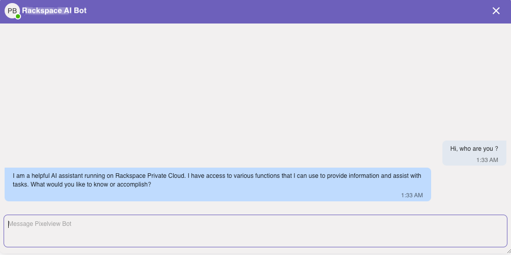
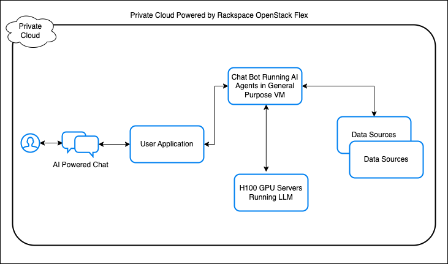
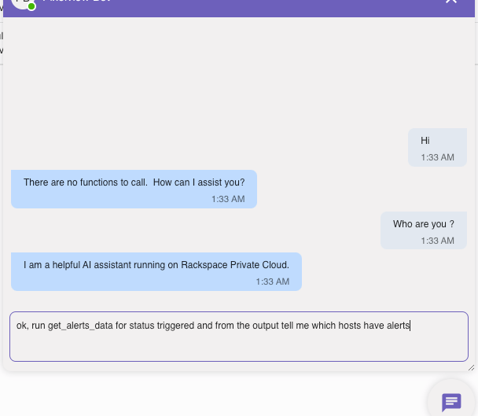
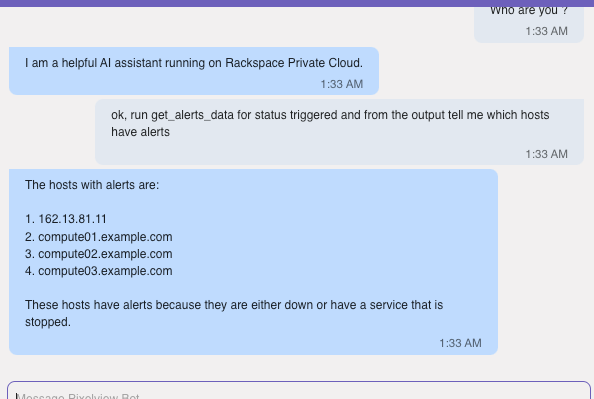

# Agentic AI in Action: Deploying Secure, Task-Driven Agents in Rackspace Cloud

The concept of AI agents has emerged as a transformative tool, empowering organizations to create AI systems capable of secure, real-world interactions. By leveraging a language model’s natural language abilities alongside function-calling capabilities, an agentic AI system can interact with external systems, retrieve data, and perform complex tasks autonomously. Enterprises can harness the full potential of AI by designing agent workflows that interact securely with business data, ensuring control and privacy. In this post, we explore building an AI agentic workflow with Meta’s LLaMA 3.1, specifically crafted for interacting with private data from a database. We’ll dive into the technical foundation of agentic systems, examine how function calls operate, and show how to securely deploy all of this within a private cloud, keeping data secure.

<!-- more -->

<figure markdown="span">
    { width="800" height="500"}
    <figcaption>AI Powered ChatBot in Rax Cloud</figcaption>
</figure>


## What is an AI Agentic System?
Before AI agents were developed, most AI applications used models to passively process queries, responding based on the provided text or data and limited to the model’s trained knowledge. Agentic AI systems represent a leap forward, allowing AI to act as autonomous agents that engage with systems, perform tasks, and adapt dynamically. These agents can retrieve, process, and analyze private data in real time and even collaborate with other agents to divide complex tasks into manageable subtasks. Some practical use cases include:

• **Customer Service AI Agents**

• **Data Extraction Agents for Structured Data Sources**

• **Event Categorization and Incident Management Agents**

• **Autonomous Workflow Agents**


An agentic system essentially provides AI with "agency," enabling it to handle sophisticated tasks independently. This is crucial for applications that require swift, automated responses to dynamic conditions, such as incident management, customer support, and automated operations. Agentic systems are structured around natural language processing combined with function calling, enabling them to work through a workflow with these steps:

1. **Query Interpretation**: The AI interprets user queries to extract intent and required actions.

2. **Dynamic Function Calling**: The system recognizes when to execute a function (e.g., a database query or API call) and assembles the necessary parameters.

3. **Data Integration**: The AI gathers data from external sources, formats it, and presents a context-driven response.

4. **Context Management**: For continuity, the AI retains context across interactions, enhancing multi-turn conversation handling.

## Key Factors for Enterprise AI Agent Adoption 

Organizations must weigh several considerations when adopting AI agents:

• **Compliance and Regulation**

• **Data Security**

• **Cost Efficiency**

• **Availability of AI Expertise**

Data security and regulatory compliance are often the most significant factors that limit organizations from adopting public AI tools like OpenAI’s ChatGPT. However, using open-weight models such as Meta’s LLaMA 3.1 allows companies to operate AI agents entirely within their own infrastructure. A hybrid AI architecture can further enhance this, enabling specific workloads to run across various platforms while maintaining privacy.


Let’s explore how a private cloud, like Rackspace’s OpenStack Flex Cloud, can host such an AI system effectively.

<figure markdown="span">
  { width="900" height="500"}
</figure>


!!! note
    See what GPU flavors are available at **Rackspace Spot** [Here](https://spot.rackspace.com/docs/cloud-servers#gpu-servers)


## Building an AI Chatbot for Database Interactions
Agentic systems are invaluable in scenarios that demand context, action, and automation. An AI agent can answer business-specific questions, monitor systems, query databases, and interact with various APIs. In this example, we’ll use LLaMA 3.1 to build an AI agent capable of accessing a MongoDB database to respond to user queries, demonstrating the power of function calling in agentic workflows. Imagine we have a MongoDB setup containing infrastructure monitoring data. Here’s how the process unfolds:

1. **User Query Interpretation**: A user inputs, “Show me all triggered alerts.” LLaMA 3.1 interprets the request, recognizing it as a MongoDB lookup for active alerts.

2. **Function Call Creation**: The model constructs a JSON function call, specifying the parameters needed to search for “triggered” status in MongoDB’s alerts collection.

3. **Data Retrieval and Response**: MongoDB processes the function call, retrieves relevant data, and sends it back to the AI. LLaMA 3.1-8B-Instruct formats this information into a clear, context-driven response.

4. **Context Management for Follow-Up Queries**: A user can follow up with, “Who is assigned to this alert?” The model retains the alert ID from the initial query, using it to fetch assignment details through another function call.

Lets implement the logic in code. We will use FastAPI to build a API driven agent.

!!! note
    There are many AI Agent frameworks now available: [AutoGen](https://github.com/microsoft/autogen), [Langchain](https://github.com/langchain-ai/langchain), [CrewAI](https://github.com/joaomdmoura/crewAI) are few of the widely used ones.


First, lets create an agent class

``` python
class Agent:
    def __init__(self, host: str, port: int):
        self.host = host
        self.port = port
        self.agent_id = None
        self.session_id = None
        self.client = LlamaStackClient(
            base_url=f"http://{host}:{port}",
        )
        self.tool_definitions = [AlertsDataTool()]
        self.agent_config = None

    async def async_init(self):
        self.agent_config = await make_agent_config_with_custom_tools(
            model="Llama3.1-8B-Instruct",
            tool_config=QuickToolConfig(
                custom_tools=self.tool_definitions,
                prompt_format="function_tag",
            ),
            disable_safety=True,
        )
```

when the agent is initialised we let it know that it has access to external tools.

``` python
self.tool_definitions = [AlertsDataTool()]
```

AlertsDataTool is a separate function that can talk to our mongoDB instance and retrieve data.

``` python
class AlertsDataTool(SingleMessageCustomTool):
    async def run_impl(self, status: str, *args, **kwargs):
        # Connect to MongoDB
        try:
            client = AsyncIOMotorClient(os.getenv("MONGODB_URI"), connectTimeoutMS=3000, serverSelectionTimeoutMS=3000, socketTimeoutMS=5000)
            db = client["demo"]
            collection = db["demo_alerts"]
        except Exception:
            print("Error connecting to MongoDB. Cant fetch alerts data.")
            response = "Error connecting to MongoDB. Cant fetch alerts data."
            return response

        # Query the MongoDB collection
        query = {"status": status}
        projection = {"_id": 0}
        try:
            cursor = collection.find(query, projection)
            result = await cursor.to_list(length=None)
            result_serialized = json.loads(json_util.dumps(result))
        except Exception as e:
            result_serialized = [str(e)]

        return result_serialized
```

!!! tip
    If you want to setup a local Llama3.1 LLM on a gpu server see my previous blog post [here](https://blog.rackspacecloud.com/blog/2024/10/09/running_llama_on_rackspace_cloud/)


We then build our chat bot API with FastAPI

``` python

@app.on_event("startup")
async def startup_event():
    global CHATBOT
    CHATBOT = Agent("localhost", 5000)
    await CHATBOT.async_init()  # Initialize chatbot here


@app.get("/api/chatbot")
def chatbot_messages(user: User = Depends(get_current_user)):
    return messages.get(user.uuid, [])


@app.post("/api/chatbot")
async def send_message(body: str = Form(...), user: User = Depends(get_current_user)):
    message = Message(
        uuid=str(uuid4()),
        body=body,
        to=CHATBOT_UUID,
        from_=user.uuid,
        created_at=datetime.now().isoformat(),
    )

    # Add the user message to the messages list
    if user.uuid not in messages:
        messages[user.uuid] = []

    messages[user.uuid].append(message)

    # Schedule the chatbot response to run independently
    asyncio.create_task(get_chatbot_response(message))

    return message
```

!!! note
    Full code for this demo example can be found [here](https://github.com/sulochan/pixelview_llama_agent).

And, lets see it in action

<figure markdown="span">
  { width="700" height="300"}
</figure>

Well, it can talk, now can it get us the reverent information, lets try asking a specific question that will required fetching data from our db.

<figure markdown="span">
  { width="700" height="300"}
</figure>

So what happened here ? When we asked for get_alerts_data the LLM knew it had to function call. It queried for triggered alerts using our AlertsDataTool class and restructured the answer in a human readable way. Here, we have alerts database with hostname, service, type of alerts and so on, so it got the 4 mock host entries we had in the db with alerts in triggered status.

Not bad for first time writing AI Agents. This is a simplistic example, but by building an AI agent like this in a private cloud setting, enterprises can harness the adaptability of agentic AI workflows while ensuring data security and regulatory compliance. This setup opens possibilities for innovation in internal operations, customer support, incident response, and more.

If you are looking for professional AI engineering help take a look at:

| Rackspace AI services                |
| ------------------------------------ |
| [Rackspace AI Anywhere Private Cloud Solutions](https://www.rackspace.com/cloud/private/ai-anywhere) |
| [Rackspace AI an ML solutions](https://www.rackspace.com/data/ai-machine-learning) |


