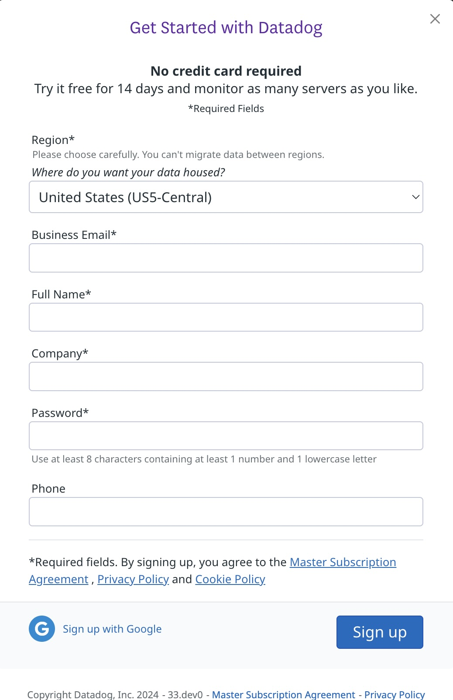
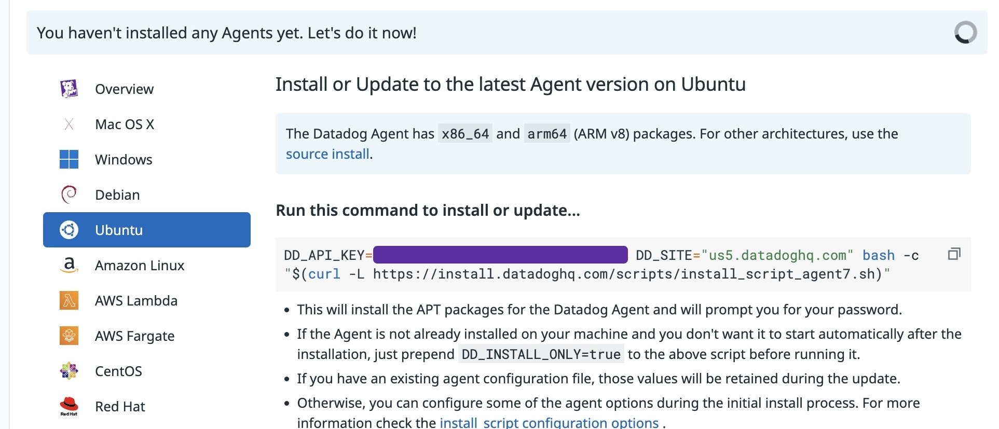
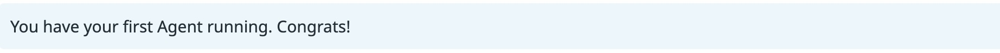
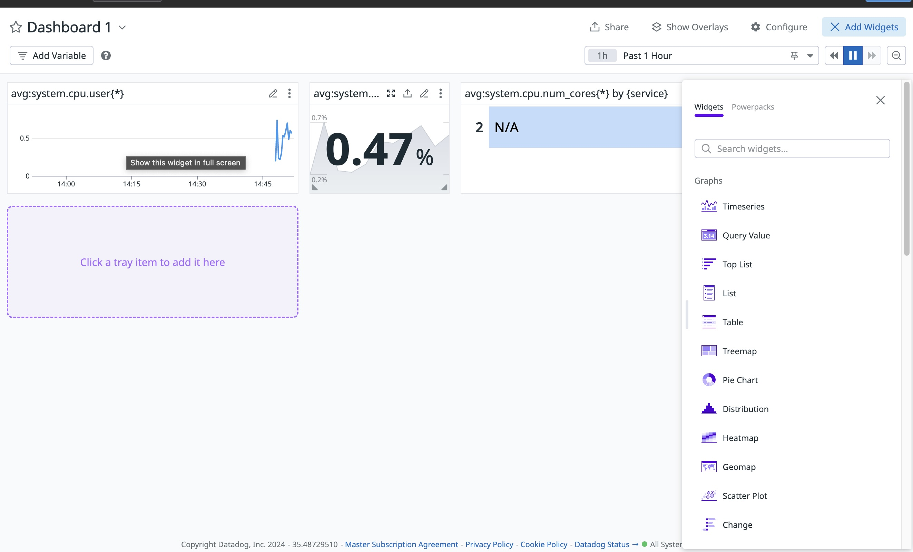
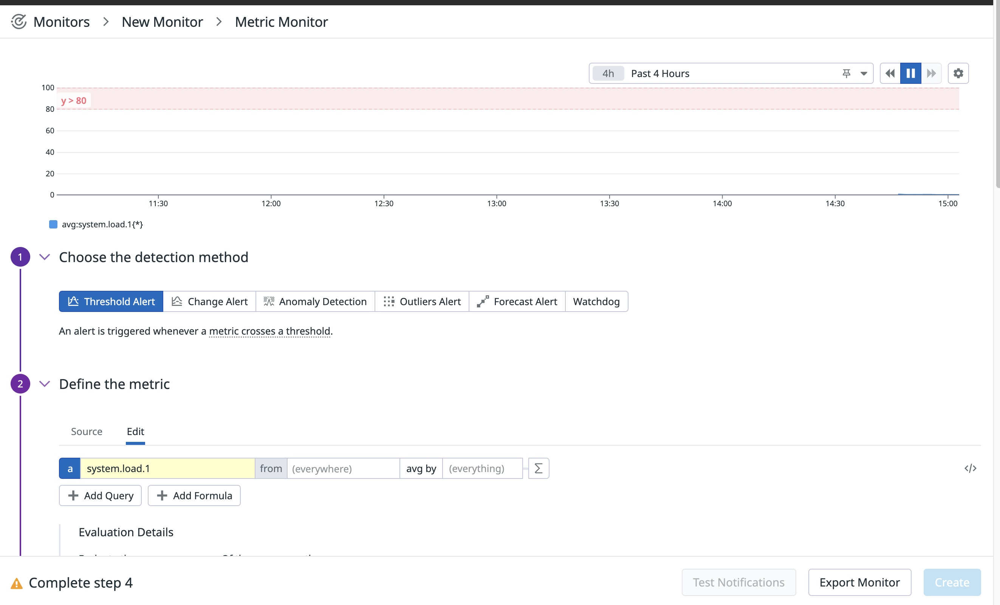

# Running datadog on Openstack-Flex

As a user we need the ability to monitor servers deployed within a project. This is where datadog comes in. With monitoring services able to automatically register nodes, provide system level metrics, and allow users to create dashboards and alerts.

<!-- more -->

{ align=left }

### Creating our Openstack-Flex Server

First we are going to create our Flex router.

``` shell
openstack  --os-cloud {cloud_name} router create flex-router
```

Second we are we wil create our flex network

``` shell
openstack  --os-cloud {cloud_name} network create flex-network
```

Next we are going to set our router's external gateway to PUBLICNET to grant access to the internet.

``` shell
openstack  --os-cloud {cloud_name} router set --external-gateway PUBLICNET flex-router
```

Now we are going to set up our subnet, you can choose between ipv4 and ipv6. The ip range is also up to you. For the DNS name server you will need to ping cachens1.sjc3.rackspace.com and cachens2.sjc3.rackspace.com.

``` shell
ping cachens1.sjc3.rackspace.com -c2
ping cachens2.sjc3.rackspace.com -c2

openstack  --os-cloud {cloud_name} subnet create --ip-version 4 --subnet-range 172.18.107.0/24 --dns-nameserver 216.109.154.188 --dns-nameserver 216.109.154.189 --network flex-network flex-subnet
```

Connect the subnet to our flex-router.

``` shell
openstack --os-cloud {cloud_name} router add subnet flex-router flex-subnet
```

Now we need to create our security group, this is the group which specify the network access rules. For our example we are only going to allow SSH access.

``` shell
openstack --os-cloud {cloud_name} security group create flex-sg
```

``` shell
openstack --os-cloud {cloud_name} security group rule create --ingress --remote-ip 0.0.0.0/0 --dst-port 22 --protocol tcp flex-sg
```

Now we need to create our floating ip.

!!! note

    Save this ip for later we will need to connect it to our server.

``` shell
openstack --os-cloud {cloud_name} floating ip create --subnet PUBLICNET_SUBNET PUBLICNET
```

Now we are going to create our Public and Private ssh keys so we can securely connect to our server. I am naming my key flex-key

``` shell
ssh-keygen
```
This will prompt you store and name your private key. I did something like this /home/{username}/.ssh/flex-key.

After that we will create our public key using the command below then we will assign it using the openstack cli tools.

``` shell
ssh-keygen -f ~/.ssh/flex-key -y > ~/.ssh/flex-key.pub
openstack —os-cloud {cloud_name} keypair create --public-key ~/.ssh/flex-key.pub flex-key
```

Now we create our server! This should include the flavor you'd like to use, the image, memory, network, key-name, and security group for this example.

``` shell
 openstack --os-cloud {cloud_name} server create --flavor m1.medium --image Ubuntu-22.04 --boot-from-volume 40 --network flex-network --key-name flex-key --security-group flex-sg flex-server
```

Assigning our floating ip. We can do this by adding it to our port for the server. If you get the fixed ip from our newly create server you can find the port ID by searching through the port list. You should also have the floating Ip that we noted before.

``` shell
openstack --os-cloud {cloud_name} port list
openstack --os-cloud {cloud_name} floating ip set --port {port id} {floating-ip}
```

SSH into your new Server!

``` shell
ssh -i ~/.ssh/flex-key ubuntu@{floating-ip}
```

## Deploying Datadog on our Openstack-Flex server

The first thing you are going to need to do is visit https://www.datadoghq.com/. There you can click on their free trial link. It will give you a window that looks like this:



Next we will need to run the code provided for you on this page. My server is running ubuntu, thus I chose the ubuntu option. 

On the top of the page you can see a message saying "You haven't installed any Agents yet. Let's do it now!". At the end of the line there a status icon that will change when it installed. As seen below:



After the agent installed the message will update to this:



Now is where the fun begins! You can make monitors, dashboards and alerts within the datadog GUI. Here are a few examples.

In this dashboard example, you can see cpu usage, number of cpu cores and it can do much more.



In this monitor example, we are looking at system load, I have set up an alert to be sent out if it gets above 80%. You can set this to any value and have the alerts sent many different ways.



## Conclusion

One of the most important things is the ability to monitor all the different aspects of our server. Datadog allows us to do this, with dashboards, monitors, alerts, and more. It may be something that you or your company may want to investigate to see if this would work for your product. 
