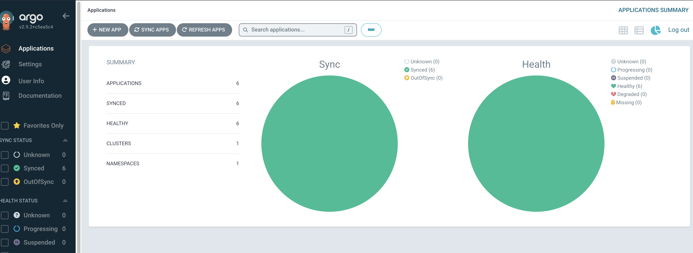

# Deploying and Managing Managed Services in a Kubernetes Cluster Using GitOps Principles

This method enables you to deploy and manage any managed service in a Kubernetes cluster while adhering to GitOps principles. By treating version control as the single source of truth, you ensure that all changes to the managed services are user-controlled, auditable, and traceable. 

Sensitive information, such as credentials and private keys, is securely masked using sealed-secrets and helm-secrets, allowing you to safely push the configuration to a Git repository. 

With this approach, even if you want to deploy any managed service using Kubernetes manifest files(i.e., not managed by Helm), you can encrypt the Kubernetes Secret resources using sealed-secrets to ensure sensitive data remains secure.

<!-- more -->

## Prerequisites

Before proceeding with the steps outlined in this guide, ensure the following prerequisites are met: 

- **Kubernetes Cluster**: A functional Kubernetes cluster is required with necessary access to deploy resources. 
- **kubectl Installed**: The Kubernetes command-line tool, kubectl, must be installed and configured to interact with the cluster. [Download kubectl](https://kubernetes.io/docs/tasks/tools/)
- **Helm Installed**: Helm CLI must be installed. [Download Helm](https://helm.sh/docs/intro/install/)
- **Kubeseal**: Kubeseal should be installed to encrypt sensitive data. [Download](https://github.com/bitnami-labs/sealed-secrets)
- **Git Repository**: A version control system like Git must be set up for storing and managing the configuration files. 
- **age-keygen**: The age-keygen tool is required to generate encryption keys for SOPS. [Download age](https://github.com/FiloSottile/age) 
- **SOPS**: Install SOPS to encrypt and decrypt secrets files. [Download SOPS](https://github.com/mozilla/sops)

## Example: Onboarding Managed Services in a Kubernetes Cluster

### List of Managed Services

The following managed services will be deployed as part of this example: 

- Metallb
- ingress-nginx
- sealed-secrets
- cert-manager
- ArgoCD
- Kyverno

### Git Repository

A Git repository is used to store the configuration files of managed services:

Github URL: [https://github.com/pratik705/716093-lab1](https://github.com/pratik705/716093-lab1)  

``` shell
git remote -v 
origin	https://github.com/pratik705/716093-lab1.git (fetch) 
origin	https://github.com/pratik705/716093-lab1.git (push) 
```

### Directory Structure

The directory structure for storing service files is as follows:

```
tree . 
. 
├── README.md 
├── argocd-apps 
│   ├── cert-manager.yaml 
│   ├── ingress-nginx.yaml 
│   ├── metallb.yaml 
│   ├── namespace.yaml 
│   └── sealed-secret.yaml 
└── managed-services 
    ├── README.md 
    ├── argocd 
    │   ├── README.md 
    │   ├── helm-secrets-private-keys.yaml 
    │   ├── kustomization.yaml 
    │   ├── values.yaml 
    └── prerequisite 
        ├── cert-manager 
        │   ├── README.md 
        │   ├── kustomization.yaml 
        │   ├── rackspace-ca-issuer.yaml 
        │   ├── rackspace-selfsigned-ca.yaml 
        │   ├── rackspace-selfsigned-issuer.yaml 
        │   └── values.yaml 
        ├── ingress-nginx 
        │   ├── README.md 
        │   ├── kustomization.yaml 
        │   └── values.yaml 
        ├── install.sh 
        ├── kustomization.yaml 
        ├── metallb 
        │   ├── ipaddresspool.yaml 
        │   ├── kustomization.yaml 
        │   ├── l2advertisement.yaml 
        │   └── values.yaml 
        ├── namespace 
        │   ├── README.md 
        │   ├── kustomization.yaml 
        │   └── namespace.yaml 
        └── sealed-secret 
            ├── README.md 
            ├── kustomization.yaml 
            └── values.yaml 
```

## Step-by-Step Guide

### 1. Deploying Prerequisite Services

- Change into the prerequisites directory and execute the installation script:

``` shell
cd managed-services/prerequisite/ 
sh install.sh
```

#### Sample Output

- Install the prerequisite services:

``` shell
sh install.sh 

[...] 
All resources installed successfully. 
```

- Validate the deployment using:

``` shell
kubectl get pod -n rackspace-system 
NAME                                                 READY   STATUS      RESTARTS   AGE 
cert-manager-rackspace-9cf649bd-fnwgc                1/1     Running     0          79s 
cert-manager-rackspace-9cf649bd-zjxwr                1/1     Running     0          79s 
cert-manager-rackspace-cainjector-677f7cf4f7-97pxs   1/1     Running     0          79s 
cert-manager-rackspace-webhook-74dffb4777-h7lcz      1/1     Running     0          79s 
ingress-nginx-controller-6cff866dd7-w7w4s            1/1     Running     0          79s 
sealed-secrets-745679794d-dgj7m                      1/1     Running     0          78s 
```

- Check metallb-system pods:

``` shell
kubectl get pod -n metallb-system 
NAME                                  READY   STATUS    RESTARTS   AGE 
metallb-controller-7fd955f9dd-7j44x   1/1     Running   0          116s 
metallb-speaker-7klvk                 4/4     Running   0          115s 
metallb-speaker-qjnh5                 4/4     Running   0          115s 
```

- Check ingress class:

``` shell
kubectl get ingressclass 
NAME              CONTROLLER                       PARAMETERS   AGE 
rackspace-nginx   k8s.io/rackspace-ingress-nginx   <none>       m45s 
```

### 2. Backing Up Sealed Secrets Key

Backup the sealed-secrets key to restore encrypted resources when required:

``` shell
kubectl get secret -n rackspace-system -l sealedsecrets.bitnami.com/sealed-secrets-key=active -o yaml > sealed-secrets-key.yaml 
```

### 3. Encrypting Sensitive Information

- To encrypt the helm-secrets private key file:

``` shell
cd managed-services/argocd/ 
kubectl -n rackspace-system create secret generic helm-secrets-private-keys --from-file=key.txt=/root/.config/sops/age/keys.txt -o yaml --dry-run > helm-secrets-private-keys.yaml 
```

- Encrypt the file using kubeseal:

``` shell
kubeseal --scope cluster-wide --allow-empty-data -o yaml --controller-namespace rackspace-system --controller-name sealed-secrets < helm-secrets-private-keys.yaml > encrypted_helm-secrets-private-keys.yaml 
```

#### Sample Output

- The content of `encrypted_helm-secrets-private-keys.yaml`

``` shell
# cd managed-services/argocd/ 
# ls 
README.md  encrypted_helm-secrets-private-keys.yaml  helm-secrets-private-keys.yaml  kustomization.yaml  values.yaml 
# cat encrypted_helm-secrets-private-keys.yaml 
--- 
apiVersion: bitnami.com/v1alpha1 
kind: SealedSecret 
metadata: 
  annotations: 
    sealedsecrets.bitnami.com/cluster-wide: "true" 
  creationTimestamp: null 
  name: helm-secrets-private-keys 
  namespace: rackspace-system 
spec: 
  encryptedData: 
    key.txt: AgDh+gKEQUmbYRLcdFfwqEq3jDvI47VWxnWq9WqU61MY+QIqwMEWm4Hm0OBM+uYxpck4uNXg/Eyr9gXieCvDY+Og7l8ZjRHXs9KBteH6yGLI7Rf6LyFO+OqDrx7OHnfjEdyBtVSGVO2S5ZgCEk57JWWFK4/mnwYBo8S1oj4Nb2JCLyLiamtFZ3SbWeCQdSlbauaLvTK02fffn8onhaBezdOkguSQqLfD8J1JgmiIKCQk3cn4jcLzaz/CSmYCIPxhhPGXSLeMKjTjZoY2CWgs5281oP+7KuPL9C+GRKYFa6kvBDQi7kzgq4D0pDznLE/H56dhSGFbRq77qrV0x2PLOa6ElCWcwI6YCx93mCcr2TarEGYQ5gybBtTw3m7d6Z9HUMU/qtBCTnRXGC/N5ZsZoKr+3Tfva9xPMk/pR4BpVHrsb4tFbBOjeEHfaC2wI+fzSVqIQUc2f7qUMu9VExO1hHtHh5b4ez8lZDWMi4CkMpW2W3ZkKQFeK/R++CfT481+g7TEqNbKXVgWpT94jDpULtj8WIrHWDLxkXIW4lj8DQPnCjePgGu+P4m9GAo3jFZtaY3g0qMj+Dj+t0eMcfFSzeQWLhM5vSwEIgSo5OHbyhSw0KXyUbgpwrLa9dPj+ltCVIlcNnFYf0k+hT/Sr5YkbhoV09CWBpfcFw+8PZgOU5sV8s0X9Y60ZHX40x6kL8PQWelmiOv07c16lxTZlNdVBhq+qgcvKw+lSkAvxJ3pZl2NL+g72w7HOxr29zkoKm7c52PgrlDTmTIAuCJd1pCG0D4LK5vKWjUNkbzYCFpxS8LMCRZVkpPv0mp9rZh8KxvSthhgWD5Gt+WT/OBB7j78V6qBaCB4UGPFyFmbVZtH+XDn9qYSTLbmO0ilnF++40OqIPkbcN7AjtgBUtWUbdNYCNQevTCnsJd764dLBgV8/8oZiEb1xYPpVZjC 
  template: 
    metadata: 
      annotations: 
        sealedsecrets.bitnami.com/cluster-wide: "true" 
      creationTimestamp: null 
      name: helm-secrets-private-keys 
      namespace: rackspace-system 
```

### 4. Installing ArgoCD

- Deploy ArgoCD:

``` shell
cd managed-services/argocd
kubectl kustomize . --enable-helm | kubectl apply -f - 
```

- Verify the deployment:

``` shell
kubectl get pod -n rackspace-system | egrep -i argocd 
```

#### Sample Output

- List the argoCD resources:

``` shell
kubectl get pod -n rackspace-system | egrep -i argocd 
argocd-application-controller-0                      1/1     Running   0          3h58m 
argocd-applicationset-controller-744f9c6bbb-d88jv    1/1     Running   0          3h58m 
argocd-applicationset-controller-744f9c6bbb-x482w    1/1     Running   0          3h58m 
argocd-dex-server-67b459b5d4-vzkw4                   1/1     Running   0          3h58m 
argocd-notifications-controller-59985b9998-kdjmf     1/1     Running   0          3h58m 
argocd-redis-5c57699668-jvz46                        1/1     Running   0          3h58m 
argocd-repo-server-6d7c8786cf-pnvc2                  1/1     Running   0          3h57m 
argocd-repo-server-6d7c8786cf-wb92p                  1/1     Running   0          3h58m 
argocd-server-5c4b6fdf87-6n8wk                       1/1     Running   0          3h57m 
argocd-server-5c4b6fdf87-fx57l                       1/1     Running   0          3h58m 
```

### 5. Managing Applications with ArgoCD

- Log in to ArgoCD and add the managed-services Git repository:

``` shell
argocd login argocd-lab1.demo.mk8s.net 
```

- Apply the application manifests:

``` shell
cd argocd-apps
kubectl apply -f argocd-apps/namespace.yaml 
kubectl apply -f argocd-apps/metallb.yaml 
kubectl apply -f argocd-apps/ingress-nginx.yaml 
kubectl apply -f argocd-apps/sealed-secret.yaml 
kubectl apply -f argocd-apps/cert-manager.yaml 
```

- List the ArgoCD applications:

``` shell
argocd app list 
```

#### Sample Output

- Login to argoCD and change to the directory where argoCD application manifests are stored

``` shell
# argocd login argocd-lab1.demo.mk8s.net 
WARNING: server certificate had error: tls: failed to verify certificate: x509: certificate signed by unknown authority. Proceed insecurely (y/n)? y 
WARN[0001] Failed to invoke grpc call. Use flag --grpc-web in grpc calls. To avoid this warning message, use flag --grpc-web. 
Username: admin 
Password: 
'admin:login' logged in successfully 
Context 'argocd-lab1.demo.mk8s.net' updated 
 
# cd argocd-apps/ 
# ls 
cert-manager.yaml  ingress-nginx.yaml  metallb.yaml  namespace.yaml  sealed-secret.yaml 
```

- Apply the argoCD application manifest files

``` shell
# kubectl apply -f namespace.yaml 
application.argoproj.io/namespace created 
# kubectl apply -f metallb.yaml 
application.argoproj.io/metallb created 
# kubectl apply -f ingress-nginx.yaml 
application.argoproj.io/ingress-nginx created 
# kubectl apply -f sealed-secret.yaml 
application.argoproj.io/sealed-secret created 
# kubectl apply -f cert-manager.yaml 
application.argoproj.io/cert-manager created 
```

- List the installed applications

``` shell
# argocd app list 
WARN[0000] Failed to invoke grpc call. Use flag --grpc-web in grpc calls. To avoid this warning message, use flag --grpc-web. 
NAME                            CLUSTER                         NAMESPACE         PROJECT  STATUS  HEALTH   SYNCPOLICY  CONDITIONS  REPO                                       PATH                                         TARGET 
rackspace-system/cert-manager   https://kubernetes.default.svc  rackspace-system  default  Synced  Healthy  Auto        <none>      git@github.com:pratik705/716093-lab1.git  managed-services/prerequisite/cert-manager   main 
rackspace-system/ingress-nginx  https://kubernetes.default.svc  rackspace-system  default  Synced  Healthy  Auto        <none>      git@github.com:pratik705/716093-lab1.git  managed-services/prerequisite/ingress-nginx  main 
rackspace-system/metallb        https://kubernetes.default.svc  rackspace-system  default  Synced  Healthy  Auto        <none>      git@github.com:pratik705/716093-lab1.git  managed-services/prerequisite/metallb        main 
rackspace-system/namespace      https://kubernetes.default.svc  rackspace-system  default  Synced  Healthy  Auto        <none>      git@github.com:pratik705/716093-lab1.git  managed-services/prerequisite/namespace      HEAD 
rackspace-system/sealed-secret  https://kubernetes.default.svc  rackspace-system  default  Synced  Healthy  Auto        <none>      git@github.com:pratik705/716093-lab1.git  managed-services/prerequisite/sealed-secret  main 
```

- Screenshot from the ArgoCD UI




---

## Adding a New Managed Service

To onboard a new service like Kyverno, follow these steps: 

- Create a directory for the service and define the values.yaml file.
- Encrypt the file using helm secrets:

``` shell
helm secrets encrypt values.yaml > values.yaml.enc 
```

- Define the ArgoCD application in argocd-apps/kyverno.yaml. 
- Apply the configuration:

``` shell
kubectl apply -f argocd-apps/kyverno.yaml 
```

### Sample Output

- In this example, I am going to deploy kyverno.
- I will create a directory for kyverno and make the required changes to values.yaml.

``` shell
# ls managed-services/kyverno/ 
values.yaml 
```

- Further I will encrypt it using `helm secrets`:

``` shell
# helm secrets encrypt values.yaml > values.yaml.enc 
```

- Define argoCD application:

``` shell
# cat argocd-apps/kyverno.yaml 
apiVersion: argoproj.io/v1alpha1 
kind: Application 
metadata: 
 name: kyverno 
 namespace: rackspace-system 
spec: 
 project: default 
 syncPolicy: 
   syncOptions: 
   - ServerSideApply=false 
   automated: 
     selfHeal: true 
     prune: false 
 sources: 
   - chart: kyverno 
     repoURL: https://kyverno.github.io/kyverno/ 
     targetRevision: 3.3.4 
     helm: 
       releaseName: kyverno 
       valueFiles: 
         - $values/managed-services/kyverno/values.yaml.enc 
   - repoURL: git@github.com:pratik705/716093-lab1.git 
     targetRevision: main 
     ref: values 
   - repoURL: git@github.com:pratik705/716093-lab1.git 
     targetRevision: main 
     path: managed-services/kyverno/ 
 destination: 
   server: "https://kubernetes.default.svc" 
   namespace: rackspace-system  
```

- Apply the argoCD application manifest:

``` shell
# kubectl apply -f argocd-apps/kyverno.yaml 
```

- Validate if kyverno is deployed in the cluster:

``` shell
# kubectl get pod -n rackspace-system |egrep -i kyverno 
kyverno-admission-controller-58789747bb-8jxwq        1/1     Running   0          29s 
kyverno-background-controller-786cd6465-hnx4h        1/1     Running   0          29s 
kyverno-cleanup-controller-64f48ddd6d-wdqdd          1/1     Running   0          29s 
kyverno-reports-controller-5664c4675d-qtm2d          1/1     Running   0          29s 
```

- Encrypted `values.yaml`:

---

## Making Changes to Existing Services

- Edit the encrypted values file:

``` shell
helm secrets edit managed-services/kyverno/values.yaml.enc 
```

- Commit and push the changes to the Git repository:

``` shell
git commit -am "Updated Kyverno configuration" 
git push 
```

### Sample Output

- Here I have updated replicas of `kyverno-admission-controller` to `3`

``` shell
helm secret edit managed-services/kyverno/values.yaml.enc 
[...] 
   replicas: 3 
[...] 
```

- Push the change to Git repository 
``` shell
# git status -s 
M  managed-services/kyverno/values.yaml.enc 
 
# git commit 
# git push 
```

- Validate if the changes have been deployed in the cluster:

``` shell
# argocd app list 
NAME                            CLUSTER                         NAMESPACE         PROJECT  STATUS  HEALTH       SYNCPOLICY  CONDITIONS  REPO                                       PATH                                         TARGET 
[...] 
rackspace-system/kyverno        https://kubernetes.default.svc  rackspace-system  default  Synced  Progressing  Auto        <none>      https://kyverno.github.io/kyverno/                                                      3.3.4 
[...] 
 
# kubectl get pod -n rackspace-system |egrep -i kyverno-admi 
kyverno-admission-controller-58789747bb-c78cx        1/1     Running     0          81s 
kyverno-admission-controller-58789747bb-gq54g        1/1     Running     0          13m 
kyverno-admission-controller-58789747bb-w2c4g        1/1     Running     0          81s 
```

---

## Deleting a Managed Service

- To remove a service:

``` shell
argocd app delete kyverno 
```

- Verify that the service has been removed:
``` shell
kubectl get pod -n rackspace-system | egrep -i kyverno 
```

### Sample Output

- Delete the Kyverno application:

``` shell
# argocd app delete kyverno 
WARN[0000] Failed to invoke grpc call. Use flag --grpc-web in grpc calls. To avoid this warning message, use flag --grpc-web. 
Are you sure you want to delete 'kyverno' and all its resources? [y/n] y 
application 'kyverno' deleted 
```

- Validate if the Kyerno application have been removed:

``` shell
# kubectl get pod -n rackspace-system |egrep -i kyverno 
```

---

# Conclusion

This comprehensive guide demonstrates how to deploy and manage managed services in a Kubernetes cluster while adhering to GitOps principles. By leveraging tools like sealed-secrets, helm-secrets, age-keygen, and SOPS, sensitive information can be securely encrypted and stored in a version control system. The integration with ArgoCD simplifies application lifecycle management, ensuring deployments are reproducible and auditable.

Additionally, this approach is versatile, allowing the deployment of managed services using either Helm charts or Kubernetes manifest files. By following these steps, you can establish a secure, automated, and scalable workflow for managing your Kubernetes environment. If you have further questions or need assistance, feel free to reach out!

# References

- [Helm Secrets](https://github.com/jkroepke/helm-secrets)
- [Sealed-Secrets Documentation](https://github.com/bitnami-labs/sealed-secrets)
- [Fortify Your Kubernetes Clusters: Encrypting Secrets with Sealed-Secrets](https://blog.rackspacecloud.com/blog/2024/07/05/fortify_your_kubernetes_clusters_-_encrypting_secrets_with_sealed-secrets/)
- [age-keygen and Age Encryption](https://github.com/FiloSottile/age)
- [SOPS Documentation](https://github.com/getsops/sops)