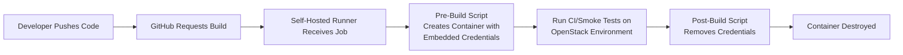

# Accelerated Genestack Smoke Testing via Self-Hosted GitHub Runners on Rackspace

**Face it**: The modern DevOps world is all about speed, security, and not forgetting to have a healthy dose of cynicism about manual processes. Because manual is so last decade, am I right? This post proudly showcases how to use a **GitHub self-hosted runner** to spin up and smoke test a Genestack (OpenStack) deployment by Rackspace. If you don’t finish the entire process in under 20 minutes, you might as well go brew another pot of coffee, or question your life choices.

<!-- more -->

## Overview

The hyperconverged lab script and ephemeral container approach let you conjure up blazing-fast OpenStack deployments, so you can test and iterate faster than your boss can ask for a status update.

### Infrastructure

- A **Rackspace OpenStack** instance running the flavor `gp.0.4.4` (4 vCPUs, 4 GiB RAM, so you can, you know, actually do something) hosts the GitHub self-hosted runner.
- This instance runs Docker.
- Within the instance a local registry is used to store built images.
- The runner service is configured to **always require a container** when picking up build jobs, because letting code run freely on your box is such a 2008 move.

### Deployment Workflow

- A hyperconverged lab deployment script launches a **3-node Kubernetes cluster** (because “Why not? We have the compute, let’s break it properly!”).
- OpenStack is then layered **on top of** this cluster in just under **20 minutes**, just enough time to watch half of a Netflix episode.
- The self-hosted runner, triggered by GitHub Actions, kicks off a **pre-build script** that injects application credentials (magically stored in a Docker image).
- After the job completes, a **post-build script** politely removes any trace of said credentials (think CIA-level cleanup).

### Security Advantage

The container ensures job isolation, much like a moody teenager demanding solitude in their room. Meanwhile, the ephemeral approach keeps credentials from floating around indefinitely on your runner, effectively telling would-be hackers, “Good luck!” Finally, application credentials are short-lived and embedded in the container only for the duration of the job, disappearing faster than your attention span right after lunch.

All of this brilliance? It’s running **Genestack Labs** on **Rackspace OpenStack Flex**, which is basically the ultimate playground for testing the **Rackspace OpenStack deployment tool, Genestack**. Because if you’re going to build a product that orchestrates the cloud, you might as well test it in the most flexible environment possible. This entire toolchain is **community available** and can scale up at the drop of a hat, highlighting not only the **speed** of Genestack Cloud but also its general **“I can do that too”** attitude.

## High-Level Process



### Developer Pushes Code

A commit or pull request triggers GitHub Actions, and your organization collectively wonders if you bothered to test locally (we both know you didn’t). Despite those second thoughts, the pipeline springs into action as soon as your code hits the remote repository.

### GitHub Requests Build

Next, the GitHub Actions workflow eagerly demands its pound of flesh. It processes the event and prepares to spin up your CI environment, because nothing says “continuous integration” like an automated system waiting to hold you accountable for any coding sins.

### Self-Hosted Runner Receives Job

Our fearless champion—the self-hosted runner living on the `gp.0.4.4` instance—picks up the job, hopefully not in the middle of the night. This runner stands ready to do your bidding, so long as you’ve kept it caffeinated and updated.

### Pre-Build Script

Before the job spins into action, a **container** is created to house the process. This container environment has application credentials injected like top-secret sauce, ensuring that everything is kept neat, tidy, and very much isolated. Think of it as a private sandbox where your job can do its thing without mucking up the rest of the system.

### Run CI/Smoke Tests

At this stage, the scripts spin up (or interact with) the existing OpenStack environment. The hyperconverged lab deployment script orchestrates a 3-node Kubernetes cluster and casually slaps OpenStack on top, merging these powerhouses into one glorious stack of modern infrastructure.

### Post-Build Script

Once the tests have run their course, the post-build script removes the credentials with ruthless efficiency, leaving behind only fond memories (or bitter ones, depending on the test results). If any ephemeral resources need clearing out, they’re disposed of here, ensuring you don’t have to explain away stray artifacts on tomorrow’s stand-up call.

### Container Destroyed

Finally, the container is destroyed without a trace, a swift farewell unlike your internet history, which is never truly forgotten. With the container gone, your job’s environment remains as ephemeral as its credentials—here one minute, gone the next.

## Dockerfile for the Build Environment

Now, let’s talk Docker, because it’s 2025 and containers are still the best thing since sliced bread. The **pre-build script** uses the following Dockerfile as the ephemeral runtime. We base it on [`quay.io/rackspace/rackerlabs-heat:2024.1-ubuntu_jammy`](https://quay.io/repository/rackspace/rackerlabs-heat?tab=tags), because who doesn’t love a specialized Rackspace image, and cram it full of necessary goodies like `rsync`, `ssh`, `jq`, and the OpenStack command line clients.

``` dockerfile
FROM quay.io/rackspace/rackerlabs-heat:2024.1-ubuntu_jammy

RUN apt update && apt install -y rsync ssh
RUN wget https://github.com/jqlang/jq/releases/download/jq-1.7.1/jq-linux-amd64 \
    && mv jq-linux-amd64 /usr/local/bin/jq \
    && chmod +x /usr/local/bin/jq

RUN pip install python-openstackclient python-neutronclient -U
RUN mkdir -p /etc/openstack /github/home/.ssh

ENV OS_CLOUD=default
ENV OS_FLAVOR=gp.5.8.16

COPY .config/openstack/clouds.yaml /etc/openstack/clouds.yaml
```

A quick breakdown for those who love reading Dockerfiles in the morning more than cereal:

1. **Docker Base Image**: Possibly the only place “heat” and “ubuntu_jammy” collide without starting a Reddit flame war.
2. **Additional Tools**: Installs `rsync`, `ssh`, and `jq`, because we like being prepared for those “it’s never going to happen” tasks.
3. **OpenStack Clients**: Python-based clients for your cloudy business.
4. **Configuration**:
   - `OS_CLOUD=default` references your new best friend, `/etc/openstack/clouds.yaml`.
   - `OS_FLAVOR=gp.5.8.16` sets a default flavor, so you never have to (gasp) type a flavor by hand.

## Configuring the GitHub Runner as a Service

Our beloved self-hosted runner is a system service that needs a little environment variable sprinkle. This environment variable is stored at `/etc/systemd/system/actions.runner.rackerlabs-genestack.genestack-ci.service.d/override.conf` and is set to require a container for every job.

``` conf
[Service]
Environment=ACTIONS_RUNNER_REQUIRE_JOB_CONTAINER=true
```

**Translation**: Every job must run in its own container, presumably to keep your main system from looking like a war-torn battlefield of random scripts and ephemeral credentials. Once set, the runner automatically spawns and kills containers so you can rest easy, even if your code tries to do something insane.

## Putting It All Together

1. **Trigger**: Developer creates a pull request to test some incredible change that will make all of the deployed services faster, better, more reliable.
2. **Automation**: GitHub Actions triggers the workflow, and the self-hosted runner attempts to do your bidding.
3. **Deployment**: In an ephemeral container, the hyperconverged lab script sets up Kubernetes and installs OpenStack, because containers within containers is apparently how we do things now.
4. **Test**: Smoke tests confirm that yes, your code is somewhat stable (or fails spectacularly).
5. **Cleanup**: Post-build script zaps your credentials like they never existed, unlike your guilt after that last production bug.

**Result**: A repeatable, scalable approach that keeps your secrets ephemeral and your code runs contained. And yes, you can deploy Genestack on Kubernetes in **under 20 minutes**, if you didn’t deviate to check your socials.

### Key takeaways

#### Faster CI

Containerized runs offer a near-magical speed boost for your build and test cycles, ensuring that even the most impatient developer can see results without wearing out their “refresh” key. However, it’s important to keep in mind that your Docker setup is only as fast as the network driving it. In other words, no amount of container wizardry can compensate for an anemic internet connection. When properly configured, though, these ephemeral containers can drastically reduce build times and maintain consistency across runs, making slow pipelines feel like a relic of the past.

#### Stronger Security

By embracing an ephemeral container model, you automatically minimize the risk of leaving sensitive credentials floating around like tumbleweeds in a wild, ungoverned environment. Because these credentials are injected into each container and vanish once the job completes, your runner won’t become a graveyard of secrets waiting to be exploited. This approach also isolates builds from one another, preventing a compromised process from leaking data into subsequent jobs. The result is a more disciplined, controlled CI process where each container is its own self-contained fortress.

#### Scalable Architecture

In a world where your customers demand ever-increasing performance and features, the flexibility to scale your testing and deployment environments is non-negotiable. Thankfully, containerization makes it simple to spin up additional instances on more powerful infrastructure—or more of the same—without rewriting your entire toolchain. As your workloads expand and your ambitions grow, this architecture ensures that your pipeline can adapt on the fly. Instead of laboriously re-engineering your CI/CD pipeline, you can simply adjust resource allocations, add more runners, or even replicate the setup across different geographic locations.

#### Stop Merging Broken Code

No one wants to spend hours tracking down the source of an epic production meltdown that could have been caught by a simple smoke test. With a reliable self-hosted runner constantly waiting to run your code through the gauntlet, you can say goodbye to merging half-baked, bug-ridden commits into critical branches. By setting up robust automated checks, you’ll keep your codebase healthy, your teammates happy, and your release cycles humming—because there’s nothing more satisfying than squashing bugs before your customers ever notice them.

## Conclusion

By leveraging **self-hosted runners** and **ephemeral containers**, we orchestrate and smoke-test a full Genestack deployment on top of Kubernetes in record time, less time than it takes your product manager to write another JIRA ticket.

Enjoy your accelerated test workflows, and remember: **It’s not production until everything breaks at least once.**

Happy coding!
