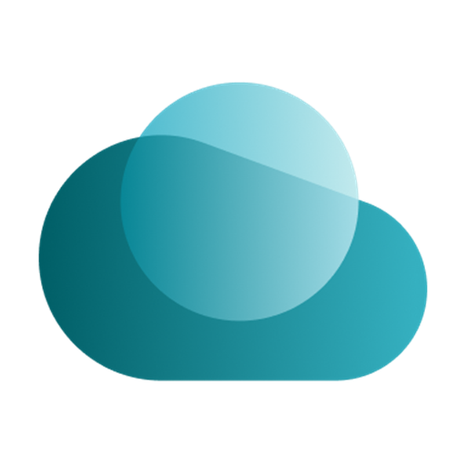
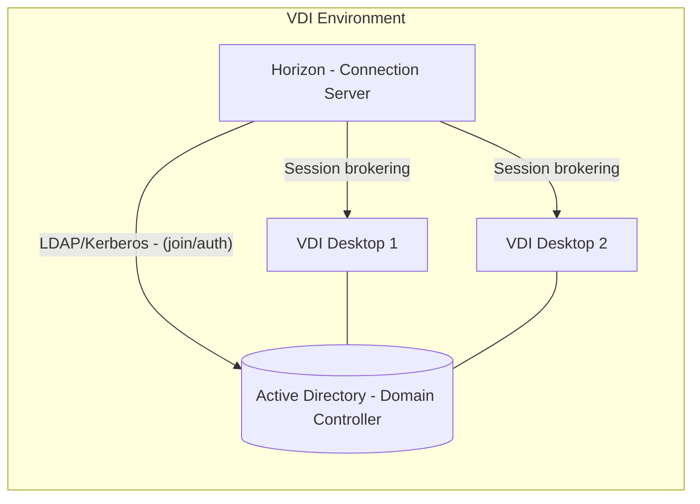
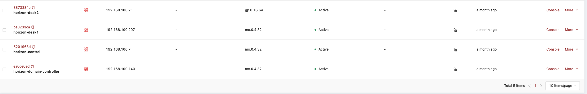
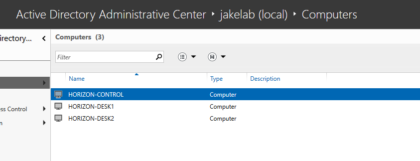
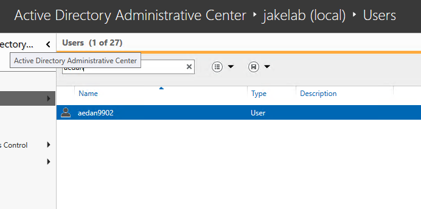
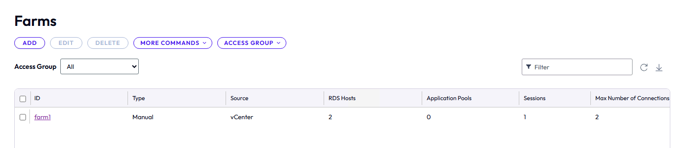
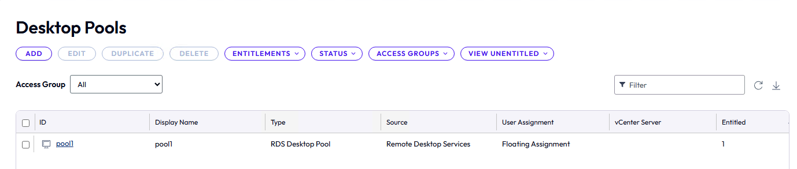
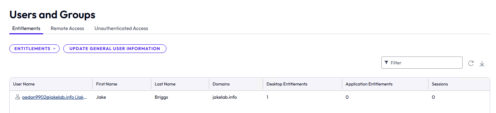
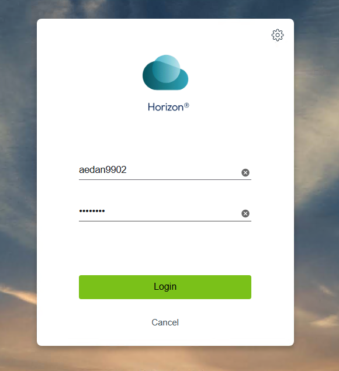
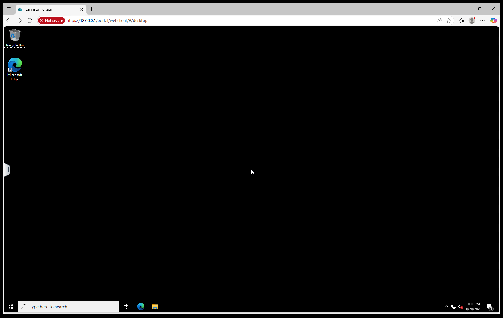

# Deploying Horizon 8 with Manual Pools and Farms on Rackspace OpenStack

{ align=left : style="max-width:125px" }

With the recent introduction of manual pools and farms in Horizon 8, organizations can now leverage infrastructure platforms not natively supported for automated pool provisioning. This blog post details a real-world deployment using manual pools and farms running on OpenStack and was inspired by the blog post "[Horizon 8 with manual pools and farms – using alternative hypervisors](https://community.omnissa.com/technical-blog/horizon-8-with-manual-pools-and-farms-using-alternative-hypervisors-r144)," written by Omnissa, which introduced how their incredible VDI solution can be leveraged on non-proprietary platforms.

<!-- more -->

## Introduction

Organizations often seek to leverage infrastructure platforms not natively supported by Horizon 8 for automated pool provisioning. By using manual pools and farms, Horizon 8 can broker end users to workloads on any platform, such as OpenStack with KVM hypervisors, ensuring a consistent user experience. This blog post details a real-world deployment using manual pools and farms on OpenStack.

## Manual Pools and Farms Overview

Manual desktop pools and farms in Horizon 8 involve workloads provisioned outside the platform, which are then registered and brokered to end users. Unlike automated pools that manage provisioning and lifecycle, manual pools are suited for persistent workloads, as non-persistent VMs require additional management not supported in manual configurations. This approach supports various platforms, including OpenStack, and delivers core Horizon 8 features like entitlement, brokering, and user experience.

Normally a Horizon 8 pod must be deployed on a supported hypervisor (e.g., vSphere, or Amazon EC2), but because we believe in the power of open-infrastructure and the strength of a non-vendor locked ecosystem we're running this deployment using OpenStack, and we're doing it for all workloads.

## Deployment Process

For this environment we're using four Windows virtual machines (VMs) deployed on Rackspace OpenStack Flex. One instance is configured as an Active Directory (AD) domain controller, one as the Horizon Connection Server, and two as VDI desktops.

### Step 1: Set Up the Virtual Machines

**Provision VMs**: Create four Windows VMs on OpenStack.

**Configure Domain Controller**: On the first VM, install Active Directory Domain Services (AD DS) and configure it as the domain controller for a new AD domain (e.g., yourdomain.local).

**Join VMs to Domain**: Join the remaining three VMs to the AD domain for centralized authentication.

**Create Domain User**: Set up a domain user account for accessing the Virtual Desktop Infrastructure (VDI) desktops.

### Step 2: Install Horizon 8 Components

**Horizon Connection Server**: On one domain-joined VM, install the Horizon Connection Server to manage brokering and pool configurations.

**Horizon Agent Installation**: Install the Horizon 8 Agent on the two VDI desktop VMs. In this deployment, these VMs registered as RDS servers in the Horizon Admin Console, likely due to the agent configuration or VM setup detecting server-like characteristics on the OpenStack platform.

### Step 3: Configure Manual Farm

**Access Horizon Admin Console**: Log in to the Omnissa Horizon Management Console.

**Create a Manual Farm**: Since the VDI desktops appeared as RDS servers, create a manual farm:

Navigate to the Farms section and select "Add" to create a new farm.
Select the two VMs (registered as RDS servers) and assign them to the farm.
Configure farm settings, such as load balancing and session limits, as needed.

**Verify Farm Status**: Ensure the farm is active and the RDS servers are correctly registered.

### Step 4: Configure Manual Pool

**Create a Manual Pool**: In the Horizon Admin Console, create a new desktop pool:

Choose "Manual Desktop Pool" and select "Other Sources" for VMs not managed by vCenter, as OpenStack is not a natively supported platform. Instead of directly assigning the VMs, select the farm created in Step 3 to include the RDS-registered VDI desktops. Complete the Pool Wizard, ensuring proper user entitlement settings for the domain user created earlier.

Note - Avoid Mixing OS Types: Ensure the pool contains only Windows VMs to prevent configuration conflicts.

### Step 5: Entitle Users

Assign the domain user to the manual pool to allow access to the VDI desktops via the Horizon Client.

#### Verifying the End-User Experience

{ align=left : style="max-width:125px" }

Connect to the VDI desktops using the Horizon Client and verify access, performance, and application delivery. This can be done by connecting to the horizon connection server with a web browser. There's also a standalone client giving consumers of the VDI environment a more integrated experience.

Once Logged in, you'll be presented with a full desktop experience.

## Conclusion

This deployment demonstrates the flexibility of Horizon 8 manual pools and farms for brokering workloads on OpenStack. By setting up an Active Directory domain, configuring a Horizon Connection Server, and addressing the unique challenge of VDI desktops registering as RDS servers, a robust VDI environment was established. This approach delivers the familiar Horizon 8 experience, enabling seamless access to remote desktops on The Openstack platform

With the introduction of manually provisioning resources and deploying Horizon 8 on OpenStack (alternative hypervisors), organizations can leverage existing infrastructure while providing a consistent user experience across different environments.

For more information on deploying Horizon using the manual pools functionality, refer to Omnissa's official documentation as found [here](https://docs.omnissa.com/bundle/Desktops-and-Applications-in-HorizonVmulti/page/CreatingandManagingManualDesktopPools.html).
