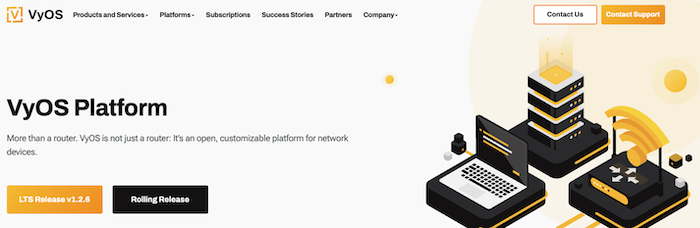

# Building a VyOS image for use in Rackspace OpenStack Flex

In the beginning there was Vyatta, a free software-based alternative to hardware-based routing products offered by network beheamoths like Cisco and Juniper. After being acquired by Brocade, development of Vyatta Core, the *community edition* of the product, began to languish until its abandonment shortly thereafter. VyOS formed from the ashes and has continued to build upon the core to deliver a highly-functional and highly-competitive routing platform.
<!-- more -->

VyOS is a recent Silver member of the OpenInfra Foundation, and more information about their fit in the ecosystem can be found here:

[Meet VyOS Networks: Advancing Open Networking in the OpenInfra Ecosystem](https://openinfra.org/blog/openinfra-member-vyos)

## Introduction

{ align=center : style="max-width:700px" }

VyOS provides three release channels:

- Rolling Release
- VyOS Stream
- LTS Release

Rolling releases can be considered the 'unstable' release - these daily releases contain the latest developments from contributors and shouldn't be counted on for production use. There is no warranty here.

VyOS Stream releases, on the other hand, are released every quarter and are a "quality gate" for upcoming LTS releases.

Lastly, LTS (long-term support) releases provide a stable core and can be backed by a support agreement with VyOS.

LTS images come in all sorts of formats compatible with various hypervisors, whereas VyOS Stream and Rolling releases are ISO-based. VyOS does provide build scripts to "roll your own" images, and I'll walk through how to do just that for use on Rackspace's OpenStack Flex platform.

## Prerequisites

To avoid any issues with the build process, I highly recommend spinning up a virtual machine either locally or in the Rackspace cloud that can run Docker and the associated build scripts. The machine can be fairly lightweight, keeping in mind that the build time will be shorter when more vCPUs are available.

For this step, I've decided to follow the official Docker installation guide for Ubuntu 24.04 LTS found at [https://docs.docker.com/engine/install/ubuntu/](https://docs.docker.com/engine/install/ubuntu/):

```
# Add Docker's official GPG key:
~> sudo apt-get update
~> sudo apt-get install ca-certificates curl
~> sudo install -m 0755 -d /etc/apt/keyrings
~> sudo curl -fsSL https://download.docker.com/linux/ubuntu/gpg -o /etc/apt/keyrings/docker.asc
~> sudo chmod a+r /etc/apt/keyrings/docker.asc

# Add the repository to Apt sources:
~> echo \
  "deb [arch=$(dpkg --print-architecture) signed-by=/etc/apt/keyrings/docker.asc] https://download.docker.com/linux/ubuntu \
  $(. /etc/os-release && echo "${UBUNTU_CODENAME:-$VERSION_CODENAME}") stable" | \
  sudo tee /etc/apt/sources.list.d/docker.list > /dev/null
~> sudo apt-get update
```

Install the Docker package(s):

```
~> sudo apt-get install docker-ce docker-ce-cli containerd.io docker-buildx-plugin docker-compose-plugin
```


## Building an image

VyOS introduced a new build system in 2024 that no longer uses Ansible. They've outlined how to use the new system [here](https://blog.vyos.io/introducing-the-image-build-flavor-system), and we'll build on that to deliver a qcow2 image that can be uploaded to your project in an OpenStack Flex region.

Start by cloning the GitHub repo with the build scripts:

```
~>  git clone https://github.com/vyos/vyos-build
~>  cd vyos-build
```

Then, start a build container from which the image building process will commence:

```
~> sudo docker run --rm -it --privileged -v $(pwd):/vyos -v /dev:/dev -w /vyos vyos/vyos-build:current bash
```

Inside the container, write a build file that provides guidance on which packages to install as well as a base configuration that can be applied to the appliance. The example here is simple and to the point, but can be expanded upon if necessary.

```
cat <<EOF > data/build-flavors/qcow2.toml
image_format = "qcow2"
packages = ["cloud-init", "qemu-guest-agent"]

default_config = '''
interfaces {
    loopback lo {
    }
}
system {
    config-management {
        commit-revisions "100"
    }
    conntrack {
        modules {
            ftp
            h323
            nfs
            pptp
            sip
            sqlnet
            tftp
        }
    }
    host-name "vyos"
    login {
        user vyos {
            authentication {
            }
        }
    }
    syslog {
        local {
            facility all {
                level "info"
            }
            facility local7 {
                level "debug"
            }
        }
    }
}
'''

[[includes_chroot]]
path = "etc/cloud/cloud.cfg.d/90_dpkg.cfg"
data = "datasource_list: [OpenStack]"

EOF
```

!!! note

    While the `vyos` user is created as part of the build, no password is generated or supplied. Instead, an SSH key in the form of a keypair should be provided at server creation and will processed by cloud-init and added to the configuration.

Lastly, run the build script:

```
~> sudo ./build-vyos-image qcow2
```

The script will work through creating an ISO, converting to raw, then to qcow2. When complete, the new image(s) can be found in the `build` directory:

```
~> ls -l build
drwxr-xr-x  2 root root        4096 Sep 19 18:26 auto
drwxr-xr-x  7 root root        4096 Sep 19 18:26 binary
-rw-r--r--  1 root root         752 Sep 19 18:34 binary.modified_timestamps
drwxr-xr-x  6 root root        4096 Sep 19 18:26 cache
drwxr-xr-x 17 root root        4096 Sep 19 18:34 chroot
-rw-r--r--  1 root root     6932238 Sep 19 18:30 chroot.files
-rw-r--r--  1 root root       59477 Sep 19 18:34 chroot.packages.all.info
-rw-r--r--  1 root root       22065 Sep 19 18:28 chroot.packages.install
-rw-r--r--  1 root root       21909 Sep 19 18:30 chroot.packages.live
drwxr-xr-x 21 root root        4096 Sep 19 18:26 config
-rw-r--r--  1 root root        9780 Sep 19 18:34 live-image-amd64.contents
-rw-r--r--  1 root root     6932238 Sep 19 18:30 live-image-amd64.files
-rw-r--r--  1 root root   633339904 Sep 19 18:26 live-image-amd64.hybrid.iso
-rw-r--r--  1 root root     2164962 Sep 19 18:34 live-image-amd64.hybrid.iso.zsync
-rw-r--r--  1 root root       21909 Sep 19 18:30 live-image-amd64.packages
drwxr-xr-x  3 root root        4096 Sep 19 18:26 local
-rw-r--r--  1 root root        9401 Sep 19 18:34 manifest.json
drwxr-xr-x  6 root root        4096 Sep 19 17:53 tmp
-rw-r--r--  1 root root   633339904 Sep 19 18:34 vyos-1.5-rolling-202509191826-qcow2-amd64.iso
-rw-r--r--  1 root root   726597632 Sep 19 18:34 vyos-1.5-rolling-202509191826-qcow2-amd64.qcow2
-rw-r--r--  1 root root 10737418240 Sep 19 18:34 vyos-1.5-rolling-202509191826-qcow2-amd64.raw
```

## Upload the image

Using the `openstack` client or Rackspace OpenStack Flex UI, upload the qcow2 image:

```
# openstack image create vyos-1.5-rolling \
  --file vyos-1.5-rolling-202509191826-qcow2-amd64.qcow \
  --disk-format qcow2 
```

!!! note

    The image will be built as the `root` user, so check the file permissions if you run into issues.

## Deploying the VM

Launching a VyOS VM can be accomplished using the `openstack server create` command or via the Skyline UI, making sure to specify an SSH keypair and a security group with SSH allowed if you want to manage the device.

```
~> openstack server create \
   --image vyos-1.5-rolling-202509191826-qcow2-amd64 \
   --flavor gp.5.2.2 \
   --network vyos-network \
   --key-name vyos-key \
   --config-drive true \
   --security-group vyos-ssh-mgmt \
   vyos-vm
```

Once `ACTIVE`, assign a floating IP to the VM so it can be reached exterally:

```
~> openstack server add floating ip vyos-vm $(openstack floating ip create PUBLICNET -f value -c floating_ip_address)
~> openstack server show vyos-vm -c addresses

+-----------+--------------------------------------------+
| Field     | Value                                      |
+-----------+--------------------------------------------+
| addresses | vyos-network=192.168.40.234, 50.56.157.237 |
+-----------+--------------------------------------------+
```

SSH to the VyOS VM and bask in the glory of the MOTD:

```
~> ssh -i key vyos@50.56.157.68

Welcome to VyOS!

   ┌── ┐
   . VyOS 1.5-rolling-202509191826
   └ ──┘  current

 * Documentation:  https://docs.vyos.io/en/latest
 * Project news:   https://blog.vyos.io
 * Bug reports:    https://vyos.dev

You can change this banner using "set system login banner post-login" command.

VyOS is a free software distribution that includes multiple components,
you can check individual component licenses under /usr/share/doc/*/copyright

---
WARNING: This VyOS system is not a stable long-term support version and
         is not intended for production use.


Last login: Fri Sep 19 18:51:56 2025 from 50.56.157.250
vyos@vyos-1-5-rolling-202509191826:~$
```

## Conclusion

VyOS as a router and firewall appliance opens up a lot of possibilities on the Rackspace OpenStack Flex cloud platform, and can be used to construct more complex virtual network architectures and to provide access methods including site-to-site VPN, client-to-site VPNs, SSL VPNs, and more!

Stay tuned as we explore some of these advanced network features and architectures in upcoming posts.
