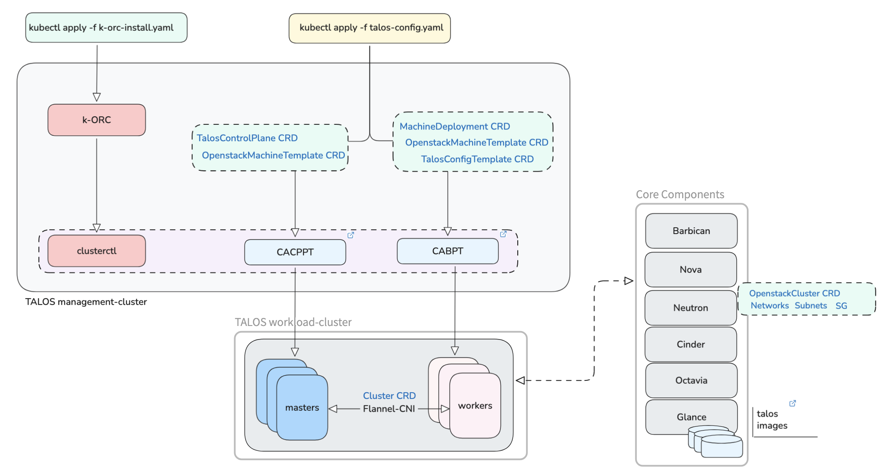

# CAPI powered TALOS clusters on Rackspace OpenStack Flex

We detail how to build immutable, secure, and minimal Kubernetes clusters by combining Cluster API (CAPI) with TALOS OS. This powerful stack allows you to leverage the cloud-agnostic management capabilities of CAPI while benefiting from TALOS's minimal attack surface. Deploying on RackSpace OpenStack Flex grants you complete control over your underlying infrastructure, maximizing resource efficiency and providing a production-ready cloud-native environment. This integration simplifies day-2 operations and delivers enterprise-grade security for your private cloud.



## Preparing the Management Cluster

!!! note

    For creating management clusters - In this case - we are going to make use of flex management cluster's namespace.

- Build TALOS image with desired options: [https://factory.talos.dev](https://factory.talos.dev)
  - For the purpose of this blog and environment, following options were chosen:
    - Hardware Type: Cloud Server
    - Talos Linux Version: 1.11.1
    - Cloud: Openstack
    - Machine Architecture: amd64
    - System Extensions: none
    - Customization: none

- Fetch the image on your RackSpace Openstack Flex environment :

``` shell
wget https://factory.talos.dev/image/376567988ad370138ad8b2698212367b8edcb69b5fd68c80be1f2ec7d603b4ba/v1.11.1/openstack-amd64.raw.xz
```

- De-compress the image:

``` shell
unxz openstack-amd64.raw.xz
```

- Convert the image to qcow2 :

!!! note

    If qemu-img isnt installed, one can install the same using: `sudo apt-get install libguestfs-tools`

``` shell
qemu-img convert -f raw \
-O qcow2 openstack-amd64.raw talos-v1.11.1.qcow2
Upload to glance:
openstack image create \
--progress \
--disk-format qcow2 \
--container-format bare \
--file ./talos-v1.11.1.qcow2 \
--property hw_vif_multiqueue_enabled=true \
--property hw_qemu_guest_agent=yes \
--property hypervisor_type=kvm \
--property img_config_drive=optional \
--os-cloud image-services \
--public \
Talos-v1.11.1
```

### Install K-ORC (needed for CAPO >=v0.12)

 K-ORC is a Kubernetes API for declarative management of OpenStack resources. By fully controlling the order of OpenStack operations, it allows consumers to easily create, manage, and reproduce complex deployments. ORC aims to be easily consumed both directly by users, and by higher level controllers. ORC aims to cover all OpenStack APIs which can be expressed declaratively.

``` shell
kubectl apply -f https://github.com/k-orc/openstack-resource-controller/releases/latest/download/install.yaml
```

!!! example "Output"

    ``` shell
    namespace/orc-system created
    customresourcedefinition.apiextensions.k8s.io/flavors.openstack.k-orc.cloud created
    customresourcedefinition.apiextensions.k8s.io/floatingips.openstack.k-orc.cloud created
    customresourcedefinition.apiextensions.k8s.io/images.openstack.k-orc.cloud created
    customresourcedefinition.apiextensions.k8s.io/networks.openstack.k-orc.cloud created
    customresourcedefinition.apiextensions.k8s.io/ports.openstack.k-orc.cloud created
    customresourcedefinition.apiextensions.k8s.io/projects.openstack.k-orc.cloud created
    customresourcedefinition.apiextensions.k8s.io/routerinterfaces.openstack.k-orc.cloud created
    customresourcedefinition.apiextensions.k8s.io/routers.openstack.k-orc.cloud created
    customresourcedefinition.apiextensions.k8s.io/securitygroups.openstack.k-orc.cloud created
    customresourcedefinition.apiextensions.k8s.io/servergroups.openstack.k-orc.cloud created
    customresourcedefinition.apiextensions.k8s.io/servers.openstack.k-orc.cloud created
    customresourcedefinition.apiextensions.k8s.io/subnets.openstack.k-orc.cloud created
    serviceaccount/orc-controller-manager created
    role.rbac.authorization.k8s.io/orc-leader-election-role created
    clusterrole.rbac.authorization.k8s.io/orc-image-editor-role created
    clusterrole.rbac.authorization.k8s.io/orc-image-viewer-role created
    clusterrole.rbac.authorization.k8s.io/orc-manager-role created
    clusterrole.rbac.authorization.k8s.io/orc-metrics-auth-role created
    clusterrole.rbac.authorization.k8s.io/orc-metrics-reader created
    rolebinding.rbac.authorization.k8s.io/orc-leader-election-rolebinding created
    clusterrolebinding.rbac.authorization.k8s.io/orc-manager-rolebinding created
    clusterrolebinding.rbac.authorization.k8s.io/orc-metrics-auth-rolebinding created
    service/orc-controller-manager-metrics-service created
    deployment.apps/orc-controller-manager created
    ```

- Enable clusterctl to add openstack provider (**This is required for non-TALOS based images**):

!!! note

    Its assumed that clusterctl is pre-installed. If not - one can refer to these [instructions](https://cluster-api.sigs.k8s.io/user/quick-start#install-clusterctl)

``` shell
clusterctl init --infrastructure openstack
```

!!! example "Output"

    ``` shell
    Fetching providers
    Skipping installing cert-manager as it is already installed
    Installing provider="cluster-api" version="v1.10.4" targetNamespace="capi-system"
    Installing provider="bootstrap-kubeadm" version="v1.10.4" targetNamespace="capi-kubeadm-bootstrap-system"
    Installing provider="control-plane-kubeadm" version="v1.10.4" targetNamespace="capi-kubeadm-control-plane-system"
    Installing provider="infrastructure-openstack" version="v0.12.4" targetNamespace="capo-system"

    Your management cluster has been initialized successfully!
    ```

- You can now create your first workload cluster by running the following:

``` shell
clusterctl generate cluster [name] --kubernetes-version [version] | kubectl apply -f -
```

## Clusterctl enablement specific for TALOS

CAPI has [bootstrap](https://cluster-api.sigs.k8s.io/reference/providers#bootstrap) and [controlplane](https://cluster-api.sigs.k8s.io/reference/providers#control-plane) provider support for TALOS:
- [CACPPT repo](https://github.com/siderolabs/cluster-api-control-plane-provider-talos)
- [CABPT repo](https://github.com/siderolabs/cluster-api-bootstrap-provider-talos)

``` shell
clusterctl config repositories | egrep 'talos|openstack'
```

!!! example "Output"

    ``` shell
    talos                   BootstrapProvider          https://github.com/siderolabs/cluster-api-bootstrap-provider-talos/releases/latest/               bootstrap-components.yaml
    talos                   ControlPlaneProvider       https://github.com/siderolabs/cluster-api-control-plane-provider-talos/releases/latest/           control-plane-components.yaml
    openstack               InfrastructureProvider     https://github.com/kubernetes-sigs/cluster-api-provider-openstack/releases/latest/                infrastructure-components.yaml 
    ```

``` shell
clusterctl init \
--infrastructure openstack \
--bootstrap talos \
--control-plane talos
```

!!! example "Output"

    ``` shell
    Fetching providers
    Skipping installing cert-manager as it is already installed
    Installing provider="bootstrap-talos" version="v0.6.9" targetNamespace="cabpt-system"
    Installing provider="control-plane-talos" version="v0.5.10" targetNamespace="cacppt-system"
    ```

## Creating Workload Clusters

!!! note

    For creating management clusters - In this case - we are going to make use of flex management cluster's namespace.

### Create talos-cluster namespace

``` shell
kubectl create ns talos-cluster
```

Create `clouds.yaml` file using project credentials

``` yaml
clouds:
  default:
    auth:
    auth_url: https://<keystone_public_url>/v3
    project_name: <project name>
    project_domain_name: <Project domain name>
    username: <username>
    password: <password>
    user_domain_name: <User domain name>
    interface: public
    region_name: <Region name>
    identity_api_version: "3"
```

Now let's create a secret and label it using below commands:

``` shell
kubectl create secret generic talos-demo-cloud-config --from-file=clouds.yaml='clouds.yaml' --from-literal=cacert="" -n talos-cluster
```

!!! example "Output"

    ``` shell
    secret/talos-demo-cloud-config created
    ```

``` shell
kubectl label secret -n talos-cluster talos-demo-cloud-config clusterctl.cluster.x-k8s.io/move=true
```

!!! example "Output"

    ``` shell
    secret/talos-demo-cloud-config labeled
    ```

Below is the `talos.yaml` manifest which we will be using to create our k8s workload cluster:

``` yaml
---
apiVersion: cluster.x-k8s.io/v1beta1
kind: Cluster
metadata:
name: talos-cluster
namespace: talos-cluster
spec:
clusterNetwork:
    pods:
    cidrBlocks:
    - 192.168.0.0/16
    serviceDomain: cluster.local
controlPlaneRef:
    apiVersion: controlplane.cluster.x-k8s.io/v1alpha3
    kind: TalosControlPlane
    name: talos-cluster-control-plane
infrastructureRef:
    apiVersion: infrastructure.cluster.x-k8s.io/v1beta1
    kind: OpenStackCluster
    name: talos-cluster
---
apiVersion: infrastructure.cluster.x-k8s.io/v1beta1
kind: OpenStackCluster
metadata:
name: talos-cluster
namespace: talos-cluster
spec:
disableAPIServerFloatingIP: false
externalNetwork:
    # adjust to the elastic IPs network id in the openstack project
    id:  158704f8-4de4-42f7-8a2a-704c3427aa6e
managedSubnets:
    - cidr: 10.6.0.0/24
    dnsNameservers:
        - 8.8.8.8
        - 8.8.4.4
identityRef:
    cloudName: default
    name: talos-demo-cloud-config
managedSecurityGroups:
    allNodesSecurityGroupRules:
    - description: Created by cluster-api-provider - Talos API nodes
    direction: ingress
    etherType: IPv4
    name: Talos-API-NODES
    portRangeMax: 50001
    portRangeMin: 50000
    protocol: tcp
    remoteIPPrefix: "0.0.0.0/0"
    - description: Created by cluster-api-provider - Talos API LB
    direction: ingress
    etherType: IPv4
    name: Talos-API-LB
    portRangeMax: 50000
    portRangeMin: 50000
    protocol: tcp
    # this means the talosctl control port is open to the world
    # adjust as seen fit
    remoteIPPrefix: "0.0.0.0/0"
    - description: Created by cluster-api-provider - ICMP Echo Request/Reply ingress
    direction: ingress
    etherType: IPv4
    name: ICMP-Echo-ingress
    protocol: icmp
    portRangeMin: 8
    portRangeMax: 0
    remoteManagedGroups:
        - controlplane
        - worker
    - description: Created by cluster-api-provider - ICMP Echo Request/Reply egress
    direction: egress
    etherType: IPv4
    name: ICMP-Echo-egress
    protocol: icmp
    portRangeMin: 8
    portRangeMax: 0
    remoteManagedGroups:
        - controlplane
        - worker
---
apiVersion: infrastructure.cluster.x-k8s.io/v1beta1
kind: OpenStackMachineTemplate
metadata:
name: talos-cluster-control-plane
namespace: talos-cluster
spec:
template:
    spec:
    flavor: gp.8.4.8
    image:
        filter:
        name: Talos-v1.11.1
---
apiVersion: infrastructure.cluster.x-k8s.io/v1beta1
kind: OpenStackMachineTemplate
metadata:
name: talos-cluster-md-0
namespace: talos-cluster
spec:
template:
    spec:
    flavor: gp.8.4.8
    image:
        filter:
        name: Talos-v1.11.1
---
apiVersion: bootstrap.cluster.x-k8s.io/v1alpha3
kind: TalosConfigTemplate
metadata:
name: talos-cluster-md-0
namespace: talos-cluster
spec:
template:
    spec:
    generateType: join
    configPatches:
        - op: replace
        path: /machine/install/disk
        value: /dev/vda
    # adjust to your talos version
    talosVersion: 1.11.1

---
apiVersion: cluster.x-k8s.io/v1beta1
kind: MachineDeployment
metadata:
name: talos-cluster-md-0
namespace: talos-cluster
spec:
clusterName: talos-cluster
# adjust to the desired number of worker nodes
replicas: 1
selector:
    matchLabels: null
template:
    spec:
    bootstrap:
        configRef:
        apiVersion: bootstrap.cluster.x-k8s.io/v1alpha3
        kind: TalosConfigTemplate
        name: talos-cluster-md-0
    clusterName: talos-cluster
    infrastructureRef:
        apiVersion: infrastructure.cluster.x-k8s.io/v1beta1
        kind: OpenStackMachineTemplate
        name: talos-cluster-md-0
    # adjust to the desired kubernetes version
    version: v1.31.0

---
apiVersion: controlplane.cluster.x-k8s.io/v1alpha3
kind: TalosControlPlane
metadata:
name: talos-cluster-control-plane
namespace: talos-cluster
spec:
infrastructureTemplate:
    kind: OpenStackMachineTemplate
    apiVersion: infrastructure.cluster.x-k8s.io/v1beta1
    name: talos-cluster-control-plane
    namespace: talos-cluster
controlPlaneConfig:
    controlplane:
    generateType: controlplane
    # adjust to the your talos version
    talosVersion: 1.11.1
    configPatches:
    - op: replace
        path: /machine/install/disk
        value: /dev/vda
    - op: add
        # this is required to deploy the cloud-controller-manager
        # which is responsible for running cloud specific controllers
        path: /cluster/externalCloudProvider
        value:
        enabled: true
        manifests:
            - https://raw.githubusercontent.com/kubernetes/cloud-provider-openstack/master/manifests/controller-manager/cloud-controller-manager-roles.yaml
            - https://raw.githubusercontent.com/kubernetes/cloud-provider-openstack/master/manifests/controller-manager/cloud-controller-manager-role-bindings.yaml
            - https://raw.githubusercontent.com/kubernetes/cloud-provider-openstack/master/manifests/controller-manager/openstack-cloud-controller-manager-ds.yaml
# adjust to the desired number of control planes (kubernetes master nodes)
replicas: 1
# adjust to the desired kubernetes version
version: v1.31.0
```

Now let's apply this manifest to create our workload cluster.

``` shell
kubectl apply -f talos.yaml
```

!!! example "Output"

    ``` shell
    cluster.cluster.x-k8s.io/talos-cluster created
    openstackcluster.infrastructure.cluster.x-k8s.io/talos-cluster created
    openstackmachinetemplate.infrastructure.cluster.x-k8s.io/talos-cluster-control-plane created
    openstackmachinetemplate.infrastructure.cluster.x-k8s.io/talos-cluster-md-0 created
    talosconfigtemplate.bootstrap.cluster.x-k8s.io/talos-cluster-md-0 created
    machinedeployment.cluster.x-k8s.io/talos-cluster-md-0 created
    taloscontrolplane.controlplane.cluster.x-k8s.io/talos-cluster-control-plane created
    ```

After 2-3 mins, we can verify our workload cluster has been created. Extract the kubeconfig using clusterctl command and try to create a pod in it to confirm that our workload k8s cluster is functional.

Get the status of the various components using below commands

#### Check OpenStackCluster resource


``` shell
kubectl get -n talos-cluster openstackcluster.infrastructure.cluster.x-k8s.io/talos-cluster
```

!!! example "Output"

    ``` shell
    NAME            CLUSTER         READY   NETWORK                                BASTION IP   AGE
    talos-cluster   talos-cluster   true    f3875bc8-b23b-4842-9c04-28fe91f48371                57s
    ```

#### Get the status of the Cluster resource

``` shell
kubectl get -n talos-cluster cluster.cluster.x-k8s.io/talos-cluster
```

!!! example "Output"

    ``` shell
    NAME            CLUSTERCLASS   PHASE         AGE   VERSION
    talos-cluster                  Provisioned   89s
    ```

#### Get the status of the TalosControlPlane resource

``` shell
kubectl get -n talos-cluster taloscontrolplane.controlplane.cluster.x-k8s.io/talos-cluster-control-plane
```

!!! example "Output"

    ``` shell
    NAME                          READY   INITIALIZED   REPLICAS   READY REPLICAS   UNAVAILABLE REPLICAS
    talos-cluster-control-plane   true    true          1          1
    ```

#### Extract the kubeconfig for the workload cluster

``` shell
clusterctl get kubeconfig talos-cluster -n talos-cluster > talos-new.kubeconfig
```

#### Get the status of the MachineDeployment resource

``` shell
kubectl --kubeconfig=./talos-new.kubeconfig get nodes
```

!!! example "Output"

    ``` shell
    NAME                                STATUS   ROLES           AGE     VERSION
    talos-cluster-control-plane-5jr7r   Ready    control-plane   9m28s   v1.31.0
    talos-cluster-md-0-ltdrq-zkld4      Ready    <none>          9m22s   v1.31.0
    ```

#### Get more details of the nodes

``` shell
kubectl get --kubeconfig=./talos-new.kubeconfig nodes -o wide
```

!!! example "Output"

    ``` shell
    NAME                                STATUS   ROLES           AGE     VERSION   INTERNAL-IP   EXTERNAL-IP   OS-IMAGE          KERNEL-VERSION   CONTAINER-RUNTIME
    talos-cluster-control-plane-5jr7r   Ready    control-plane   9m34s   v1.31.0   10.6.0.39     <none>        Talos (v1.10.6)   6.12.40-talos    containerd://2.0.5
    talos-cluster-md-0-ltdrq-zkld4      Ready    <none>          9m28s   v1.31.0   10.6.0.118    <none>        Talos (v1.10.6)   6.12.40-talos    containerd://2.0.5
    ```

#### Get the status of the pods in kube-system namespace

``` shell
kubectl get --kubeconfig=./talos-new.kubeconfig  pods -n kube-system
```

!!! example "Output"

    ``` shell
    NAME                                                        READY   STATUS    RESTARTS      AGE
    coredns-958d7d544-4p5hw                                     1/1     Running   0             10m
    coredns-958d7d544-h7fjz                                     1/1     Running   0             10m
    kube-apiserver-talos-cluster-control-plane-5jr7r            1/1     Running   0             9m48s
    kube-controller-manager-talos-cluster-control-plane-5jr7r   1/1     Running   2 (10m ago)   9m2s
    kube-flannel-gbtpl                                          1/1     Running   0             9m58s
    kube-flannel-mxgzj                                          1/1     Running   0             10m
    kube-proxy-frjfg                                            1/1     Running   0             9m58s
    kube-proxy-ppcw8                                            1/1     Running   0             10m
    kube-scheduler-talos-cluster-control-plane-5jr7r            1/1     Running   2 (10m ago)   8m55s
    ```

#### Create a nginx pod to verify the workload cluster functionality

``` shell
kubectl --kubeconfig=./talos-new.kubeconfig run nginx --image=nginx
```

!!! example "Output"

    ``` shell
    Warning: would violate PodSecurity "restricted:latest": allowPrivilegeEscalation != false (container "nginx" must set securityContext.allowPrivilegeEscalation=false), unrestricted capabilities (container "nginx" must set securityContext.capabilities.drop=["ALL"]), runAsNonRoot != true (pod or container "nginx" must set securityContext.runAsNonRoot=true), seccompProfile (pod or container "nginx" must set securityContext.seccompProfile.type to "RuntimeDefault" or "Localhost")
    pod/nginx created
    ```

#### Get the status of the pods

``` shell
kubectl --kubeconfig=./talos-new.kubeconfig get pods -o wide
```

!!! example "Output"

    ``` shell
    NAME    READY   STATUS    RESTARTS   AGE   IP            NODE                             NOMINATED NODE   READINESS GATES
    nginx   1/1     Running   0          15s   192.168.1.2   talos-cluster-md-0-ltdrq-zkld4   <none>           <none>
    ```

#### Check OpenStack resources

The k8s cluster resources can also be seen as newly created Virtual Machines, Networ, using:

``` shell
openstack server list
```

#### Interacting with TALOS nodes using talosctl

Now let's get the `talosconfig` secret from talos-cluster namespace in our management cluster so that we can run some of talosctl commands.

``` shell
kubectl get secret talos-cluster-talosconfig -n talos-cluster -o jsonpath="{.data.talosconfig}" | base64 -d > taclosconfig.new
```

Following talosctl commands can be run to interact with the TALOS cluster. TALOS by default does not allow SSH for security reasons, adhering to the least-priviledge principle.

!!! info

    In below commands:
    -e : Endpoint viz. FloatingIP of the control plane VM.
    -n : Node IP which are master/worker nodes in the cluster.

``` shell
talosctl --talosconfig talosconfig.new -e 204.232.x.x -n 204.232.x.x get disks

talosctl --talosconfig talosconfig.new -e 204.232.x.x -n 10.22.0.226 mounts

talosctl --talosconfig talosconfig.new -e 204.232.x.x -n 10.22.0.226 cluster show

talosctl --talosconfig talosconfig.new -e 204.232.x.x -n 10.22.0.148 config info

talosctl --talosconfig talosconfig.new -e 204.232.x.x -n 10.22.0.148 containers

talosctl --talosconfig talosconfig.new -e 204.232.x.x -n 10.22.0.226 dashboard
```
