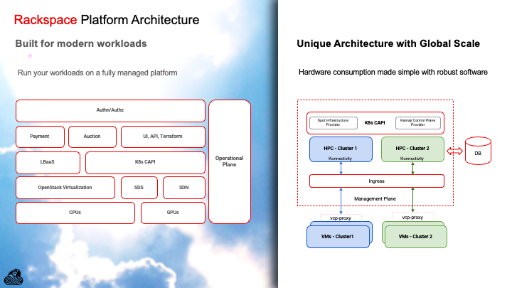

# A new paradigm for cloud-native infrastructure

{ width="172" align=left }

What if spinning up a fully isolated Kubernetes cluster took seconds instead of hours, and cost a fraction of traditional managed Kubernetes? What if that cluster could run worker nodes anywhere in the world, even across clouds, while still being centrally managed? What if the Control Plane itself could be treated as a workload, scaling elastically and sharing infrastructure with hundreds of other clusters? What if all of this functionality was available now?

Rackspace launched "Spot", a Kubernetes offering with a clear mission: to provide fully managed Kubernetes clusters at compelling cost-efficiency, powered by dynamic spot/auction compute, and delivered as a turnkey experience.

In doing so, a fundamental question has to be confronted: how do you build a multi-tenant service that can spin up hundreds, or even thousands, of isolated Kubernetes clusters, each with its own Control Plane, without the overhead and complexity that traditional architectures entail?

What was needed was way more than a simple Kubernetes cluster creation automation: Rackspace needed an architecture built for scale, elasticity, and efficient multi-tenant orchestration. That's where Kamaji came in.

<!-- more -->

## The business challenge: cost, scale, agility

From a business point of view, an instance marketplace platform based on an auction system must satisfy three key goals. First, cost efficiency: for every managed cluster, we want to minimise overhead for the Control Plane, maximise utilisation of resources, and pass savings onto our customers. Traditional Control Plane architecture, three dedicated VMs/hosts per cluster (etcd + API + controllers), adds a fixed cost per cluster that doesn't scale well when you target hundreds of clusters. Second, rapid provisioning and elasticity: given the nature of spot instances with short-lived consumption, customers expect clusters on demand, spun up not in minutes but seconds. To remain competitive, systems must scale up (and down) control planes dynamically in response to demand. Third, operational consistency and reliability: each tenant's cluster must behave like a single-tenant experience with an isolated control plane, predictable performance, and robust lifecycle management including upgrades, patching, and fail-over. Yet the platform must provide a unified management entry point to operate them all, automating lifecycle operations and treating the control planes as infrastructure-as-code.

In a traditional model, these aims conflict. The overhead of dedicated hardware or VMs per control plane limits cost efficiency; manual or semi-automated provisioning slows agility; and per-cluster operations become an operational nightmare. We needed a new model.

## Why Kubernetes is the platform of choice

Using Kubernetes both as the customer-facing orchestration layer and for the internal management plane makes perfect sense. The familiar API delivers a declarative infrastructure model with a rich ecosystem of controllers and operators, while integration with CNCF primitives and open-source tooling provides a solid foundation. Most importantly, Kubernetes gives us the ability to treat Kubernetes clusters themselves as workloads, leveraging standard Kubernetes lifecycle features like rolling upgrades, self-healing, and autoscaling not just for apps, but for the entire cluster.

By building the management cluster on Kubernetes and running every tenant control plane on top of it, Rackspace has unified operational tooling and driven automation at scale. As we all know, Kubernetes is reliable if its Control Plane can perform its duties; an architecture for these at scale requires a careful implementation.

## Enter Kamaji: Control Planes as Workloads

{ width="96" align=left }

Kamaji is an open-source project designed to treat Kubernetes Control Planes as pods (i.e., workloads) inside a shared management cluster. This architecture is well known with the terminology Hosted Control Plane (HCP), and such a model aligns perfectly with the Rackspace Spot requirements.

### Key features of Kamaji for our use case

Kamaji brings several capabilities that proved essential for our platform. Each tenant cluster's control plane, API server, controller-manager, scheduler, and etcd, runs as a pod or set of pods in the management cluster. Control Plane lifecycle operations including creation, scaling, upgrade, and deletion become as simple as applying a custom resource (KamajiControlPlane) in Cluster API and letting Kamaji handle the rest in tandem with Cluster API.

The high-density model represents one of the most important KPIs for cloud providers: many control planes share the same underlying infrastructure, avoiding the traditional one-Control Plane-per-dedicated-VM approach. Despite this sharing, isolation remains robust, although control planes share the same management cluster, each is treated as a tenant via Namespaces, RBAC, and network segmentation. Kamaji also provides flexibility in DataStore topologies, supporting etcd or MySQL in shared or dedicated configurations depending on isolation and performance requirements. Since everything is Kubernetes-native, we leverage our existing automation tooling, operators, controllers, CRDs, GitOps, and Cluster API, to manage control planes just like application workloads.

### Why is this architecture superior for our platform

{ width="512" align=right }

The Hosted Control Plane architecture granted us extreme scalability: Control Planes can be spun up in seconds, allowing our service to grow rapidly without a linear increase in operational overhead.

Given Rackspace Spot's product placement offering instances at very low prices, resource efficiency plays a huge role. Instead of provisioning a full VM cluster for each tenant, we share Control Plane infrastructure. The management cluster can host hundreds of Control Planes, making better use of hardware.

As with any other product, the CAPEX vs. OPEX dilemma is always up for discussion: it's not only a matter of hardware, but also operations such as upgrade strategies, patching, monitoring, and logging. Thanks to the operational uniformity, we can apply the same pattern across all dynamically created Control Planes via our management cluster tooling rather than per-cluster custom scripts.

This brought us to achieve agility and elasticity: with traditional approaches not designed for scale, KPIs decrease as the number of managed customers increases. By embracing the Hosted Control Plane architecture, Control Plane pods can easily be autoscaled on a rolling-update basis, idle clusters can be spun down, and everything managed declaratively via APIs as well as our infrastructure-as-code pipelines.

## Architecture at a glance

We maintain a management/seed Kubernetes cluster (or clusters) that hosts Kamaji, Cluster API, and other Control Plane provisioning tooling. Each tenant Kubernetes cluster is based on Cluster API, and Kamaji's extensibility supporting a variety of Infrastructure Providers, including non-public ones, allowed us to integrate it into our ecosystem.

Worker nodes may be remote from the management cluster: Rackspace Spot allows you to auction instances from all over the Rackspace regions, meaning they could be in different data-centres and availability-zones. The control plane, however, remains centrally managed and exposed using an Ingress-based load balancer. This design can be described as Hybrid Control Planes, where Worker Nodes join an externally managed Control Plane.

We rely on Konnectivity, an optional component of the Kubernetes control plane, for remote connectivity. The worker nodes communicate outbound to the API-server via the Konnectivity Agent running on each worker, so the Control Plane does not need inbound connectivity into arbitrary worker nodes. This significantly simplifies firewall and topology concerns while helping preserve latency and connection performance even when worker nodes are geographically dispersed. For the DataStore question, we support a MySQL database for each Control Plane, Kamaji's framework concept allowed Rackspace to pick the most suitable architecture to ensure high quality of service while guaranteeing persistence.

## Technical deep dive: handling remote workers & latency

One of the key architectural considerations for a widely-distributed managed Kubernetes platform is the latency between the Control Plane and worker nodes.

In a conventional cluster, Control Plane nodes and worker nodes are typically co-located (same VPC/subnet/region) to minimise latency. But in the Rackspace Spot architecture, worker nodes may be in regions beyond the management cluster, in different availability zones, or even across cloud providers in hybrid/multi-cloud setups. How do we ensure that the Control Plane can communicate with the Worker Node kubelets?

### Konnectivity to the rescue

With Konnectivity, worker nodes initiate outbound connections to the Control Plane rather than the Control Plane initiating inbound connections to kubelets. This means worker nodes remain firewalled and internally isolated, minimising attack surface. The Control Plane sees consistent connectivity from all worker nodes, even those across regions, so long as the outbound path to the API endpoint is available. The architecture decouples physical topology from logical Control Plane location; worker nodes simply register with the remote API endpoint and behave as if they are local. From the tenant workload's perspective, scheduling and Control Plane operations behave as though the nodes and Control Plane were co-located; the latency introduced by worker-to-Control-Plane communication is minimal and does not degrade the customer experience.

### Why latency doesn't degrade end-user application performance

Worker nodes handle local pod lifecycles, scheduling, kubelet, container runtime, without waiting synchronously on the Control Plane for each operation, as most operations are asynchronous. The control loop (API server → controllers → kubelet) is designed for small control latency; even when the Control Plane is geographically distant, the latency remains in the tens to low hundreds of milliseconds, negligible for typical microservices workloads.

Kubernetes performance characteristics and our automation tooling ensure that we monitor and alert on Control Plane responsiveness including API latency, commit latency, and controller loop duration. We scale the management cluster or relocate Control Plane pods if any degradation is detected. The separation also means we can optimize the node-pool without impacting Control Plane footprint and vice versa: worker nodes may scale across zones and regions while Control Planes remain centrally managed for efficiency.

## Why this architecture serves Spot's workload model

Given that our Spot offering uses dynamic compute (spot/auction instances) for worker nodes, we needed a Control Plane architecture supporting several critical requirements. The architecture enables rapid spin-up of clusters including worker nodes across variable capacity and geographies, while handling worker node churn from pre-emptions without Control Plane churn, the Control Plane remains stable while worker nodes appear and disappear. Elasticity allows scaling down idle clusters or migrating them seamlessly, and multi-tenant isolation ensures each customer cluster behaves as a dedicated cluster despite running on shared infrastructure. The minimal per-cluster fixed cost enables the business model of low-cost Kubernetes, while global reach allows locating worker nodes anywhere but still managing them via central Control Plane infrastructure.

Kamaji, combined with its native support for Konnectivity, delivered precisely that: Control Planes decoupled from the physical location of compute, centralised management, yet local experience for the nodes and workloads. Worker nodes behave as though they are governed by a Control Plane "nearby," although physically the Control Plane may live anywhere.

## Realising multi-region & multi-cloud in practice

Our platform users often deploy worker node pools across multiple regions for capacity, cost, and redundancy while the Control Plane resides in our management cluster. Because worker nodes communicate outbound via Konnectivity to the API server, we don't need to replicate Control Planes per region, allowing Rackspace to offer a top-tier service at a fraction of the cost.

## Final thoughts and future directions

By adopting this architecture we've moved beyond the "one cluster = three VMs for Control Plane + worker nodes" model. Instead, we've embraced a cloud-native paradigm: Control Planes as workloads. Kamaji enables this model, Konnectivity ensures worker-Control Plane connectivity regardless of topology, and our automation, telemetry, and infrastructure-as-code pipelines execute it at scale.

For customers of Rackspace Spot, this means faster provisioning, predictable performance, consistent lifecycle, and a Kubernetes experience that is truly global and elastic.

!!! quote "Kevin Carter (Director, Open Source Product, Rackspace Technology)"

    We're excited about this architecture, and publicly endorsing Kamaji for making this possible: Rackspace is committed to Open Source and we're confident in recommending this architecture as the foundation for the next generation of managed Kubernetes services.

If you'd like to learn more, check out the Kamaji project on GitHub and reach out to the Rackspace Engineering team, we'd love to chat.

Explore the Kamaji project on [GitHub](https://github.com/clastix/kamaji), and experience Rackspace Spot at [spot.rackspace.com](https://spot.rackspace.com) today. If you'd like to talk to others in the Spot community, reach out to us and create a [discussion](https://github.com/rackerlabs/spot/discussions) or join us in [Discord](https://discord.gg/2mN5yZvV3a).
