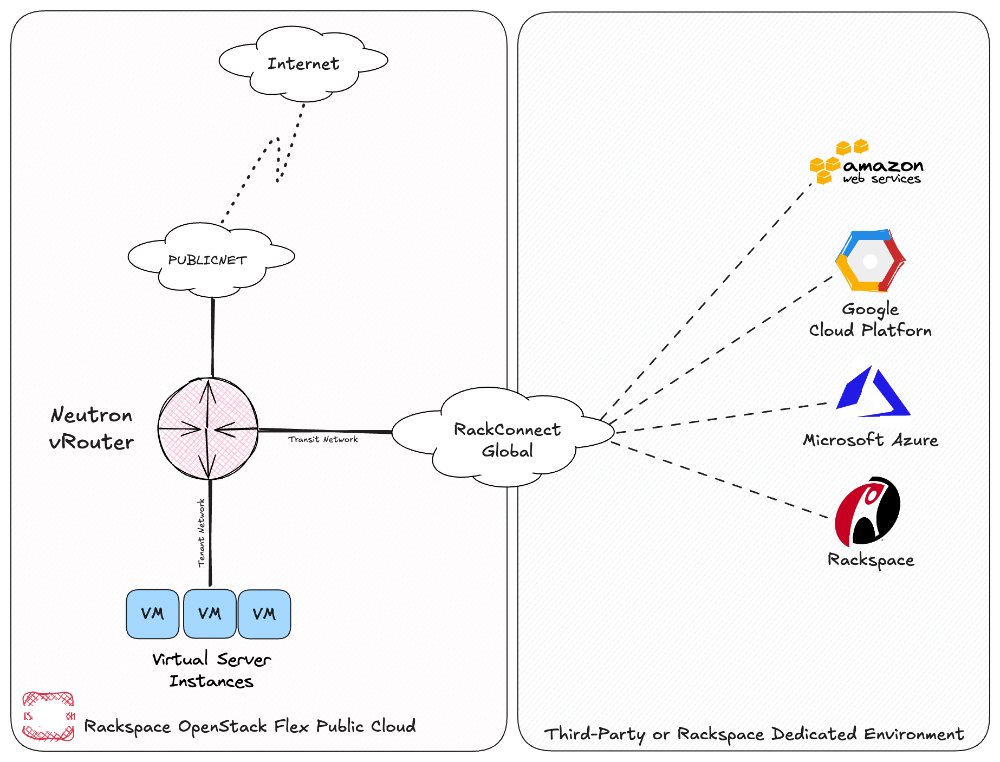
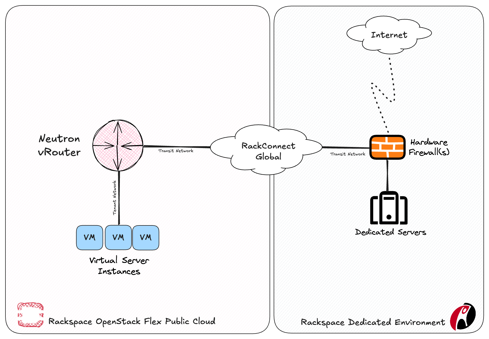

# Enabling Hybrid Cloud with RackConnect Global

RackConnect® Global (RCG) is a software-defined, multi-cloud interconnection platform that links Rackspace Technology customers with other Rackspace data centers, third-party data centers, and third-party clouds through direct, private, low-latency, virtual connections. All traffic flowing between every endpoint avoids the public Internet and instead rides the Rackspace private backbone.

Within OpenStack Flex, Rackspace's next-generation multi-tenant public cloud, RackConnect Global allows customers to connect their virtual machine instances to third-party datacenters or to dedicated (baremetal) server environments within Rackspace DCs. RackConnect Global can enable customers to leverage the elasticity of public cloud while utilizing dedicated hardware gateways and firewalls, or simply add routes to remote resources over the RCG link.

## Connecting to a third-party or Rackspace dedicated environment

RackConnect Global allows customers to connect their OpenStack Flex resources to third-party environments, including popular hyperscalers, as well as existing dedicated footprints in a Rackspace datacenter.

In this topology, outbound connectivity from VMs in OpenStack Flex is provided by the vRouter using source NAT or Floating IPs (static NAT). Inbound traffic to VMs in OpenStack Flex is the inverse and requires a Floating IP for each VM in the absence of a load balancer. Security of VMs in OpenStack Flex is managed via security group rules. For non-Internet traffic, a set of routes are required on both sides of RCG to direct certain traffic over the RackConnect Global links.

## Connecting through a Rackspace dedicated environment

Customers with existing dedicated footprints in a Rackspace datacenter can deploy resources in an OpenStack Flex region and connect to those physical servers behind their dedicated firewall. 

In this topology, outbound traffic from VMs in OpenStack Flex traverses the RCG link and out the dedicated firewall using source NAT or static NAT. Inbound connectivity to VMs in OpenStack Flex is the inverse and requires static NATs for each VM in the absence of a load balancer. Security of VMs in OpenStack Flex is still managed via security group rules, but additional rules can be applied at the firewall using the Rackspace Firewall Control Panel (FWCPv2) or by engaging Rackspace Network Security via ticket. A set of routes are required on both sides of RCG to direct certain (or all) traffic over the RackConnect Global links.

## How to order

If you're interested in learning more about how RackConnect Global can assist you in your hybrid cloud journey, check out the [product page](https://www.rackspace.com/cloud/rackconnect-global) and [Frequently Asked Questions](https://docs.rackspace.com/docs/rackconnect-global-faq). To order, contact your Rackspace sales account team or appropriate Rackspace representative.