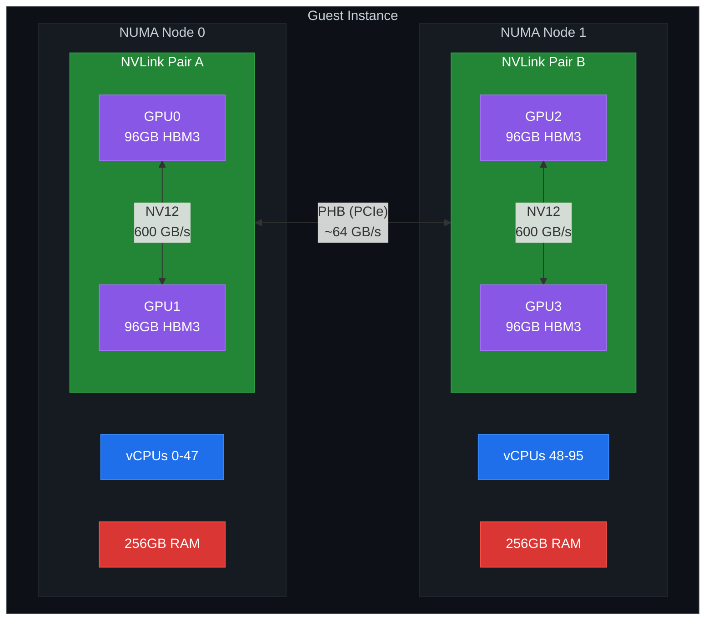

# Solving GPU Passthrough Memory Addressing in OpenStack

Delivering Accelerator enabled Developer Cloud Functionality on Rackspace OpenStack Flex.

When AMD launched the [AMD Developer Cloud](https://www.amd.com/en/developer/resources/cloud-access/amd-developer-cloud.html), we took notice. Here was a streamlined platform giving developers instant access to high-performance MI300X GPUs, complete with pre-configured containers, Jupyter environments, and pay-as-you-go pricing. The offering resonated with the AI/ML community because it eliminated friction: spin up a GPU instance, start training, destroy it when done.

<!-- more -->

We wanted to deliver similar functionality for our customers using NVIDIA H100 NVL GPUs on Rackspace OpenStack Flex. Not to become a NeoCloud, that's not our business, but to ensure customers leveraging our GPU infrastructure could access the same seamless, high-memory multi-GPU experience that specialized providers offer.

Then we hit a wall. Instances with four H100 NVL GPUs would boot successfully, only three GPUs were visible to the NVIDIA driver when the instance was configured with 256G of RAM, 2 GPUs were visible with 512G of RAM, and 1 GPU was visible with 768G of RAM. The problem was confounding. The more RAM we had, the less GPUs we could use and they consistently failed with `nvidia: probe of 0000:0X:00.0 failed with error -1`.

This is the story of how we diagnosed the problem, discovered it wasn't NUMA (our initial suspect), and implemented a two-line fix that unlocked full multi-GPU functionality for our customers.

## The target: matching developer cloud configurations

AMD's Developer Cloud configurations set the benchmark we were measuring against:

**AMD Developer Cloud (MI300X)**

| Configuration | GPU Memory | vCPUs | System Memory | Storage |
|--------------|------------|-------|---------------|---------|
| Small (1× GPU) | 192GB | 20 | 240GB | 720GB boot + 5TB scratch NVMe |
| Large (8× GPU) | 1,536GB | 160 | 1,920GB | 1.9TB boot + 40TB scratch NVMe |

**Rackspace OpenStack Flex (H100 NVL)**

| Configuration | GPU Memory | vCPUs | System Memory | Storage |
|--------------|------------|-------|---------------|---------|
| Small (1× GPU) | 96GB | 48 | 128GB | 2TB+ HA-NetApp volume |
| Large (4× GPU) | 384GB | 96 | 512GB | 2TB+ HA-NetApp volume |

Different hardware, different scale, but the same goal: give developers frictionless access to GPU compute for AI/ML workloads. The H100 NVL's 96GB HBM3 memory per GPU, combined with 900 GB/s NVLink interconnect bandwidth, makes it exceptionally capable for distributed training, if all GPUs are actually addressable.

## The symptom: one GPU always missing

Our four-GPU configuration exhibited a consistent failure pattern. The instance would boot normally, `lspci` would show all four NVIDIA devices, but `nvidia-smi` reported only a subset of the GPUs. The kernel ring buffer told the story:

```log
[    2.847291] pci 0000:09:00.0: BAR 1: no space for [mem size 0x4000000000 64bit pref]
[    2.847294] pci 0000:09:00.0: BAR 1: failed to assign [mem size 0x4000000000 64bit pref]
[    3.521847] nvidia: probe of 0000:09:00.0 failed with error -1
```

!!! note

    That hex value, `0x4000000000`, is 256GB. The guest firmware couldn't allocate address space for the fourth GPU's BAR1 memory region.

## The initial misdiagnosis: NUMA topology

Our first instinct pointed to NUMA. Multi-GPU systems are notoriously sensitive to NUMA topology, and cross-socket memory access can cause exactly the kind of asymmetric behavior we observed. We spent considerable time examining:

- `numactl --hardware` output inside guests
- GPU-to-NUMA-node mappings via `nvidia-smi topo -m`
- Various `hw:numa_nodes` and `hw:pci_numa_affinity_policy` flavor configurations
- CPU pinning strategies to ensure GPU locality
- Kernel boot parameters related to NUMA and PCI
- HugePages configurations
- IOMMU settings and VFIO parameters
- and more...

None of it helped. In a four GPU configuration, the fourth GPU failed regardless of NUMA configuration. The `BAR 1: no space` message kept appearing, suggesting something more fundamental than memory locality.

## The real problem: QEMU's 32GB IO window

Gerd Hoffmann's [blog post on physical address space in QEMU](https://www.kraxel.org/blog/2023/12/qemu-phys-bits/) provided the breakthrough. The issue traces back to x86_64's early days.

When QEMU first supported 64-bit guests, it adopted AMD Opteron's 40-bit physical address space (1TB) as the default. This conservative choice persists today for backward compatibility. But the real constraint isn't QEMU, it's OVMF, the UEFI firmware.

OVMF couldn't reliably determine actual physical address space available to a VM. Early Intel 64-bit CPUs supported only 36 bits, while AMD offered 40. Rather than risk crashes from address space misconfiguration, OVMF adopted an ultra-conservative approach: a **fixed 32GB MMIO aperture** for PCI devices.

For typical VMs, this worked fine. An 8GB VM with a basic GPU fits easily. But modern AI workloads changed the equation dramatically:

| Component | Address Space Required |
|-----------|----------------------|
| Guest RAM | 512GB |
| H100 NVL BAR1 (×4) | 512GB (128GB each, power-of-two alignment) |
| Control BARs, platform devices | ~1GB |
| **Total** | **~1,025GB** |

The legacy 32GB MMIO aperture can't accommodate 512GB of GPU BARs. OVMF maps the first three GPUs successfully, exhausts available address space, and leaves the fourth GPU with nowhere to live. The kernel sees the PCI device but can't initialize it, hence `probe failed with error -1`.

### Debugging checklist for operators

When multi-GPU instances show partial GPU visibility:

**Inside the guest:**

```bash
# Check physical address bits visible to guest
lscpu | grep "Address sizes"

# Look for BAR allocation failures
dmesg | grep -E "(BAR|no space|failed to assign)"

# Check NVIDIA probe errors
dmesg | grep nvidia

# Verify GPU count
nvidia-smi -L
```

**On the compute host:**

```bash
# Verify host capabilities
virsh capabilities | grep maxphysaddr

# Check instance configuration
virsh dumpxml <instance-id> | grep -A5 '<cpu'

# Verify flavor properties applied
openstack flavor show <flavor-name> -f json | jq '.properties'
```

## The solution: expanding physical address bits

Modern datacenter CPUs support far more than 40 bits of physical addressing:

| Platform | Physical Address Bits | Addressable Space |
|----------|----------------------|-------------------|
| QEMU default | 40 bits | 1TB |
| Intel Xeon Scalable (Sapphire Rapids) | 46-52 bits | 64TB - 4PB |
| AMD EPYC (Genoa) | 48-52 bits | 256TB - 4PB |

With sufficient physical address bits, OVMF scales the IO window dynamically and places GPU BARs in the expanded high-memory region. The fix required discovering our hypervisors' capabilities and configuring Nova flavors to expose them.

### Step 1: Discover hypervisor capabilities

```bash
virsh capabilities | grep maxphysaddr
      <maxphysaddr mode='emulate' bits='46'/>
```

Our compute nodes, running Intel Xeon Scalable processors, support 46-bit physical addressing, providing 64TB of addressable space.

### Step 2: Configure Nova flavor properties

OpenStack Nova 2024.1 (Caracal) introduced `hw:maxphysaddr_bits` and `hw:maxphysaddr_mode` flavor extra specs. The fix required just two properties:

```bash
hw:maxphysaddr_mode='emulate'
hw:maxphysaddr_bits='46'
```

We used `maxphysaddr_mode=emulate` because our hypervisors run with `cpu_mode=host-model`, which allows live migration between hosts with different CPU microarchitectures. If we had configured `cpu_mode=host-passthrough`, we could use `maxphysaddr_mode=passthrough` to directly expose host CPU capabilities.

!!! notice

    The `maxphysaddr_bits=46` value isn't arbitrary, it matches our hypervisors' specific capabilities. Operators must query their own hosts and configure flavors accordingly. Nova's `ComputeCapabilitiesFilter` automatically ensures instances land only on hosts supporting the requested physical address width.

### Step 3: Complete flavor configuration

To ensure optimal performance and reliability for GPU workloads, we combined the physical address space settings with other best-practice flavor properties, resulting in the following complete flavor definitions for both four-GPU and single-GPU instances.

**Four-GPU (Training/Rendering) Flavor:**

```bash
openstack flavor create --vcpu 96 \
                        --ram 524288 \
                        --disk 0 \
                        --ephemeral 0 \
                        --property :price=10.022336 \
                        --property :architecture='x86_architecture' \
                        --property :category='compute_optimized' \
                        --property hw:cpu_max_sockets='2' \
                        --property hw:cpu_max_threads='1' \
                        --property hw:cpu_policy='dedicated' \
                        --property hw:cpu_thread_policy='require' \
                        --property hw:hide_hypervisor_id='true' \
                        --property hw:maxphysaddr_bits='46' \
                        --property hw:maxphysaddr_mode='emulate' \
                        --property hw:numa_nodes='2' \
                        --property hw:numa_cpus.0='0-47' \
                        --property hw:numa_cpus.1='48-95' \
                        --property hw:numa_mem.0='262144' \
                        --property hw:numa_mem.1='262144' \
                        --property hw:mem_page_size='any' \
                        --property hw:pci_numa_affinity_policy='required' \
                        --property hw:watchdog_action='disabled' \
                        --property pci_passthrough:alias='h100:4' \
                        --property trait:CUSTOM_HW_GPU_H100='required' \
                        --private \
                        ao.3.96.512_H100-4
```

**Single GPU (Development/Inference) Flavor:**

```bash
openstack flavor create --vcpu 48 \
                        --ram 131072 \
                        --disk 0 \
                        --ephemeral 0 \
                        --property :architecture='x86_architecture' \
                        --property :category='compute_optimized' \
                        --property hw:cpu_max_sockets='2' \
                        --property hw:cpu_max_threads='1' \
                        --property hw:cpu_policy='dedicated' \
                        --property hw:cpu_thread_policy='require' \
                        --property hw:hide_hypervisor_id='true' \
                        --property hw:mem_page_size='any' \
                        --property pci_passthrough:alias='h100:1' \
                        --property trait:CUSTOM_HW_GPU_H100='required' \
                        ao.3.96.512_H100
```

#### Flavor property explanations

| <div style="width:192px">Property</div>  | <div style="width:176px">Value</div> | Description |
|----------|-------|-------------|
| `hw:cpu_max_sockets` | `2` | Maximum CPU sockets exposed to the guest. Distributes vCPUs across two virtual sockets, mirroring dual-socket physical hosts and aligning with the `hw:numa_nodes=2` configuration. |
| `hw:cpu_max_threads` | `1` | Maximum threads per core in guest topology. Setting to `1` disables SMT presentation inside the guest, ensuring each vCPU maps to a distinct physical core for consistent compute performance. |
| `hw:cpu_policy` | `dedicated` | CPU allocation policy. `dedicated` pins each vCPU to a specific physical CPU, preventing core sharing with other instances. Eliminates noisy-neighbor effects critical for GPU workloads. |
| `hw:cpu_thread_policy` | `require` | Controls vCPU placement on host SMT threads. `require` mandates SMT-enabled hosts and places vCPUs on thread siblings. Ensures predictable resource allocation. Options: `require`, `prefer`, `isolate`. |
| `hw:hide_hypervisor_id` | `true` | Hides hypervisor CPUID signature from guest. Essential for NVIDIA GPU passthrough—prevents driver detection of virtualized environment. Also bypasses software with anti-VM licensing checks. |
| `hw:maxphysaddr_bits` | `46` | Maximum physical address bits for guest. 46 bits provides 64TB addressable space, enabling OVMF firmware to allocate sufficient MMIO aperture for four H100 GPUs (~512GB BAR space required). |
| `hw:maxphysaddr_mode` | `emulate` | Physical address bit determination method. `emulate` explicitly sets the value via QEMU; required with `cpu_mode=host-model`. Alternative `passthrough` requires `cpu_mode=host-passthrough`. |
| `hw:mem_page_size` | `any` | Guest memory backing page size. `any` allows Nova to select available sizes (4KB, 2MB, or 1GB). Consider `1GB` for reduced TLB pressure with large memory footprints if huge pages are pre-allocated on hosts. |
| `hw:numa_cpus.0` | `0-47` | Explicit vCPU-to-NUMA mapping for node 0. Pins guest vCPUs 0-47 to virtual NUMA node 0, ensuring predictable topology rather than relying on Nova's automatic distribution. |
| `hw:numa_cpus.1` | `48-95` | Explicit vCPU-to-NUMA mapping for node 1. Pins guest vCPUs 48-95 to virtual NUMA node 1, completing the symmetric dual-node topology. |
| `hw:numa_mem.0` | `262144` | Memory allocation for NUMA node 0 in MB. Pins 256GB to node 0, preventing cross-socket memory allocation and ensuring GPU0-1 access local memory. |
| `hw:numa_mem.1` | `262144` | Memory allocation for NUMA node 1 in MB. Pins 256GB to node 1, ensuring GPU2-3 access local memory. Total: 512GB evenly split across nodes. |
| `hw:numa_nodes` | `2` | Number of virtual NUMA nodes exposed to guest. Matches dual-socket physical topology for optimal memory locality and GPU affinity. |
| `hw:pci_numa_affinity_policy` | `required` | PCI device NUMA affinity enforcement. `required` strictly enforces GPU-to-NUMA alignment—instance scheduling fails if affinity cannot be satisfied rather than silently degrading performance. |
| `hw:watchdog_action` | `disabled` | Guest watchdog behavior. `disabled` eliminates watchdog timer interrupts, reducing interrupt overhead for latency-sensitive GPU workloads. |
| `pci_passthrough:alias` | `h100:4` | PCI passthrough device request. `h100` references alias in `nova.conf` mapping to NVIDIA H100 vendor/product IDs. `:4` requests four GPUs for this instance. |
| `trait:CUSTOM_HW_GPU_H100` | `required` | Placement API scheduling constraint. Instances only land on compute nodes reporting this custom trait, ensuring H100-equipped host selection beyond PCI alias matching. |

**Property Prefix Reference:**

| Prefix | Scope | Function |
|--------|-------|----------|
| `hw:` | Nova libvirt driver | Configures guest hardware: CPU topology, memory, NUMA, physical addressing |
| `hw:numa_*` | Nova libvirt driver | Explicit NUMA pinning for CPUs and memory per virtual node |
| `pci_passthrough:` | Nova PCI manager | PCI device assignment by alias or direct address |
| `trait:` | Placement API | Scheduling constraints based on host resource provider traits |

## The result: full multi-GPU functionality

After applying the fix along with our tuning, all four H100 NVL GPUs initialize correctly:

```bash
$ nvidia-smi
+-----------------------------------------------------------------------------------------+
| NVIDIA-SMI 580.105.08             Driver Version: 580.105.08     CUDA Version: 13.0     |
+-----------------------------------------+------------------------+----------------------+
| GPU  Name                 Persistence-M | Bus-Id          Disp.A | Volatile Uncorr. ECC |
| Fan  Temp   Perf          Pwr:Usage/Cap |           Memory-Usage | GPU-Util  Compute M. |
|                                         |                        |               MIG M. |
|=========================================+========================+======================|
|   0  NVIDIA H100 NVL                On  |   00000000:06:00.0 Off |                    0 |
| N/A   32C    P0             63W /  400W |       0MiB /  95830MiB |      0%      Default |
|                                         |                        |             Disabled |
+-----------------------------------------+------------------------+----------------------+
|   1  NVIDIA H100 NVL                On  |   00000000:07:00.0 Off |                    0 |
| N/A   31C    P0             62W /  400W |       0MiB /  95830MiB |      0%      Default |
|                                         |                        |             Disabled |
+-----------------------------------------+------------------------+----------------------+
|   2  NVIDIA H100 NVL                On  |   00000000:08:00.0 Off |                    0 |
| N/A   35C    P0             64W /  400W |       0MiB /  95830MiB |      0%      Default |
|                                         |                        |             Disabled |
+-----------------------------------------+------------------------+----------------------+
|   3  NVIDIA H100 NVL                On  |   00000000:09:00.0 Off |                    0 |
| N/A   31C    P0             61W /  400W |       0MiB /  95830MiB |      0%      Default |
|                                         |                        |             Disabled |
+-----------------------------------------+------------------------+----------------------+

+-----------------------------------------------------------------------------------------+
| Processes:                                                                              |
|  GPU   GI   CI              PID   Type   Process name                        GPU Memory |
|        ID   ID                                                               Usage      |
|=========================================================================================|
|  No running processes found                                                             |
+-----------------------------------------------------------------------------------------+
```

**NVLink topology is preserved, enabling efficient multi-GPU communication:**

```bash
$ nvidia-smi topo -m
        GPU0   GPU1   GPU2   GPU3
GPU0     X     NV12   PHB    PHB
GPU1    NV12     X    PHB    PHB
GPU2    PHB    PHB      X    NV12
GPU3    PHB    PHB    NV12     X
```

**NUMA Topology Visualization:**



## Key takeaways

**Multi-GPU passthrough failures aren't always NUMA issues.** The 32GB MMIO aperture limitation affects any high-memory GPU configuration, regardless of NUMA topology.

**The fix is simple but requires discovery.** Two flavor properties unlock full functionality, but the `maxphysaddr_bits` value must match your hypervisors' capabilities, query `virsh capabilities` on each compute node.

**Nova 2024.1+ is required.** The `hw:maxphysaddr_mode` and `hw:maxphysaddr_bits` extra specs were introduced in the Caracal release.

**CPU mode affects passthrough options.** Use `emulate` mode with `host-model` for migration flexibility, or `passthrough` mode with `host-passthrough` for maximum performance on homogeneous clusters.

With these configurations in place, Rackspace OpenStack Flex delivers the multi-GPU compute functionality our customers expect, matching the seamless experience of specialized developer clouds while maintaining the operational benefits of OpenStack infrastructure: API compatibility, hybrid cloud integration, and complete data sovereignty.

---

For more information about GPU-enabled compute on Rackspace OpenStack Flex, see the [Genestack documentation](https://docs.rackspacecloud.com/) or contact your Rackspace account team. [Sign-up](https://cart.rackspace.com/en/cloud/openstack-flex/account) for Rackspace OpenStack today.
