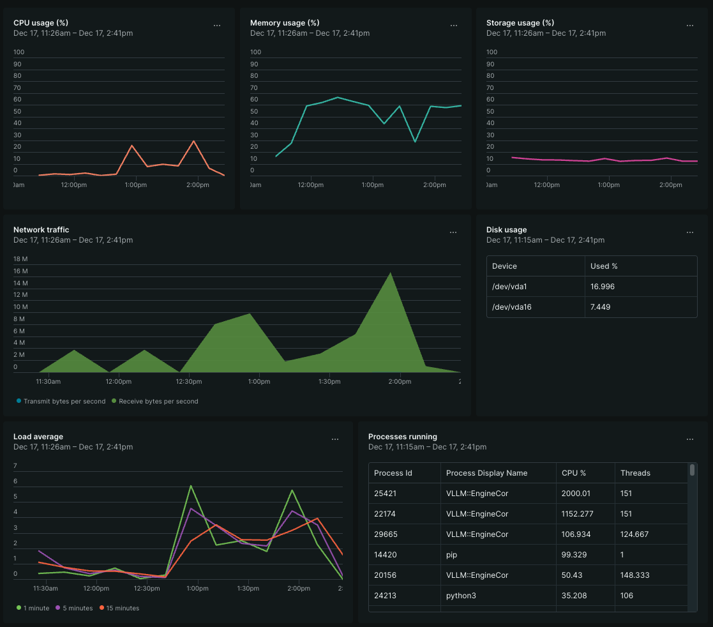

# Running AI Inference on AMD EPYC Without a GPU in Sight

**Spoiler: You don't need a $40,000 GPU to run LLM inference. Sometimes 24 CPU cores and the right software stack will do just fine.**

The AI infrastructure conversation has become almost synonymous with GPU procurement battles, NVIDIA allocation queues, and eye-watering hardware costs. But here's a reality that doesn't get enough attention: for many inference workloads, especially during development, testing, and moderate-scale production, modern CPUs with optimized software can deliver surprisingly capable performance at a fraction of the cost.

<!-- more -->

I recently spent some time exploring AMD's ZenDNN optimization library paired with vLLM on Rackspace OpenStack Flex, and the results challenge the assumption that CPU inference is merely a curiosity. Let me walk through what I found.

## The Setup: AMD EPYC 9454 on OpenStack Flex

For this testing, I spun up a general-purpose VM in Rackspace OpenStack Flex's DFW3 environment using the `gp.5.24.96` flavor.

| Resource | Specification |
|----------|---------------|
| vCPUs | 24 |
| RAM | 96 GB |
| Root Disk | 240 GB |
| Ephemeral | 128 GB |
| Processor | AMD EPYC 9454 (Genoa) |
| Hourly Cost | $0.79 |

The AMD EPYC 9454 is a 4th-generation Zen 4 processor with AVX-512 support, including the BF16 and VNNI extensions that matter for inference workloads. These aren't just marketing checkboxes; they translate directly into optimized matrix operations that LLMs depend on.

!!! note "Containerization with Docker"

    This post isn't going into how to install [Docker](https://docs.docker.com/engine/install), but before getting started, it should be installed.

## Getting vLLM

vLLM is an open-source library designed for efficient large language model inference. It supports CPU and GPU backends and features a pluggable architecture that allows integration with optimization libraries like ZenDNN. To get started, clone the vLLM repository.

```bash
git clone https://github.com/vllm-project/vllm
```

!!! tip

    Review the version compatibility matrix in the [vLLM documentation](https://vllm.readthedocs.io/en/latest/) and [Zentorch](https://github.com/amd/ZenDNN-pytorch-plugin/blob/main/src/cpu/python/zentorch/vllm/README.md#compatibility) to ensure you're using compatible versions of Python, PyTorch, vLLM, and Zentorch (ZenDNN).

    > At the time of writing, the recommended vLLM version to use with ZenTorch is v0.11.0. To check out this specific version, run:

    ```shell
    git checkout v0.11.0
    ```

    !!! warning

        Make sure to use the correct version of vLLM that is compatible with the ZenTorch plugin to avoid any runtime issues. If the version of ZenDNN-pytorch-plugin is incompatible with the installed vLLM version, you may encounter errors such as:

        ```log
        [WARNING zentorch.vllm - register:72] [zentorch] Unsupported vLLM version: X.YY.Z. Plugin supports versions: A.BB.C
        ```

        This indicates that the plugin does not support the installed vLLM version and will likely result in a failure to load or operate optimally.

## Building vLLM with ZenTorch

AMD's ZenDNN library provides optimized deep learning primitives specifically tuned for Zen architecture processors. The ZenTorch plugin integrates these optimizations into PyTorch, and by extension, into vLLM's inference pipeline.

Build the initial Docker Image for vLLM with CPU optimizations enabled and the AVX-512 extensions activated.

```shell
docker build -f docker/Dockerfile.cpu \
             --build-arg VLLM_CPU_AVX512BF16=1 \
             --build-arg VLLM_CPU_AVX512VNNI=1 \
             --build-arg VLLM_CPU_DISABLE_AVX512=0 \
             --tag vllm-cpu:local \
             --target vllm-openai \
             .
```

With the base container built, we now add the layers to make sure we can leverage ZenDNN optimizations. The build process involves creating a custom Docker image that layers ZenDNN-pytorch-plugin on top of vLLM's CPU-optimized base image.

!!! example "Dockerfile for vLLM with ZenTorch at `docker/Dockerfile.cpu-amd`"

    ```dockerfile title="Dockerfile.cpu-amd" linenums="1"
    FROM vllm-cpu:local
    RUN apt-get update -y \
        && apt-get install -y --no-install-recommends make cmake ccache git curl wget ca-certificates \
                                                    gcc-12 g++-12 libtcmalloc-minimal4 libnuma-dev ffmpeg \
                                                    libsm6 libxext6 libgl1 jq lsof libjemalloc2 gfortran \
        && update-alternatives --install /usr/bin/gcc gcc /usr/bin/gcc-12 10 --slave /usr/bin/g++ g++ /usr/bin/g++-12

    RUN git clone https://github.com/amd/ZenDNN-pytorch-plugin.git && \
        cd ZenDNN-pytorch-plugin && \
        uv pip install -r requirements.txt && \
        CC=gcc CXX=g++ python3 setup.py bdist_wheel && \
        uv pip install dist/*.whl

    ENTRYPOINT ["vllm", "serve"]
    ```

Now build the final Docker image with ZenTorch enabled.

```bash
docker build -f docker/Dockerfile.cpu-amd \
             --build-arg VLLM_CPU_AVX512BF16=1 \
             --build-arg VLLM_CPU_AVX512VNNI=1 \
             --build-arg VLLM_CPU_DISABLE_AVX512=0 \
             --tag vllm-cpu-zentorch:local \
             .
```

Runtime configuration binds vLLM to available CPU cores and allocates substantial memory for the KV cache to maximize throughput. If you plan to use smaller instances, adjust these values accordingly.

For the test environment I set the shared memory size to 95G to accommodate larger models.

??? example "computing SHM_SIZE"

    ```bash
    export SHM_SIZE="$(($(free -m | awk '/Mem/ {print $2}') - 1024))"
    ```

For the test environment I set the CPU core binding to use all but one core for vLLM processing.

??? example "computing CORES"

    ```bash
    export CORES="0-$(($(nproc) - 1))"
    ```

For the vLLM server, we set the `VLLM_CPU_KVCACHE_SPACE` to 50GB to allow room for larger models. Adjust this value based on your instance's memory capacity and the models you plan to run. In general, we've found that this should be around 75% of your total memory minus some overhead for the model, OS and other processes.

??? example "setting `KVCACHE_SPACE`"

    ```bash
    export KVCACHE_SPACE="$(($(free -g | awk '/Mem/ {print $2}') * 75 / 100))"
    ```

    !!! warning

        Setting this value too high may lead to out-of-memory errors, so monitor your system's memory usage during initial runs, which will cause the vLLM server to fail with a `RuntimeError` if it cannot allocate the requested KV cache space.

Finally, set the model you want to run inference against. For this testing, In the following example we're using the [Qwen3-4B](https://huggingface.co/Qwen/Qwen3-4B) model from HuggingFace.

??? example "setting MODEL"

    ```bash
    export MODEL="Qwen/Qwen3-4B"
    ```

Now run the vLLM container with ZenTorch enabled.

!!! note "The HF_TOKEN variable should be set to a valid HuggingFace token with model access."

    If you intend to use a model with access restrictions, ensure your HuggingFace token is set in the `HF_TOKEN` environment variable. Models like LLama 3.2 require an acceptance to their terms as well as authentication using a read-only token.

```bash
docker run --net=host \
           --ipc=host \
           --shm-size=${SHM_SIZE}m \
           --privileged=true \
           --detach \
           --volume /var/lib/huggingface:/root/.cache/huggingface \
           --env HUGGING_FACE_HUB_TOKEN="${HF_TOKEN}" \
           --env VLLM_PLUGINS="zentorch" \
           --env VLLM_CPU_KVCACHE_SPACE=${KVCACHE_SPACE} \
           --env VLLM_CPU_OMP_THREADS_BIND=${CORES} \
           --env VLLM_CPU_NUM_OF_RESERVED_CPU=1 \
           --name vllm-server \
           --rm \
           vllm-cpu-zentorch:local --dtype=bfloat16 \
                                    --max-num-seqs=5 \
                                    --model=${MODEL}
```

??? tip "Validating the server is running"

    You can check that the server output is healthy by following the logs from docker.

    ```bash
    docker logs -f vllm-server
    ```

    !!! example "If the plugin is loading correctly, you should see output similar to the following in the logs."

        ```log
        INFO 12-18 01:09:29 [__init__.py:43] Available plugins for group vllm.platform_plugins:
        INFO 12-18 01:09:29 [__init__.py:45] - zentorch -> zentorch.vllm:register
        INFO 12-18 01:09:29 [__init__.py:57] Loading plugin zentorch
        ...
        ZenDNN Info: Execution has entered the ZenDNN library. Optimized deep learning kernels are now active for high-performance inference on AMD CPUs.
        ...
        (APIServer pid=1) INFO:     Started server process [1]
        (APIServer pid=1) INFO:     Waiting for application startup.
        (APIServer pid=1) INFO:     Application startup complete.
        ```

## Benchmark Results: What Can CPU Inference Actually Do?

I ran vLLM's built-in benchmark suite across several model families with 128-token input/output sequences and 4 concurrent requests. Here's what the numbers look like.

!!! example "Benchmark setup and command"

    ```bash
    # Install
    apt install python3.12-venv
    python3 -m venv ~/.venvs/vllm
    ~/.venvs/vllm/bin/pip install vllm ijson

    # Run benchmark
    HUGGING_FACE_HUB_TOKEN=${HF_TOKEN:-"None"} ~/.venvs/vllm/bin/python3 \
        -m vllm.entrypoints.cli.main bench serve --backend vllm \
                                                 --base-url http://localhost:8000 \
                                                 --model ${MODEL} \
                                                 --tokenizer ${MODEL} \
                                                 --random-input-len 128 \
                                                 --random-output-len 128 \
                                                 --num-prompts 20 \
                                                 --max-concurrency 4 \
                                                 --temperature 0.7
    ```

    While this command is being run against the local vLLM server, you can change the `--base-url` parameter to point to any vLLM server instance, allowing you to benchmark remote deployments as well.

    !!! note "Sliding Window"

        The benchmark uses a sliding window approach however, for some models this may not be fully supported. If you see warnings from the server logs similar to the following:

        ```log
        (APIServer pid=1) WARNING 12-20 16:33:05 [_logger.py:72] sliding window (CPU backend) is not supported by the V1 Engine. Falling back to V0.
        ```

        This indicates that the sliding window feature is not supported for that model and you should consider disabling it using the following flag `--disable-sliding-window` in your benchmark command.

### Qwen3 Family (Alibaba)

| Model | Parameters | Output Tokens/sec | TTFT (median) | Tokens per Output (median) |
|-------|------------|-------------------|---------------|---------------------------|
| Qwen3-0.6B | 0.6B | 124.81 | 403.64ms | 27.57ms |
| Qwen3-1.7B | 1.7B | 95.55 | 482.31ms | 36.75ms |
| Qwen3-4B | 4B | 60.00 | 1024.18ms | 57.91ms |
| Qwen3-8B | 8B | 39.75 | 1724.28ms | 86.42ms |

### Llama 3.2 Family (Meta)

| Model | Parameters | Output Tokens/sec | TTFT (median) | Tokens per Output (median) |
|-------|------------|-------------------|---------------|---------------------------|
| Llama-3.2-1B | 1B | 123.95 | 389.88ms | 27.99ms |
| Llama-3.2-3B | 3B | 71.87 | 934.78ms | 47.79ms |

### Gemma 3 Family (Google)

| Model | Parameters | Output Tokens/sec | TTFT (median) | Tokens per Output (median) |
|-------|------------|-------------------|---------------|---------------------------|
| Gemma-3-1b-it | 1B | 97.35 | 374.32ms | 37.05ms |
| Gemma-3-4b-it | 4B | 53.83 | 1178.90ms | 64.73ms |
| Gemma-3-12b-it | 12B | 25.36 | 3508.26ms | 129.60ms |

### Phi-4 Family (Microsoft)

| Model | Parameters | Output Tokens/sec | TTFT (median) | Tokens per Output (median) |
|-------|------------|-------------------|---------------|---------------------------|
| Phi-4-mini-instruct | 4B | 67.32 | 1519.74ms | 46.95ms |
| Phi-4 | 15B | 23.83 | 5383.14ms | 129.80ms |

## Full Benchmark Results

The full benchmark results, including detailed metrics, can be found here. The following files contain the complete output from the benchmark runs for both optimized (with ZenDNN) and un-optimized (without ZenDNN) configurations, which highlights the performance improvements achieved through ZenDNN optimizations.

??? example "ZenDNN optimized vLLM Benchmark Results"

    ```text title="results.optimized.txt"
    --8<-- "docs/blog/posts/assets/files/2025-12-17/results.optimized.txt"
    ```

??? example "ZenDNN un-optimized vLLM Benchmark Results"

    ```text title="results.unoptimized.txt"
    --8<-- "docs/blog/posts/assets/files/2025-12-17/results.unoptimized.txt"
    ```

## Resource Utilization: What the System Actually Does

Beyond throughput numbers, understanding resource consumption patterns matters for capacity planning. Here's what the system looked like under load during these benchmarks.

!!! info "Dashboard: System metrics showing CPU, memory, network, and load patterns during vLLM inference testing"

    { align=left : style="max-width:512px;width:75%;" }

    * CPU load patterns (1-minute load spiking to 5-6 during inference)
    * Memory utilization bands (50-70% during active runs)
    * Network traffic spikes during HuggingFace model downloads (16 MB/s peak)
    * Process table data showing VLLM::EngineCore threads (50-2000% CPU, 106-151 threads)

### CPU Behavior

The load average tells the real story. During active inference, the 1-minute load spiked to 5-6 on this 24-vCPU system, significant but not saturated. The CPU usage percentage chart shows bursty patterns: idle between requests, then concentrated utilization during token generation.

The process table captures vLLM's multi-threaded architecture in action. Multiple `VLLM::EngineCore` processes consumed 50-2000% CPU (remember, 100% = one core, so 2000% means 20 cores active). Thread counts ranged from 106 to 151 per engine process, reflecting the parallelized inference pipeline.

### Memory Patterns

Memory utilization climbed to 50-70% during model loading and sustained inference, consuming roughly 48-67GB of the 96GB available. This tracks with model size plus KV cache allocation (configured at 50GB via `VLLM_CPU_KVCACHE_SPACE`).

Container-level metrics show memory consumption scaling with model complexity.

| Model Size Class | Memory Consumption |
|-----------------|-------------------|
| Sub-1B models | ~27-57 GB |
| 3-4B models | ~56-60 GB |
| 8B+ models | ~69-74 GB |

The larger memory footprint relative to model parameter count reflects vLLM's continuous batching and KV cache management overhead, memory traded for throughput optimization.

### Network and Storage I/O

Network traffic spiked dramatically during model downloads from HuggingFace Hub, reaching 16 MB/s receive rates. Once models cached locally in `/var/lib/huggingface`, subsequent runs showed minimal network activity.

Disk I/O patterns were write-heavy during model caching (21GB+ written across test runs) with modest read activity. The root disk sat at 17% utilization, model weights and container layers fit comfortably within the 240GB allocation.

### Container Resource Summary

Across all benchmark runs, the vLLM containers exhibited these aggregate characteristics.

| Metric | Range | Notes |
|--------|-------|-------|
| CPU % | 44-873% | Multi-core utilization during inference |
| Memory | 682MB - 74GB | Scales with model size |
| Thread Count | 73-253 | Parallel inference workers |
| Network Rx | 46-97 GB | Model downloads from HuggingFace |

The key insight: CPU inference is memory-bandwidth bound more than compute-bound. The EPYC 9454's 12-channel DDR5 memory architecture matters as much as its core count for this workload class.

## Reading the Results

Let's be direct about what these numbers mean for practical use cases.

**Sub-2B models are genuinely usable.** The Qwen3-0.6B and 1.7B models deliver ~95-125 tokens per second with sub-second time-to-first-token. That's responsive enough for interactive applications, chatbots, code completion, document summarization. You're not waiting around.

**4B models hit a sweet spot for quality vs. speed.** At ~53-71 tokens per second, models like Phi-4-mini-instruct, Qwen3-4B, and Llama-3.2-3B provide meaningfully better outputs than their smaller siblings while remaining practical for batch processing and near-real-time applications. A ~1-1.5 second TTFT is noticeable but not painful.

**8B+ models work but require patience.** The Qwen3-8B at ~40 tokens/sec, Gemma-3-12b and Phi-4 at ~25 tokens/sec, are slower but absolutely functional for use cases where quality trumps latency, document analysis, async processing, development and testing workflows.

## The Economics: GPU-Free Doesn't Mean Value-Free

Here's where this gets interesting from an infrastructure planning perspective.

That `gp.5.24.96` flavor runs at $0.79/hour, roughly $575/month for continuous operation. Compare that to GPU instance pricing where you're looking at $1-4/hour for entry-level accelerator access, assuming availability.

!!! note "Instance Sizing"

    The `gp.5.24.96` flavor was chosen for its balance of CPU cores and memory capacity. Depending on your workload, smaller or larger instances may be more appropriate. The key is ensuring sufficient memory for the model and KV cache while providing enough CPU cores to handle concurrency. **Bottom line:** Choose the instance size that aligns with your workload requirements and budget. Any of the `gp.5` family flavors will work, simply adjust your `VLLM_CPU_KVCACHE_SPACE` and `VLLM_CPU_OMP_THREADS_BIND` settings accordingly.

For development teams iterating on prompts, testing model behavior, or running moderate inference loads, CPU-based instances provide a dramatically lower barrier to entry. You can spin up the infrastructure in minutes without joining a GPU allocation queue.

This isn't about replacing GPU infrastructure for training or high-throughput production inference. It's about recognizing that not every AI workload requires the same hardware profile, and that forcing GPU dependency on all AI workloads is both expensive and often unnecessary.

## Practical Applications

Where does CPU inference with ZenDNN actually make sense?

**Development and testing environments.** Every AI application needs a place to iterate that doesn't burn through GPU budget. CPU inference lets teams test model behavior, refine prompts, and validate integrations without competing for accelerator resources.

**Batch processing at moderate scale.** Processing thousands of documents overnight? Analyzing logs for anomalies? Generating embeddings for search indexing? These workloads often care more about cost-per-token than tokens-per-second.

**Edge and hybrid deployments.** Not every deployment location has GPU infrastructure. Branch offices, on-premise installations, and resource-constrained environments can still run inference workloads.

**Burst capacity.** When your GPU fleet is fully loaded, CPU instances can absorb overflow traffic rather than dropping requests or queuing indefinitely.

## Running This Yourself

The complete setup on Rackspace OpenStack Flex involves.

1. Launch an AMD EPYC instance (gp.5 flavor family)
2. Install Docker and clone the vLLM repository
3. Build the CPU-optimized image with ZenTorch
4. Configure CPU binding and memory allocation
5. Deploy and test

The vLLM server exposes an OpenAI-compatible API, so existing tooling and integrations work without modification:

```bash
curl http://localhost:8000/v1/models | jq
```

From there, your application code doesn't need to know whether inference is happening on a GPU or CPU, the API contract remains identical.

## The Bigger Picture

The AI infrastructure narrative has over-indexed on GPU scarcity and the assumption that meaningful work requires accelerators. That's true for training and high-throughput production inference, but it misses a substantial category of workloads where CPU-based solutions deliver genuine value.

AMD's investment in ZenDNN, combined with vLLM's architecture that supports pluggable backends, creates a practical path for organizations to deploy AI capabilities without GPU dependency. Running this on OpenStack Flex demonstrates that cloud infrastructure doesn't need to be hyperscaler-specific to support modern AI workloads.

The 24-core EPYC VM running inference at 125 tokens per second for a ~1B model, or 60 tokens per second for a ~4B model, isn't a compromise. It's the right tool for a substantial portion of the AI workload landscape.

Sometimes the most expensive hardware isn't the most appropriate hardware. And sometimes, 24 flexible CPU cores on the Rackspace cloud is exactly what you need.
