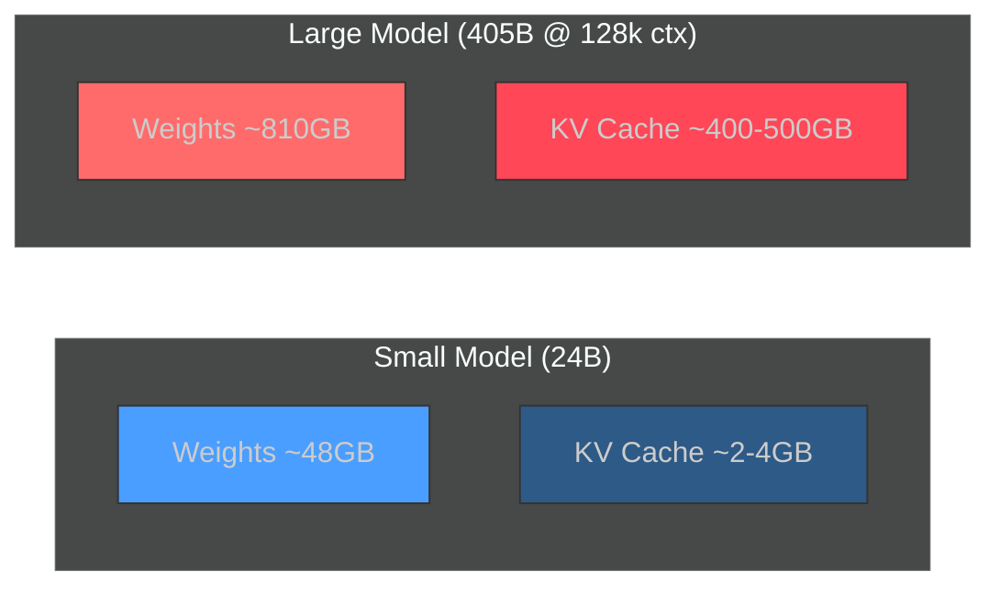
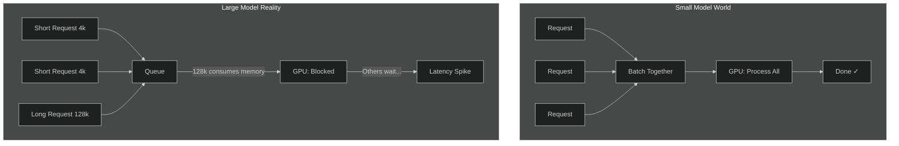
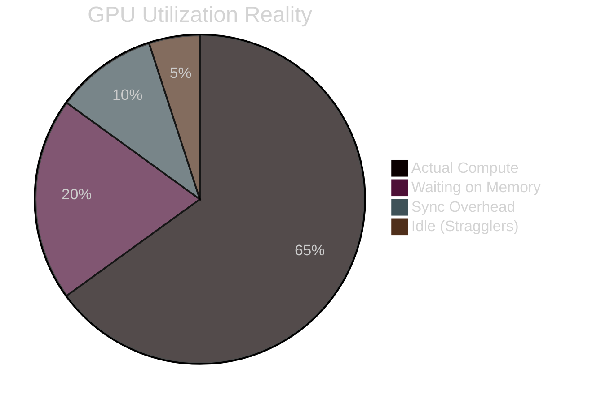
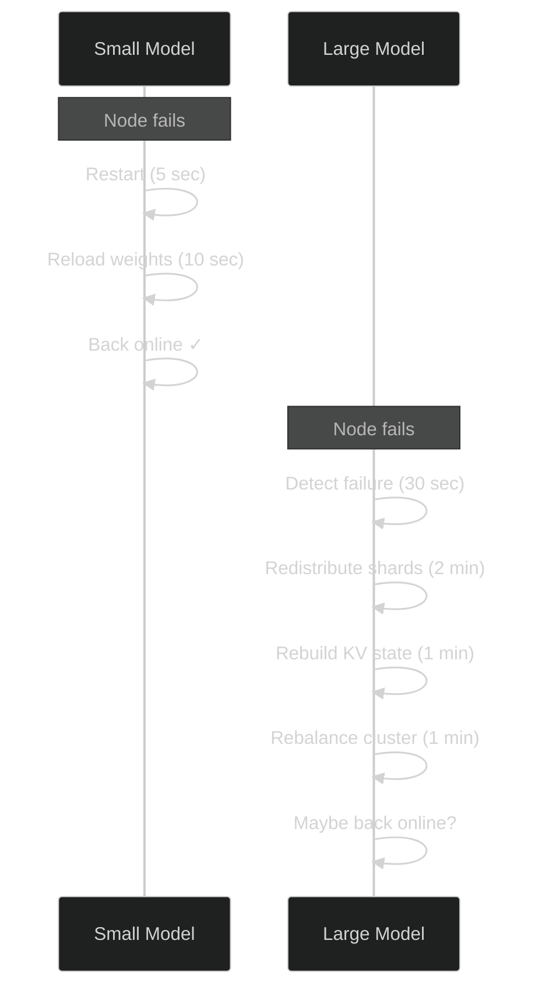

# Why Your "Senior ML Engineer" Can't Deploy a 70B Model

> **TL;DR:** Small models (≤30B) and large models (100B+) require fundamentally different infrastructure skills. Small models are an inference optimization problem—make one GPU go fast. Large models are a distributed systems problem—coordinate a cluster, manage memory as the primary constraint, and plan for multi-minute failure recovery. The threshold is around 70B parameters. Most ML engineers are trained for the first problem, not the second.

Here's something companies learn after burning through 6 figures in cloud credits: the skills for small models and large models are completely different. And most of your existing infra people can't do both.

Once you cross ~70B parameters, your job description flips. You're not doing inference optimization anymore. You're doing distributed resource management. Also known as: the nightmare.

<!-- more -->

I've watched teams of excellent ML engineers—people who can write CUDA kernels in their sleep—completely fall apart when they try to scale past the threshold. Not because they're bad. Because the game changed and nobody told them.

## At a Glance

| Dimension | Small Models (≤30B) | Large Models (100B+) |
|-----------|---------------------|----------------------|
| **Hardware** | 1-2 GPUs | 8+ GPUs, sharded |
| **Weights (FP16)** | ~14-60GB | 200-800GB+ |
| **KV Cache** | Negligible (~2-4GB) | Dominates (100s of GB per request at long context) |
| **GPU Utilization** | 85-95% achievable | 60-70% is "good" |
| **Primary Constraint** | Compute (FLOPs) | Memory bandwidth + interconnect |
| **Batching Strategy** | Aggressive = better throughput | Under-batch for stable p99 |
| **Failure Recovery** | Seconds (restart pod) | Minutes (rehydrate weights + KV across cluster) |
| **Parallelism** | Optional (data parallel) | Mandatory (tensor + pipeline + expert) |
| **Hardware Abstraction** | Portable containers | Co-design with specific topology |
| **Core Skills** | CUDA, kernel optimization | Distributed systems, scheduling |
| **Cost Model** | ~Linear with tokens | Fixed costs dominate, memory-time matters |

## The Memory Regime Shift (This Is The Big One)

Let's talk numbers.

**Small models (≤30B):** Your weights are ~60GB in FP16. Fits comfortably in 1-2 GPUs. KV cache? Negligible. Replication is cheap. Life is good.

**Large models (100B-400B+):** Weights need to be sharded across 8+ H100s. And here's where it gets fun—KV cache *dominates* at long contexts.

Do the math on a 405B model at 128k context: you're looking at **~400-500GB of KV cache per request** in FP16. One long session pins more memory than the weights themselves.



Suddenly you're dealing with dynamic allocation, fragmentation, eviction policies. You're basically running a distributed database that happens to do matrix multiplication.

## KV Cache Turns Inference Stateful

For small models, KV is ephemeral—a few GB total. Stateless batching works great.

For large models at 128k tokens? Hundreds of GB pinned *per request*. And this creates problems that'll make you question your career choices:

- **Head-of-line blocking:** one chunky request starves the cluster
- **Fairness explodes:** power users with long contexts crush everyone else
- **"One bad request" syndrome:** a single user can tank your entire system



The modern fix is **PagedAttention** (what vLLM uses). It reduces fragmentation by 20-50%. But here's the kicker: memory bandwidth—not FLOPs—becomes the bottleneck. Your expensive compute sits idle waiting on HBM. You paid for 1000 TFLOPS and you're getting maybe 300 because data can't move fast enough.

## Parallelism: Where Utilization Goes to Die

**Small models:** Near-100% GPU utilization is easy. Crank up batch size, done.

**Large models:** You need tensor parallelism + pipeline parallelism + (if MoE) expert parallelism. It's mandatory, not optional. And stragglers in any pipeline stage kill your tail latency.

The reality according to vLLM/TensorRT-LLM reports: **60-70% utilization is considered "good"** at scale. You're trading efficiency just to make the thing physically fit.

And before you say "just add more NVLink"—on H100 SXM, interconnect bandwidth caps at 900 GB/s per GPU (4th gen NVLink). Blackwell doubles that to 1.8 TB/s. But the fundamental constraint remains: you're moving tensors between 8 GPUs every forward pass, and interconnect saturation is a real ceiling regardless of generation.



## Failure Modes Flip

**Small models:** Something breaks? Restart the pod. 10 seconds later you're back.

**Large models:** Rehydration takes *minutes*. You need to reload weights across the cluster, rebuild KV state. A partial node failure strands gigabytes of cached state somewhere in limbo.

You need actual fault isolation strategies. Graceful degradation paths. This isn't "restart and pray" territory anymore.



## The Batching Paradox

Every ML engineer's instinct: batch aggressively → more tokens/sec → better utilization → profit.

Large models flip this on its head. Aggressive batching spikes memory consumption. Tail latency explodes. You start violating SLAs because one batch got too ambitious.

The counterintuitive move: **intentionally under-batch** for predictable p99 latency. You're leaving throughput on the table to not blow up randomly.

## Hardware Coupling: No More Abstractions

**Small models:** Write your code, containerize, ship it anywhere. Kubernetes doesn't care.

**Large models:** Co-design with hardware becomes mandatory. HBM capacity, NVLink topology, NUMA boundaries—these aren't nice-to-knows, they're architectural constraints.

Your inference code is married to your iron whether you like it or not.

## The Economics Nobody Wants to Talk About

**Small models:** Cost scales roughly with tokens. Predictable.

**Large models:** Fixed costs dominate. That cluster of H100s burns money whether you're at 100% or 10% utilization. Memory-time becomes the real unit—how much VRAM is pinned, for how long.

Long context destroys your margins. A user running 128k context requests consumes 10-100x the resources of someone at 4k contexts. But they're probably on the same pricing tier. This is why every inference provider is moving to reserved tiers and context-length pricing. The economics force it.

```mermaid
%%{init: {'theme': 'dark'}}%%
xychart-beta
    title "Cost Structure Comparison"
    x-axis ["Tokens", "Memory", "Fixed/Idle", "Long Context"]
    y-axis "% of Total Cost" 0 --> 100
    bar [80, 10, 5, 5]
    bar [20, 25, 35, 20]
```



*First bar: small models. Second bar: large models. Notice how "tokens processed" stops being the main cost driver.*

## What "Comfortable" Actually Looks Like

Here's my setup for a 24B model on 2x H100s. This is still the good life:

```bash
# The sweet spot - still manageable territory
CMD="$CMD --gpu-memory-utilization 0.95"
CMD="$CMD --max-num-seqs 512"          # Can batch aggressively
CMD="$CMD --max-model-len 32768"       # 32k context, no sweat
CMD="$CMD --kv-cache-dtype fp8"        # Compression helps
CMD="$CMD --tensor-parallel-size 2"    # Just 2 GPUs, clean split
CMD="$CMD --attention-backend flash_attn"
CMD="$CMD --max-num-batched-tokens 16384"  # Healthy batch size
```

Two GPUs. Tensor parallelism across them. 95% memory utilization. I can tune for throughput with `--max-num-batched-tokens 16384` or drop to 8192 if I need lower TTFT. Prefix caching works. Async scheduling works. Everything is still *tractable*.


Scale this to 8 GPUs with pipeline parallelism and expert routing? Now you're juggling synchronization points, straggler mitigation, memory pressure from 4x the KV cache, and failure domains that span the whole cluster.

## The Skill Gap Is Real

Here's the uncomfortable truth that nobody wants to say out loud:

**For small models:** You need ML engineers with CUDA expertise. Kernel optimization, quantization tricks, squeezing everything out of a single GPU.

**For large models:** You need distributed systems engineers + compiler people. Scheduling, resource management, fault tolerance, consistency semantics. The overlap is smaller than you'd think.

I've seen brilliant CUDA hackers completely lost when dealing with distributed state management. And I've seen infrastructure engineers who can build bulletproof distributed systems make rookie numerical computing mistakes.

## When NOT to Scale

Before you chase the biggest model you can afford, consider this: a well-tuned smaller model often beats a poorly-deployed large one.

**Stick with smaller models when:**

- **Your task is narrow and well-defined.** A fine-tuned 7B model for customer support classification will outperform a generic 70B model that wasn't trained for your domain. Smaller models with task-specific training consistently beat larger general-purpose models on focused tasks.

- **Latency matters more than capability.** A 7B model can hit sub-100ms TTFT easily. A 70B model on 4 GPUs? You're looking at 200-500ms minimum, and that's before network overhead. For real-time applications, smaller is faster.

- **You don't have the ops maturity.** Running a distributed inference cluster requires monitoring, alerting, graceful degradation, and on-call rotations that can handle multi-minute recovery scenarios. If your team isn't ready for that, you'll have worse uptime than a simpler deployment.

- **Your traffic is unpredictable.** Small models scale horizontally with simple replication. Large models require careful capacity planning because you can't just "spin up another pod" when each replica needs 8 GPUs.

- **Cost predictability matters.** With small models, you can estimate costs from traffic. With large models, you're paying for idle memory, long-context users subsidize short-context users, and your bill becomes harder to attribute.

The industry has a bias toward "bigger is better." But the engineering reality is that complexity has costs, and those costs compound. Sometimes the right answer is a 13B model that actually works reliably.

## The Takeaway

The infrastructure cliff is real. The sooner you accept that crossing ~70B parameters is a qualitative shift—not just "bigger numbers"—the less money you'll burn figuring it out.

Whether you're deploying a 7B model for a specific use case or scaling to hundreds of billions of parameters in a private environment, the path forward requires understanding these tradeoffs deeply. Not every team has the time or expertise to navigate this alone.

If you're figuring out where to start with AI infrastructure—or you've already hit the wall and need help scaling—we work on exactly these problems at Rackspace. Check out our [Private AI solutions](https://www.rackspace.com/cloud/private/ai) to see how we can help.

---

*This article is partially based on a comment in LinkedIn of unknown origin which was emailed to me and served as an inspiration for the writing.*

