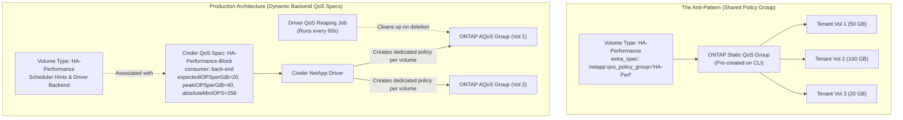

# Demystifying NetApp Adaptive QoS in OpenStack Genestack

Configuring multi-tenant Quality of Service (QoS) for enterprise storage in OpenStack sounds straightforward on paper: define standard and high-performance tiers, specify IOPS per gigabyte, and let the storage backend handle enforcement. In practice, our journey implementing NetApp ONTAP Adaptive QoS (AQoS) across Rackspace OpenStack Flex and Genestack production environments revealed sharp discrepancies between early published deployment specifications and storage reality.

<!-- more -->

From mysterious 10x performance penalties on small Boot-From-Volume (BFV) instances to confusing driver scheduler hints with backend configuration and navigating account privilege nuances, our cloud engineering and block storage teams spent many late nights untangling how OpenStack Cinder and NetApp ONTAP actually interact.

This post documents the hard-learned lessons, resolves the confusion around early specifications, details key upstream bug fixes, and shares the exact production QoS architecture running across our NetApp AFF 700 clusters today.

---

## The Architectural Goal: Enterprise HA Storage

In Genestack, our enterprise High Availability (HA) block storage tiers are backed by dedicated NetApp All Flash FAS (AFF) 700 systems. These arrays connect to compute nodes over redundant iSCSI fabrics with Linux native multipath (`multipathd`) and `volume_use_multipath=true` enabled in `nova.conf`.

We offer two primary NetApp-backed volume types:

1. **`HA-Standard`**: Cost-effective, enterprise SSD storage for general-purpose workloads.
2. **`HA-Performance`**: High-IOPS tier for latency-sensitive databases and critical workloads.

Both volume types take advantage of storage-controller-level Data Reduction Ratio (DRR) features—inline deduplication and compression—and leverage NetApp Volume Encryption (NVE) at rest, eliminating host-side LUKS encryption overhead while maintaining data security.

However, the real engineering challenge was enforcing strict, proportional performance guarantees across thousands of tenant volumes.

---

## Pitfall 1: The Flawed "Published Specification"

When isolated Cinder volume workers were first containerized and deployed under Kubernetes via Kustomize (`/etc/genestack/kustomize/cinder/netapp`), the initial operator documentation prescribed an opaque Kubernetes secret containing an 11-field comma-separated environment string:

```bash
# Early flawed specification (cinder-netapp secret)
BACKENDS="ha-block,openstack_user,password,192.0.2.10,443,vserver_ha,HA-Performance,True,True,False,disabled"
```

The fields were mapped as follows:

| Index | Option Name | Early Assumed Role |
| :--- | :--- | :--- |
| 0 | `backend_name` | Cinder backend identifier (`volume_backend_name`) |
| 1 | `netapp_login` | ONTAP authentication user |
| 2 | `netapp_password` | ONTAP password |
| 3 | `netapp_server_hostname` | Storage management IP / FQDN |
| 4 | `netapp_server_port` | HTTPS management port (443) |
| 5 | `netapp_vserver` | Target SVM / Vserver |
| 6 | `netapp:qos_policy_group` | Target QoS policy group |
| 7 | `netapp_dedup` | Deduplication toggle |
| 8 | `netapp_compression` | Compression toggle |
| 9 | `netapp_thick_provisioned` | Provisioning type (thin vs thick) |
| 10 | `netapp_lun_space_reservation` | LUN reservation toggle |

While well-intentioned, this design had fundamental flaws that immediately disrupted production operations.

### The Shared Policy Group Trap

By injecting `netapp:qos_policy_group` into the backend configuration (or attempting to assign it directly as a Cinder volume type extra-spec), the driver instructs ONTAP to place newly provisioned volumes into a static, pre-existing ONTAP QoS policy group.

As documented in the upstream NetApp ONTAP Cinder driver specification:

> *"All Cinder volumes associated with a single QoS policy group share the throughput value restrictions as a group... Use the `netapp:qos_policy_group` option when a Service Level Objective (SLO) needs to be applied to a set of Cinder volumes."*

In a multi-tenant cloud, this behavior is catastrophic. If 100 tenant volumes share the `HA-Performance` volume type, they do not each receive the defined throughput. Instead, all 100 volumes are throttled against **a single aggregate pool**. A single I/O-heavy instance running an unindexed database query or benchmark can starve every other tenant in the region!

Additionally, `netapp:qos_policy_group` requires the storage administrator to manually pre-provision the policy group on the NetApp ONTAP cluster CLI *before* any volume can be created:

```text
ontap-cluster::> qos adaptive-policy-group create -policy-group HA-Performance -vserver vs_cinder_data ...
```

If an operator typoed the group name or forgot to pre-create it, Cinder volume creation crashed with errors that mystified operators (`cinder create fail with netapp qos extra-spec`).

### Driver Backend Config vs. Scheduler Extra-Specs

Parameters such as `netapp_dedup`, `netapp_compression`, and `netapp_qos_min_support` were mistakenly assumed to be backend driver flags. 

In Cinder's architecture, however, these parameters are **volume type extra-specs** that function as scheduler capabilities and filters. The Cinder scheduler matches the extra-specs requested on a volume type against the capabilities reported by storage pools in the `cinder-volume` heartbeat. Passing these as raw environment variables to a worker backend bypassed Cinder's scheduler filtering logic and caused silent misconfigurations.

---

## Pitfall 2: The Boot-From-Volume (BFV) Performance Cliff

Once we began experimenting with NetApp Adaptive QoS (AQoS) to scale IOPS proportionally with disk size, we ran into a bizarre performance issue during synthetic benchmarks.

During early benchmarking of our draft `HA-Performance` tier, our engineering team spun up two Boot-From-Volume instances of different capacities and executed sequential `fio` benchmarks:

```bash
time fio --name=sequential-read-test-sdb \
  --ioengine=sync --rw=read --bs=4k --numjobs=1 \
  --size=5G --runtime=1m --time_based --direct=1 \
  --filename=/test
```

The benchmark results revealed a massive performance gap:

- **200 GiB Instance**: Delivered **11.3 MiB/s (~2,820 IOPS)**, completing swiftly.
- **20 GiB Instance**: Throttled down to **1.1 MiB/s (~280 IOPS)**, grinding through the benchmark at 1/10th the speed and taking over 1 minute 30 seconds to finish.

```text
# 20 GiB BFV Instance fio output
   bw (  KiB/s): min=  776, max= 2224, per=100.00%, avg=1126.45, stdev=106.42, samples=119

# 200 GiB BFV Instance fio output
   bw (  KiB/s): min=10680, max=20576, per=100.00%, avg=11286.32, stdev=880.10, samples=119
```

At first glance, it appeared as though a QoS multiplier was configured incorrectly by an entire order of magnitude.

### The Math Behind the Anomaly

It turned out the policy was doing exactly what was configured. In pure Adaptive QoS, throughput is calculated strictly as:

```text
Expected IOPS = expectedIOPSperGiB × Volume Size (GiB)
Peak IOPS     = peakIOPSperGiB × Volume Size (GiB)
```

When testing with early values like `expectedIOPSperGiB=3` and `peakIOPSperGiB=5` (or even `10` and `20`):

- A **200 GiB volume** received:
  - Expected: `200 × 10 = 2,000 IOPS`
  - Peak: `200 × 20 = 4,000 IOPS`
- A **20 GiB boot disk** received:
  - Expected: `20 × 10 = 200 IOPS`
  - Peak: `20 × 20 = 400 IOPS`
- A minimal **5 GiB root disk** received a crippling **50 to 100 IOPS**!

A Linux operating system booting from a 200 IOPS disk takes minutes to start services, systemd units time out, and `cloud-init` stalls. Customers provisioning minimal instances were penalized simply because their root disks were small.

### The Antidote: `absoluteMinIOPS`

The fix came from an essential property within NetApp's Adaptive QoS schema: **`absoluteMinIOPS`**.

As stated in the ONTAP driver documentation:

> *"You can use the `absoluteMinIOPS` field with very small storage objects. It overrides both `peakIOPSperGiB` and/or `expectedIOPSperGiB` when `absoluteMinIOPS` is greater than the calculated `expectedIOPSperGiB`."*

By enforcing an `absoluteMinIOPS` floor of **`256`** on `HA-Performance` and **`128`** on `HA-Standard`, any volume—even a 5 GiB root volume—is guaranteed responsive, stable performance during boot and package installation. Once the volume size scales to where `(perGiB × size) > absoluteMinIOPS`, the adaptive scaling gracefully takes over.

---

## Pitfall 3: Cinder Extra-Specs vs. Cinder QoS Specs

The turning point in our architecture came from separating **Volume Types** from **QoS Specifications**:



### The Power of `consumer: back-end`

Instead of pointing volume types to static ONTAP groups, OpenStack Cinder provides first-class QoS Specifications via `openstack volume qos create`.

When `consumer` is set to `back-end`:

1. **Dedicated Per-Volume Policy Groups**: For each volume created, the Cinder NetApp driver automatically generates a dedicated, isolated Adaptive QoS policy group on the ONTAP cluster specifically for that volume.
2. **True Tenant Isolation**: Every volume enjoys its own calculated performance envelope without sharing limits with neighboring volumes.
3. **Automated Lifecycle Management (Reaping Job)**: When an OpenStack volume is deleted, the Cinder NetApp driver tags the volume's policy group for deletion. The driver's background **QoS reaping job**, running every 60 seconds, removes the transient policy groups from ONTAP, preventing cluster configuration bloat.

---

## The Upstream Journey: Bug #1924798 & Driver Modernization

During initial cluster deployments, our teams encountered authentication and capability discovery hurdles when configuring storage credentials.

Initial configurations attempted to restrict Cinder to a Storage Virtual Machine (SVM) scoped account (such as `vsadmin`), adhering to the principle of least privilege. However, Cinder repeatedly failed to initialize volume backends or failed to discover QoS capabilities properly.

This stemmed from how Cinder historically checked for minimum QoS capabilities on ONTAP.

### Launchpad Bug #1924798

In earlier versions of the NetApp ONTAP driver, querying whether a backend supported minimum QoS (`netapp_qos_min_support`) triggered API calls that required cluster-level privileges. When operators configured Cinder with a Storage Virtual Machine (SVM) scoped account (`vsadmin`), the capability check failed, causing the scheduler to report `NoValidBackend` or disable minimum QoS guarantees.

Upstream fixed this issue in **[Launchpad Bug #1924798](https://bugs.launchpad.net/cinder/+bug/1924798)** (backported through OpenStack Yoga and Zed), allowing SVM-scoped accounts to inspect QoS capabilities correctly. In practice, however, managing full Adaptive QoS policies dynamically on an enterprise array is cleanest when providing the driver with a cluster-scoped user (such as `cluster-limited`) with role-based access control (RBAC) granting read/write access to QoS policy groups and storage pools.

### The REST API Transition (2024.1 – 2026.2)

Across OpenStack 2024.1 (Caracal), 2025.1 (Epoxy), and 2026.1/2026.2 (Gazpacho), NetApp transitioned the Cinder driver from legacy ZAPI (ONTAPI) to the modern ONTAP REST API client.

Key improvements and operational impacts include:

- **Enhanced Resilience**: Better HTTP connection pooling and robust retry logic during volume provisioning and cloning.
- **MBPS Rounding**: When using the REST client, throughput limits (previously passed in BPS) are handled by ONTAP as integer MBPS values, automatically rounding up.
- **NetApp Interoperability Matrix (IMT) Validation**: Recent NetApp IMT matrices confirm that Cinder 2025.1 and 2026.1 paired with ONTAP 9.16.1+ through 9.18.1+ fully certify QoS support, Active/Active high availability, thin provisioning, and storage-assisted migration across AFF and ASA platforms.

### Retype and Volume Extend Behavior

Two additional architectural nuances are vital for cloud operators:

1. **Volume Extension**: Because our QoS specs define `expectedIOPSAllocation='allocated-space'` and `peakIOPSAllocation='allocated-space'`, when a user runs `openstack volume extend <vol-id> <new-size>`, ONTAP dynamically recalculates the new peak and expected IOPS thresholds immediately without volume downtime.
2. **Retyping Constraints**: Unlike some storage drivers, ONTAP does not support live in-place volume retyping across different QoS policies without storage migration. In recent Cinder releases, an `openstack volume retype` that alters QoS specs is safely treated as an active storage-assisted migration.

---

## Production Blueprint: Verified Reference Configuration

Below is the verified, production-tested configuration running in our Genestack `release-2026.2.0.2` production environments.

### 1. The Active QoS Policies

```bash
((genestack) ) [PROD] ubuntu@overseer01:/opt/genestack/ansible/playbooks$ openstack volume qos list
+--------------------------------------+----------------------+----------+----------------+-----------------------------------------------------------------------------------------------------------------------------------------------------+
| ID                                   | Name                 | Consumer | Associations   | Properties                                                                                                                                          |
+--------------------------------------+----------------------+----------+----------------+-----------------------------------------------------------------------------------------------------------------------------------------------------+
| cabff7be-2fcb-40ab-b907-e975ad1462f4 | HA-Performance-Block | back-end | HA-Performance | absoluteMinIOPS='256', expectedIOPSAllocation='allocated-space', expectedIOPSperGiB='20', peakIOPSAllocation='allocated-space', peakIOPSperGiB='40' |
| a3e76832-ff63-4d5d-a53f-ba0b3b4233fc | HA-Standard-Block    | back-end | HA-Standard    | absoluteMinIOPS='128', expectedIOPSAllocation='allocated-space', expectedIOPSperGiB='10', peakIOPSAllocation='allocated-space', peakIOPSperGiB='20' |
+--------------------------------------+----------------------+----------+----------------+-----------------------------------------------------------------------------------------------------------------------------------------------------+
```

Notice the key settings:

- **`consumer='back-end'`**: Enforces QoS directly on the NetApp controller rather than at the hypervisor.
- **`absoluteMinIOPS='256'` / `'128'`**: Protects small and boot-from-volume instances from starving.
- **`expectedIOPSperGiB` & `peakIOPSperGiB`**: Provides linear scalability as storage capacity grows.
- **`allocated-space`**: Bases throughput on provisioned volume size rather than consumed data blocks.

### 2. The Volume Types & Extra-Specs

```bash
((genestack) ) [PROD] ubuntu@overseer01:/opt/genestack/ansible/playbooks$ openstack volume type list --long --encryption-type
+--------------------------------------+----------------+-----------+----------------------------------------------+----------------------------------------------------------------------------------------------------+------------+
| ID                                   | Name           | Is Public | Description                                  | Properties                                                                                         | Encryption |
+--------------------------------------+----------------+-----------+----------------------------------------------+----------------------------------------------------------------------------------------------------+------------+
| dece7db2-f286-4246-9684-422649663425 | HA-Performance | True      | HA Block Performance with at rest encryption | :price='0.000246575', netapp:qos_policy_group_is_adaptive='true', netapp_compression='true',       | -          |
|                                      |                |           |                                              | netapp_dedup='true', netapp_qos_min_support='true', provisioning:max_vol_size='2048',              |            |
|                                      |                |           |                                              | provisioning:min_vol_size='5', volume_backend_name='ha-block'                                      |            |
| 746b3415-7ce2-4b69-ba2b-5cd94c0bcdd4 | HA-Standard    | True      | HA Block Standard with at rest encryption    | :price='0.000205479', netapp:qos_policy_group_is_adaptive='true', netapp_compression='true',       | -          |
|                                      |                |           |                                              | netapp_dedup='true', netapp_qos_min_support='true', provisioning:max_vol_size='2048',              |            |
|                                      |                |           |                                              | provisioning:min_vol_size='5', volume_backend_name='ha-block'                                      |            |
+--------------------------------------+----------------+-----------+----------------------------------------------+----------------------------------------------------------------------------------------------------+------------+
```

### 3. Step-by-Step Deployment Commands

To recreate this configuration in an OpenStack environment:

#### Step A: Create the Backend QoS Specs

```bash
# HA-Performance QoS Specification
openstack volume qos create \
  --consumer back-end \
  --property absoluteMinIOPS=256 \
  --property expectedIOPSAllocation=allocated-space \
  --property expectedIOPSperGiB=20 \
  --property peakIOPSAllocation=allocated-space \
  --property peakIOPSperGiB=40 \
  HA-Performance-Block

# HA-Standard QoS Specification
openstack volume qos create \
  --consumer back-end \
  --property absoluteMinIOPS=128 \
  --property expectedIOPSAllocation=allocated-space \
  --property expectedIOPSperGiB=10 \
  --property peakIOPSAllocation=allocated-space \
  --property peakIOPSperGiB=20 \
  HA-Standard-Block
```

#### Step B: Define Volume Types and Capabilities

```bash
# HA-Performance Volume Type
openstack volume type create HA-Performance \
  --description "HA Block Performance with at rest encryption" \
  --public

openstack volume type set HA-Performance \
  --property volume_backend_name="ha-block" \
  --property netapp_qos_min_support="true" \
  --property netapp:qos_policy_group_is_adaptive="true" \
  --property netapp_compression="true" \
  --property netapp_dedup="true" \
  --property provisioning:min_vol_size="5" \
  --property provisioning:max_vol_size="2048"

# HA-Standard Volume Type
openstack volume type create HA-Standard \
  --description "HA Block Standard with at rest encryption" \
  --public

openstack volume type set HA-Standard \
  --property volume_backend_name="ha-block" \
  --property netapp_qos_min_support="true" \
  --property netapp:qos_policy_group_is_adaptive="true" \
  --property netapp_compression="true" \
  --property netapp_dedup="true" \
  --property provisioning:min_vol_size="5" \
  --property provisioning:max_vol_size="2048"
```

#### Step C: Associate QoS Specs with Volume Types

```bash
openstack volume qos associate HA-Performance-Block HA-Performance
openstack volume qos associate HA-Standard-Block HA-Standard
```

---

## Comparison: HA NetApp vs. LVM iSCSI Tiers

In our production deployment, NetApp storage coexists alongside locally attached LVM iSCSI nodes (`volume_backend_name='LVM_iSCSI'`). Comparing the two highlights why backend-enforced Adaptive QoS is such a significant architectural advantage:

| Characteristic | NetApp HA Tiers (`ha-block`) | LVM iSCSI Tiers (`LVM_iSCSI`) |
| :--- | :--- | :--- |
| **QoS Consumer** | `back-end` (ONTAP Controller) | `both` (Front-end hypervisor throttling via QEMU/libvirt) |
| **QoS Properties** | Adaptive IOPS (`expectedIOPSperGiB`, `peakIOPSperGiB`, `absoluteMinIOPS`) | Static limits (`read_iops_sec_per_gb`, `write_iops_sec_per_gb`) |
| **Small Volume Floor** | Enforced via `absoluteMinIOPS` (128 / 256 IOPS) | Linear per-GiB scaling (requires manual minimum sizing) |
| **Encryption Model** | Storage-layer at rest (NetApp Volume Encryption) | Front-end host-level LUKS (`aes-xts-plain64`) |
| **Efficiency** | Array-level inline deduplication & compression | None (raw LVM blocks) |
| **Volume Scaling** | Dynamic automatic recalculation upon extend | Hypervisor throttles update via Nova/libvirt |

---

## Summary of Hard-Learned Takeaways

1. **Avoid static `netapp:qos_policy_group` in multi-tenant environments**: Pointing multiple tenant volumes to a shared ONTAP policy group creates noisy-neighbor contention. Always use standalone Cinder QoS Specs with `consumer: back-end`.
2. **Never deploy Adaptive QoS without `absoluteMinIOPS`**: Pure linear scaling starves small root disks during instance boot. An absolute minimum of 128 to 256 IOPS ensures responsive VMs at any size.
3. **Keep scheduler capabilities on the Volume Type**: Storage efficiency flags (`netapp_dedup`, `netapp_compression`, `netapp_qos_min_support`) are scheduler filters. Do not attempt to hardcode them in backend worker environment strings.
4. **Leverage All Flash FAS for Guaranteed Floors**: ONTAP guarantees minimum IOPS only on All Flash FAS (AFF) platforms. Use `netapp_qos_min_support='true'` to prevent scheduling onto non-flash or hybrid pools.
5. **Embrace the ONTAP REST API**: Modern Cinder releases (2024.1+) provide superior stability and automated retries over the modern REST API interface, leaving legacy ZAPI hurdles in the past.

By combining Cinder's backend QoS spec model with NetApp's Adaptive QoS engine, cloud operators can deliver truly enterprise-grade, predictably performing, and hands-free multi-tenant storage in OpenStack.
