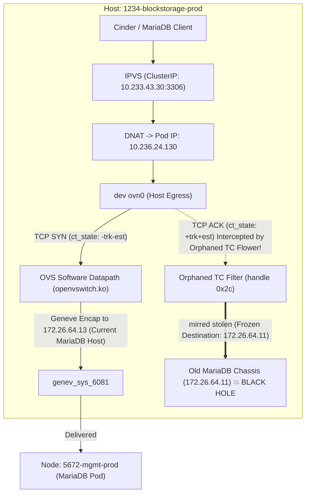

# When Hardware Offload Goes Silent: The Case of the Orphaned TC Flowers

In large-scale cloud infrastructure, few things sound as compelling on paper as hardware offloading. When you are running Genestack—powering enterprise OpenStack clouds orchestrated on top of Kubernetes with Kube-OVN and Open vSwitch (OVS)—encapsulating Geneve overlay traffic and tracking connection state can consume measurable CPU cycles across a busy fleet. Offloading those flow tables and match-action rules directly into the physical NIC silicon is the holy grail: line-rate throughput, near-zero CPU overhead, and microsecond packet handling.

Until your network cards decide they cannot actually handle it.

<!-- more -->

In our production environments, enabling OVS hardware offloading (`other_config:hw-offload=true`) did not yield frictionless line-rate acceleration. Instead, the physical NICs in our fleet encountered firmware locks, driver crashes, and unrecoverable server panics. 

Naturally, we took the responsible engineering decision: turn off hardware offloading fleet-wide (`other_config:hw-offload=false`) and revert cleanly to the tried-and-true Linux kernel software datapath (`openvswitch.ko`). Node stability immediately returned, server crashes vanished, and we closed the maintenance window.

What we did not realize at the time was that we had inadvertently primed a silent time bomb across dozens of hosts. Weeks later, services would begin mysteriously hanging, TCP handshakes would drop into one-way black holes, and the culprit would turn out to be a ghost in the Linux kernel: **orphaned Traffic Control (TC) flower filters**.

Here is the story of how we uncovered the problem, why standard troubleshooting tooling failed to see it, and how we engineered an automated audit and remediation pipeline across 121 production nodes in [PR #1843](https://github.com/rackerlabs/genestack/pull/1843/) and its subsequent bidirectional overhaul.

---

## The Mystery: The Case of the Hanging Cinder Nodes

The trouble surfaced weeks after disabling hardware offload during routine operations and certificate rotations. On storage nodes like `1234-blockstorage-prod`, OpenStack block storage services (`cinder-volume`, `cinder-volume-netapp`, and `cinder-backup`) reported as `active (running)` in `systemctl status`, yet they were completely dead in the water.

They logged no application output, generated no heartbeats, and were conspicuously absent from `openstack volume service list`:

```shell
overseer$ openstack volume service list --service cinder-volume | grep 1234-blockstorage-prod
# (crickets — no output)
```

Inspecting the service journal revealed nothing beyond the initial systemd invocation. Even restarting the units failed to produce logs:

```text
cinder-volume.service: State 'stop-sigterm' timed out. Killing.
cinder-volume.service: Killing process 1720535 (cinder-volume) with signal SIGKILL.
cinder-volume.service: Consumed 2.001s CPU time, 123.8M memory peak
```

A process consuming only 2.0 seconds of CPU across its entire lifetime is a classic signature: it wasn't crashing or churning; it was hanging synchronously on an external I/O call during early boot.

Attaching `py-spy` to the stuck process showed the main thread blocked in Eventlet's polling hub:

```text
MainThread idle in eventlet hub (do_poll / wait / run)
  cinder/service.py:create -> Service.create()
```

In OpenStack Cinder, the very first network operation executed inside `Service.create()` is querying the MariaDB database to register or update its host service record. RabbitMQ hasn't even been touched yet.

We ran a quick TCP check from the host to the MariaDB ClusterIP VIP:

```shell
root@1234-blockstorage-prod:~# nc -zv 10.233.43.30 3306
Connection to 10.233.43.30 3306 port [tcp/mysql] succeeded!
```

Wait. `nc -zv` succeeded! If TCP port 3306 was reachable, why did the MySQL client and Cinder hang indefinitely?

---

## Down the Rabbit Hole: The One-Way TCP Black Hole

When `nc -zv` says "succeeded", it only proves one thing: the initial TCP SYN was acknowledged by a SYN-ACK. It does **not** prove that application data or subsequent ACKs can pass through the network path.

We fired up the real MariaDB client from the broken node:

```shell
root@1234-blockstorage-prod:~# mariadb -h 10.233.43.30 -u cinder -p
# Hangs indefinitely...
```

Meanwhile, from a peer storage node (`1236-blockstorage-prod`), the exact same command connected instantly.

We checked the low-level TCP socket statistics with `ss -tnpi`:

```text
ESTAB 10.233.43.30:35976 -> 10.233.43.30:3306
  bytes_acked:1 segs_out:7 segs_in:6 rcvmss:536
```

MariaDB is a server-speaks-first protocol: once the TCP 3-way handshake finishes, the database server emits an initial greeting packet (e.g. `11.8.5-MariaDB-ubu2404`).

Look at those segment counters:
- `segs_in: 6`: The server sent 1 SYN-ACK, followed by 5 duplicate SYN-ACK retransmissions.
- `segs_out: 7`: The client sent 1 SYN, 1 ACK, and 5 duplicate ACKs.

The server never received our client's ACK! The server thought the connection was still opening, while our client thought the handshake was complete and was waiting for the server's handshake greeting.

To see where the packets were vanishing, we ran simultaneous `tcpdump` traces during a connection attempt.

On the healthy node (`1236-blockstorage-prod`), every outbound packet appeared on the OVN host interface (`ovn0`) and then on the Geneve tunnel interface (`genev_sys_6081`):
```text
ovn0 Out: SYN -> genev_sys_6081 Out: SYN
genev_sys_6081 In: SYN-ACK -> ovn0 In: SYN-ACK
ovn0 Out: ACK -> genev_sys_6081 Out: ACK
# Greeting received! Handshake complete.
```

On the broken node (`1234-blockstorage-prod`), something bizarre happened:
```text
ovn0 Out: SYN -> genev_sys_6081 Out: SYN
genev_sys_6081 In: SYN-ACK -> ovn0 In: SYN-ACK
genev_sys_6081 Out: ACK          <-- NOTICE: Never appeared on ovn0!
genev_sys_6081 Out: ACK (re-tx)  <-- Never appeared on ovn0!
```

The SYN traversed `ovn0` normally. But the ACK and every subsequent packet **bypassed `ovn0` entirely** and showed up only on the Geneve tunnel interface—and yet the remote pod never saw them!



---

## The Ghost in the Stack: Orphaned TC Flowers

How could packets skip the interface capture point and end up tunneled to oblivion? We inspected the Linux Traffic Control (`tc`) filters on `ovn0`:

```shell
root@1234-blockstorage-prod:~# tc -s filter show dev ovn0 egress
```

Buried in the dump was this rule:

```text
filter protocol ip pref 2 flower chain 0 handle 0x2c
  eth_type ipv4
  ip_proto tcp
  src_ip 100.64.0.101
  dst_ip 10.236.24.130
  ct_state +trk+est-rel-rpl
  not_in_hw
  action order 1: tunnel_key set src_ip 172.26.64.191 dst_ip 172.26.64.11 key_id 3 ...
  action order 2: mirred (Egress Redirect to device genev_sys_6081) stolen
```

Let's dissect what this rule was doing:

1. **`src_ip 100.64.0.101`**: The Kube-OVN join subnet IP for this node.
2. **`dst_ip 10.236.24.130`**: The Kubernetes Pod IP of MariaDB.
3. **`ct_state +trk+est`**: It only matched **established** connections! The initial SYN had `ct_state -trk-est`, so it bypassed this filter and flowed through the normal OVS software pipeline.
4. **`tunnel_key set ... dst_ip 172.26.64.11`**: It encapsulated the packet directly into Geneve and addressed the tunnel to chassis **`172.26.64.11`**.
5. **`mirred ... stolen`**: It stole the packet immediately at the TC egress hook—before tcpdump on `ovn0` ever saw it!

And here is the kicker: **MariaDB was not at `172.26.64.11` anymore.**

Twelve days earlier, during an automated TLS certificate rotation orchestrated by `mariadb-operator`, the single-replica MariaDB pod had been deleted and rescheduled from management node `5670-mgmt-prod` (overlay IP `172.26.64.11`) to `5672-mgmt-prod` (overlay IP `172.26.64.13`). 

The live OVS software datapath knew this and correctly routed to `.13`. But the TC flower filter was a frozen relic pointing at `.11`. Every ACK sent by Cinder was being stolen by the kernel TC subsystem and thrown into the void on a host that no longer ran the database!

### Why Were These Rules Still in the Kernel?

When hardware offload was enabled (`hw-offload=true`), OVS offloaded flows into the Linux kernel TC flower subsystem. 

When we flipped `other_config:hw-offload=false`, OVS gracefully switched back to its own kernel datapath module (`openvswitch.ko`). But **OVS does not delete or flush existing TC flower rules when hardware offloading is disabled.** It simply stops talking to the TC subsystem!

Because OVS stopped managing them, the revalidation thread stopped reaping them. They became permanent **orphans** in the Linux kernel. 

And it wasn't just on `ovn0`. When we checked the Geneve tunnel interface (`genev_sys_6081`), we found **94 orphaned ingress filters**. Many looked like this:

```text
action order 2: mirred (Egress Redirect to device *) stolen
```

In `tc` output, `device *` is what `iproute2` prints when an action's target interface index (`ifindex`) is 0. That happens when the target network device (such as a pod's veth pair `*_h`) has been deleted. When a packet hits a filter pointing to a deleted interface, the kernel logs `tc mirred: target device is gone` once and silently drops every packet thereafter.

Any packet arriving on the tunnel whose tuple collided with one of these dormant filters was silently stolen and blackholed.

---

## Remediation Iterations and the Hidden Blind Spots

Once we understood the problem, we set out to build automation. We created a read-only audit script (`scripts/tc-offload-audit.sh`) and an Ansible remediation playbook (`ansible/playbooks/clear-stale-tc-flower.yaml`) in [PR #1740](https://github.com/rackerlabs/genestack/pull/1740).

The strategy was straightforward:
- Confirm OVS reports zero live TC datapath flows (`ovs-appctl dpctl/dump-flows type=tc`).
- Delete stale flower filters and ingress qdiscs on affected interfaces.

It seemed to work. But as we observed the cluster over the subsequent weeks, intermittent network timeouts continued to pop up across different node roles. When we dug deeper, we realized our early tooling was riddled with subtle, layered architectural blind spots.

### Blind Spot 1: The "Chain 0" Fallacy

In the initial audit script and playbook, cleanup commands were explicitly scoped to **`chain 0`**:

```bash
# Early playbook snippet
pre=$(tc filter show dev $d ingress chain 0 2>/dev/null | grep -c "^filter.*flower")
if [ "$pre" -gt 0 ]; then
  tc filter del dev $d ingress chain 0 2>/dev/null
fi
```

And in `tc-offload-audit.sh`:

```bash
# Early audit verdict logic
elif [ "$hw" = "false" ] && [ "$live_flows" = "0" ] && [ "$chain0_max" -eq 0 ]; then
  verdict="RESIDUAL-ONLY (Acceptable)"
```

This was a major oversight. OVS flower offloading uses **goto-chains** extensively. Complex flows match on chain 0, perform an action (like `ct` or `pedit`), and branch into `chain 1`, `chain 2`, or arbitrary chain IDs like `chain 234159283`.

When `chain 0` was cleared, the higher-numbered chains remained lodged in the kernel on `genev_sys_6081` and shared ingress blocks (`block 10`, `block 11`). The audit script saw `chain 0` was empty, declared the node `RESIDUAL-ONLY (Acceptable)`, exited with code `0`, and allowed our deployment pipelines to proceed. Meanwhile, dozens of dormant filters containing `mirred (Egress Redirect to device *) stolen` remained alive on higher chains, ready to swallow packets whenever an ephemeral port or tunnel ID collided with them.

### Blind Spot 2: Hostname Resolution and the Skipped Node

In our Ansible playbook, the task executed `ovs-appctl` inside the local `ovs-ovn` pod to verify flow status. It built a dictionary mapping node names:

```yaml
# Early playbook lookup
ovs_pod: "{{ ovs_pod_by_node[node_name] | default('') }}"
```

In production, inventory hostnames often vary between short names (`1238-blockstorage-prod`) and fully qualified domain names (`1238-blockstorage-prod.example.com`), whereas Kubernetes `spec.nodeName` uses the FQDN. When an inventory host failed an exact string match, `ovs_pod` resolved to an empty string:

```yaml
- name: Skip hosts that do not run an ovs-ovn pod
  when: ovs_pod | length == 0
  block:
    - name: Mark NO-OVS-POD
```

The node was silently marked `NO-OVS-POD` and skipped! The playbook reported a clean run, while the node sat completely un-remediated with all its stranded flower rules intact.

### Blind Spot 3: The Direction Blind Spot (`ingress` vs. `egress` on `ovn0`)

Even after multi-chain cleanup was introduced in [PR #1843](https://github.com/rackerlabs/genestack/pull/1843/), transit tunnel drops were resolved on compute and storage nodes, but **certain management nodes remained broken**, unable to reach MariaDB.

Why? Because Linux `clsact` qdiscs attach to **both** ingress and egress.

For transit packets forwarded through Geneve tunnels between nodes, traffic hits `ingress`. But **host-originated traffic** destined for Kubernetes ClusterIPs (such as control plane services communicating with `mariadb-cluster-primary.openstack.svc.cluster.local:3306`) takes a fundamentally different path:

1. A local host process (Cinder, Nova, Glance, Neutron) issues a TCP SYN to `<cluster-ip>:3306` (with `TTL=64`).
2. **IPVS** intercepts locally on the host, decrements the TTL to 63, and DNATs the destination to the backend Pod IP (`<pod-ip>`).
3. Netfilter **`KUBE-POSTROUTING`** SNATs the source address to the node's Kube-OVN join IP (`<join-ip>`).
4. The kernel routing table sends the packet **out** through interface **`ovn0`** into the OVN overlay.
5. Consequently, the packet traverses the **`egress` hook of `ovn0`**!

Stranded TC flower offload rules explicitly matched `ip_ttl 63` + `dst_ip <pod-ip>` on **`ovn0 egress`**, applying `tunnel_key set dst_ip <old-node-ip>` and `mirred stolen`.

Because earlier tooling exclusively audited and cleaned `ingress`, every single one of these `ovn0 egress` rules was completely invisible and survived cleanup!

### Blind Spot 4: Netlink Silent Deletion Rejection (`ENOENT`)

When we attempted to script the deletion of flower rules across devices, we ran into an unexpected Netlink quirk.

OVS TC offload installs rules explicitly bound to specific network protocols (`protocol ip` / `ETH_P_IP` `0x0800`). When running deletion commands without specifying `protocol ip`:

```bash
# What the script ran:
tc filter del dev $d egress chain $c
```

`iproute2` sends a Netlink request defaulting the protocol field to `0` (`ETH_P_ALL`). The kernel classifier rejects this request with `ENOENT` ("No such file or directory") because no rule exists under protocol 0!

Because shell cleanup routines frequently suppress errors with `2>/dev/null || true` to ignore devices that don't have filters, **the kernel was silently refusing to delete the filters**, and the failure was completely masked. The playbook reported a clean pass, but the filters remained active.

### Blind Spot 5: Lingering Netfilter Conntrack State on Port 3306

Because services continually retried TCP connections while the bad TC rules were in place, the host netfilter connection tracking table became populated with stale NAT and destination states. Even after deleting the TC filters and flushing OVS datapath caches, immediate TCP retries continued hitting poisoned conntrack entries until conntrack was explicitly cleared for port 3306 (`conntrack -D -p tcp --dport 3306` and `--sport 3306`).

---

## The Overhaul: Bidirectional Sweeping & Protocol-Aware Deletion

To permanently solve this problem, we completely overhauled both `scripts/tc-offload-audit.sh` and `ansible/playbooks/clear-stale-tc-flower.yaml`.

### 1. Bidirectional Sweeping (`ingress` + `egress`)

Both the audit script and the playbook now inspect and sweep both directions across all discovered `clsact` and `ingress` devices, known OVN interfaces (`ovn0`, `genev_sys_6081`, `mirror0`, `br-int`), and shared blocks (`ingress_block`, `egress_block`, `block`):

```bash
for d in $all_devs; do
  [ -d "/sys/class/net/$d" ] || continue
  for dir in ingress egress; do
    pre=$(tc filter show dev $d $dir 2>/dev/null | grep -c "^filter.*flower" || true)
    if [ "$pre" -gt 0 ]; then
      clean_target "dev $d $dir"
    fi
  done
done
```

### 2. Protocol- and Priority-Aware Deletion (`clean_target`)

Instead of issuing generic deletion commands that Netlink silently rejects, the cleanup helper parses `tc filter show` to extract exact `(protocol, pref, chain, handle)` attributes:

```bash
clean_target() {
  local target="$1"
  local show_out
  show_out=$(tc filter show $target 2>/dev/null || true)
  [ -n "$show_out" ] || return 0

  # 1. Parse and delete specific flower filter handles with protocol & pref
  while IFS="|" read -r p_proto p_pref p_chain p_handle; do
    [ -n "$p_handle" ] || continue
    tc filter del $target ${p_proto:+protocol $p_proto} ${p_pref:+pref $p_pref} ${p_chain:+chain $p_chain} handle "$p_handle" flower >/dev/null 2>&1 || true
    tc filter del $target ${p_proto:+protocol $p_proto} ${p_pref:+pref $p_pref} handle "$p_handle" flower >/dev/null 2>&1 || true
    tc filter del $target protocol ip ${p_pref:+pref $p_pref} handle "$p_handle" flower >/dev/null 2>&1 || true
    tc filter del $target protocol ip pref 2 handle "$p_handle" flower >/dev/null 2>&1 || true
  done < <(echo "$show_out" | awk '...')

  # 2. Explicitly purge pref 2 offload chain (OVS HW_OFFLOAD default)
  tc filter del $target protocol ip pref 2 >/dev/null 2>&1 || true
  tc filter del $target protocol ipv6 pref 2 >/dev/null 2>&1 || true
  tc filter del $target pref 2 >/dev/null 2>&1 || true

  # 3. Purge all remaining discovered chains
  for c in $(echo "$show_out" | awk '/^filter .*flower/ { ... }' | sort -un); do
    tc filter del $target chain "$c" >/dev/null 2>&1 || true
    tc filter del $target protocol ip chain "$c" >/dev/null 2>&1 || true
  done
}
```

### 3. Flushing OVS Datapath & Netfilter Conntrack

Immediately following filter removal, the playbook flushes the OVS software datapath cache and purges stale netfilter conntrack entries for database connections:

```bash
# Flush OVS kernel datapath flow cache
if command -v ovs-appctl >/dev/null 2>&1; then
  ovs-appctl dpctl/del-flows >/dev/null 2>&1 || true
elif command -v crictl >/dev/null 2>&1; then
  ovs_cid=$(crictl ps --name openvswitch -q 2>/dev/null | head -n1)
  if [ -n "$ovs_cid" ]; then
    crictl exec "$ovs_cid" ovs-appctl dpctl/del-flows >/dev/null 2>&1 || true
  fi
fi

# Purge stale MariaDB connection tracking states
if command -v conntrack >/dev/null 2>&1; then
  for p in $CONNTRACK_PORTS; do
    conntrack -D -p tcp --dport "$p" >/dev/null 2>&1 || true
    conntrack -D -p tcp --sport "$p" >/dev/null 2>&1 || true
  done
fi
```

### 4. Canonical Kubernetes Node Accounting

We fixed node resolution by mapping canonical unique Kubernetes node names in `tc_ovs_nodes` via `spec.nodeName` and normalizing both FQDNs and short hostnames in `tc_k8s_node_by_name`. This eliminated false "uncovered node" failures and allows operators to safely run with `-e tc_strict=true`.

---

## Validation & Results

Before rolling across our production fleet, we performed a dry-run and canary execution on `1240-blockstorage-prod`:

```shell
ansible-playbook -i /etc/genestack/inventory/inventory.yaml \
  /opt/genestack/ansible/playbooks/clear-stale-tc-flower.yaml \
  --limit 1240-blockstorage-prod.example.com \
  -e tc_cleanup_dry_run=true
```

Output:
```text
TASK [Report (dry run) orphaned flower filters on shared blocks and per-device qdiscs]
ok: [1240-blockstorage-prod.example.com] => {
    "msg": "1240-blockstorage-prod.example.com [DRY-RUN]: genev_sys_6081:73->73"
}
```

The playbook correctly found all 73 stranded rules on `genev_sys_6081`. 

We executed the remediation live (`-e tc_cleanup_dry_run=false`). The cleanup completed in seconds without a single packet drop, interface flap, or socket disconnect. A direct verification check with `tc -s filter show dev genev_sys_6081 ingress` and `tc -s filter show dev ovn0 egress` returned completely clean.

With confidence restored, we executed the playbook across all 121 production nodes (compute, control, storage, and network). 

We ran the post-remediation audit:

```text
((genestack) ) [PROD] ubuntu@5678-overseer01:/opt/genestack/scripts$ ./tc-offload-audit.sh
=== per-node (full TSV: /home/ubuntu/maint/tc-offload-audit-2026-10-06-1821.tsv) ===
...
=== summary ===
ovs-ovn pods audited : 121
  CLEAN           121
by role label       :
  NOLABEL/CLEAN                       8
  compute,network/CLEAN               64
  control/CLEAN                       6
  network/CLEAN                       4
  storage/CLEAN                       39
nodes needing attention: none
```

**100% of nodes transitioned to `CLEAN`.** 

MariaDB ClusterIP and Service FQDN connectivity immediately stabilized across all management and storage nodes. OpenStack control plane services reconnected cleanly, database queries succeeded without delay, and Cinder volume heartbeats resumed as expected.

---

## Lessons Learned

This incident was one of the most subtle networking bugs we have encountered, and it left us with several key takeaways for operating large-scale software-defined networks:

1. **Turning off a userspace feature does not clean up the kernel.** Setting `other_config:hw-offload=false` in OVS stopped it from managing TC rules, but it did not remove existing rules. The kernel faithfully executed those abandoned rules until we explicitly purged them.
2. **SDN offload is bidirectional.** `clsact` attaches to both ingress and egress hooks. Transit overlay packets arrive on `ingress`, but host-originated traffic routed into overlays traverses `egress`. Never audit only `ingress`.
3. **Beware silent Netlink rejections.** Netlink commands like `tc filter del` require exact protocol matching (`protocol ip`). Omitting the protocol defaults to protocol 0 (`ETH_P_ALL`), which the kernel classifier rejects with `ENOENT`. Swallowing errors with `2>/dev/null || true` can easily mask persistent filter retention.
4. **L4 connection tracking outlives L2/L3 datapath fixes.** Even after deleting stale TC flower rules and clearing OVS flow caches, netfilter conntrack can continue routing retried connections through poisoned NAT states until flushed.
5. **Beware the "Chain 0" assumption.** Modern kernel networking uses multi-chain classification. When auditing or pruning TC flower rules, always inspect all chains. A clean `chain 0` can easily conceal active packet-dropping filters on higher-numbered chains.
6. **Normalize your inventory keys.** In cross-system automation bridging Ansible and Kubernetes, never rely on a single hostname format. Normalize both FQDNs and short hostnames to prevent critical nodes from being silently skipped.
7. **Canary with dry-runs and automated gates.** By building an audit script with strict exit codes and pairing it with a dry-run enabled playbook, we were able to safely remediate 121 production hypervisors and storage appliances during live customer operations without downtime.

---

*Have you encountered orphaned TC filters or unexpected hardware offload behavior in your OVS or Kube-OVN clusters? Join us in the [Rackspace Discord](https://discord.gg/2mN5yZvV3a) or check out our open-source repositories on [GitHub](https://github.com/rackerlabs/genestack).*
